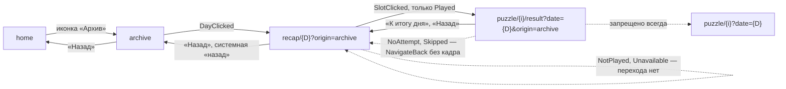
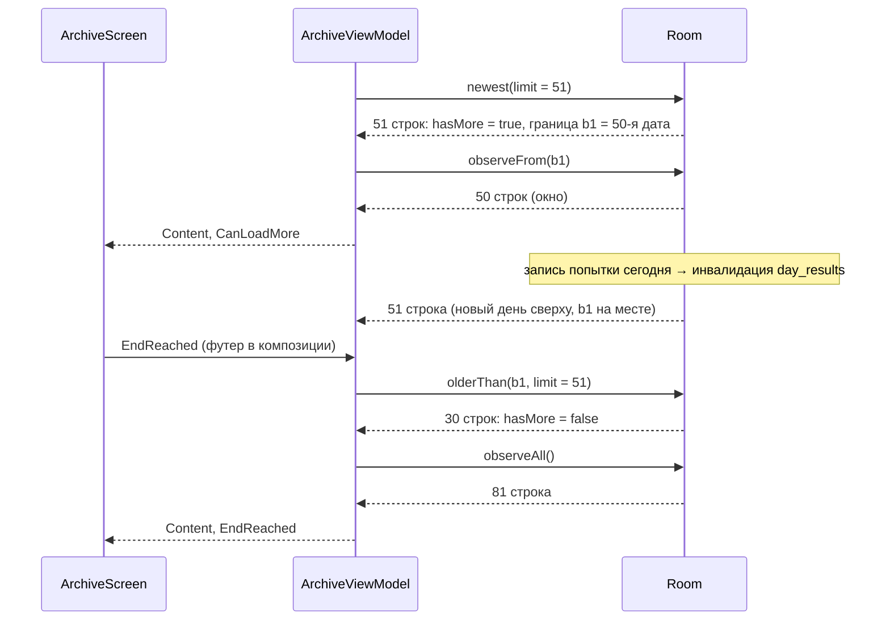
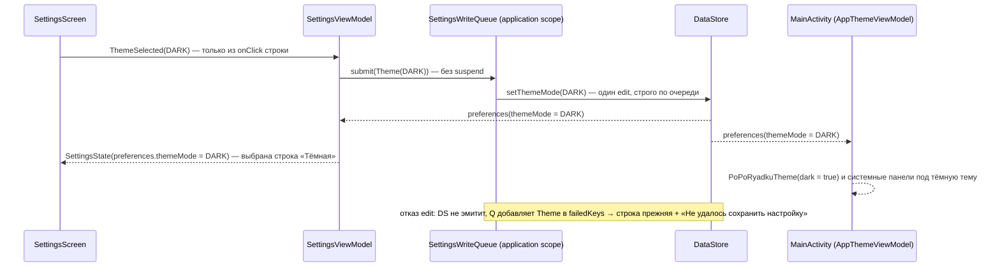
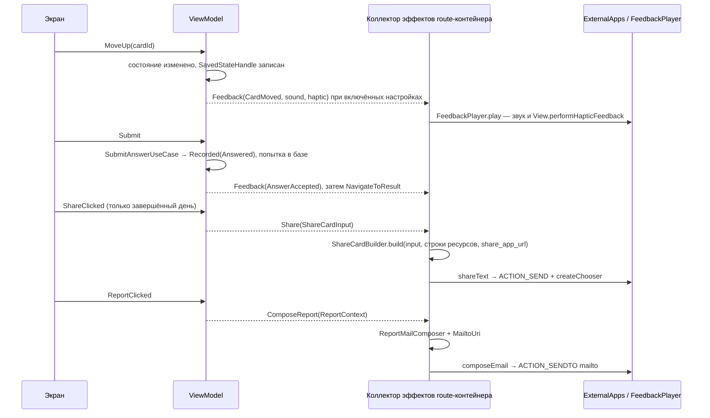

# ITERATION_5_DESIGN.md — «По порядку!»

Техническое проектирование итерации 5 «Архив, статистика, настройки, шеринг». Статус: **ревизия 1.1, готова к финальному архитектурному подтверждению**, 2026-09-11. Документ не утверждён: решения, вынесенные в раздел 13, требуют ответа владельца проекта до мержа указанных там PR.

**Что изменилось в ревизии 1.1** (точечные исправления по итогам ревью ревизии 1.0; архитектура итерации и состав PR 5A–5E не меняются):

- **загрузка `DayRecap` отделена от записей DataStore** (новое **I5-D31**, правки I5-D25): `hasCompletedFirstDay` пишет `SubmitAnswerUseCase` в момент фактического завершения первого дня, best-effort; `DayRecapViewModel` не пишет ничего, `GetDayRecapUseCase` больше не вызывает `GetStreaksUseCase`, поэтому отказ DataStore не может заменить готовый итог на `NotFound`; тесты `I5-R6`, `I5-V35` (разделы 3.7, 6.3, 6.8, 6.12);
- **порядок инициализации `SoundPool`** (I5-D23): listener регистрируется до первого `load()`, воспроизведение — только после `status == 0`, `release()` ровно один раз; логика вынесена в `SoundCueBank` над узкой границей `SoundEngine`; `I5-F2` расширен (разделы 3.14, 8.2);
- **записи настроек детерминированы** (I5-D15): одна очередь `SettingMutation` с одним worker в application-scoped `SettingsWriteQueue`, ошибки — множеством ключей, снимаются только успешной записью того же ключа, `NonCancellable` не используется; `SettingsState.writeFailures`, `I5-V20`…`I5-V22`, `I5-V24` (разделы 3.9, 4.5, 5.5, 6.9, 8.5);
- **строгий mapper строки архива**: `setIndex ∈ 0 until Int.MAX_VALUE`, `total_score ≤ 6 × completed_count`, `dayNumber` — только после проверок; `I5-S8` расширен (разделы 3.5, 5.1);
- синхронизированы тестовая матрица, файлы и критерии PR 5A, 5B, 5C, 5E, риски и план правок документов.

Документ дополняет `IMPLEMENTATION_PLAN.md` (итерация 5) и не заменяет его: план говорит **что** делает итерация, этот документ — **как**, **в каком порядке**, **какими типами и запросами**, и закрывает вопросы, на которые утверждённые документы отвечают противоречиво или не отвечают вовсе.

**Изменён ровно один файл — этот.** Kotlin-код, Room-схема (`app/schemas/`), JSON-контент (`app/src/main/assets/content/`), ресурсы (`app/src/main/res/`), `AndroidManifest.xml`, Gradle, CI и остальные документы не редактировались. Все листинги ниже — проект, а не реализация. Правки утверждённых документов перечислены в разделе 12 и выполняются в PR итерации 5 после утверждения этого дизайна.

**Основание для утверждений о коде.** Все ссылки на существующий код проверены чтением файлов на коммите `21c8995` (merge PR №16, итерация 4D), ветка `main`, рабочее дерево чистое. Прочитаны целиком: `docs/PRODUCT.md`, `docs/ARCHITECTURE.md`, `docs/CONTENT_MODEL.md`, `docs/UX_FLOW.md`, `docs/design/COMPONENTS.md`, `docs/design/DESIGN_PRINCIPLES.md`, `docs/IMPLEMENTATION_PLAN.md`, `docs/ITERATION_3_DESIGN.md`, `docs/ITERATION_4_DESIGN.md`; дополнительно — нужные разделы `docs/design/DESIGN_TOKENS.md`, `docs/design/UI_REVIEW_CHECKLIST.md`, `docs/design/b2/state-sheets/share-card-format.md`, `docs/VERSIONS.md`. `AGENTS.md` в репозитории отсутствует. Ни один API, которого нет в коде, не предполагается существующим: всё новое перечислено явно как создаваемое.

---

## 1. Scope и non-goals

### 1.1 Подтверждённая базовая линия

| Утверждение | Чем подтверждено |
| --- | --- |
| Итерация 4 влита в `main` | `git log`: `21c8995 Merge pull request #16 … iteration-4d-content-cutover`; PR 4A, 4B, 4C-1…4C-5 влиты раньше |
| Рантайм работает на настоящем JSON-пакете 35 наборов / 105 головоломок | `app/src/main/assets/content/manifest.json`: `contentVersion 1`, `setCount 35`, `puzzleCount 105`; CI проверяет `--expect-sets 35 --expect-puzzles 105` |
| Временные реализации удалены из продуктового DI | `di/ContentModule.kt` связывает `PuzzleRepositoryImpl` и `ContentImporter`; каталога `data/content/temporary/` нет |
| История при импорте сохраняется | `ContentImporter` пишет только `puzzles` (upsert) и `daily_sets` (единственный `DELETE` вне диапазона); `day_assignments`, `puzzle_attempts`, `day_results` импорт не трогает (ADR-003, ADR-015) |
| Головоломки автоматически не удаляются | `PuzzleDao` не содержит ни одного `DELETE`; `DELETE` в `src/main/java/ru/poporyadku/data` один — `DailySetDao.deleteOutsideRange` |
| В пакете v1 нет отозванных головоломок | `retiredIn` = `null` у всех 105 объектов `puzzles-001.json` |
| Физический замер `I4-C6` не выполнен | `ITERATION_4_DESIGN.md`, «Результаты приёмки PR 4D»: «Реальное устройство — не измерено» |
| `I4-C6` перенесён в release-readiness итерации 7 | решение владельца по итогам PR 4D; в итерации 5 этот замер **не выполняется, не маскируется и не засчитывается** ни одним тестом `I5-*` |
| Отсутствие `I4-C6` не блокирует итерацию 5 | замер касается скорости первого импорта (решение о выносе установки из `mapLatest`), а итерация 5 не меняет импорт, `GetTodayStateUseCase.compute()` по порядку вызовов и диспетчеры |

Схема Room — версия 1 (`AppDatabase.version = 1`, `app/schemas/ru.poporyadku.data.db.AppDatabase/1.json`), миграций нет. Paging 3 в зависимостях нет (`gradle/libs.versions.toml`), и итерация 5 его не добавляет.

### 1.2 Что входит в итерацию 5

1. Архив сыгранных дней с постраничным чтением и статистикой.
2. Архивный просмотр `DayRecap`, включая незавершённый день и слоты без попытки.
3. Просмотр результата головоломки прошлого дня (`PuzzleResult` по историческому `puzzleId`).
4. Пометка отозванной головоломки на `PuzzleResult`.
5. Настройки: звук, вибрация, тема; раздел «О приложении»; экран источников сыгранных головоломок; действие «Сообщить о неточности».
6. «Сообщить о неточности» на `PuzzleResult` (с `puzzleId`) и в настройках (без него).
7. Spoiler-free `ShareCard` и системный share sheet на `DayRecap`.
8. Звуковая и тактильная отдача при перестановке карточки и при принятии ответа «Проверить».
9. Перенос всех новых UI-текстов в ресурсы и финальная проверка отсутствия литералов.
10. Базовая доступность новых экранов: TalkBack-семантика, сенсорные цели ≥ 48 dp, 320 dp и шрифт 200 %, светлая и тёмная темы, ландшафт.

### 1.3 Что не входит (non-goals)

| Не входит | Куда | Почему не сейчас |
| --- | --- | --- |
| Напоминания, `POST_NOTIFICATIONS`, выбор времени, `NotificationOptInDialog` | итерация 6 | `IMPLEMENTATION_PLAN.md`, итерация 6; переключатель напоминания в итерации 5 **не показывается** |
| Drag-and-drop, `DragHandle`, `DragEducationHint` | итерация 6 | I3-D24 |
| Анимационная и полная accessibility-полировка всех экранов | итерация 6 | базовая доступность новых экранов входит в итерацию 5 (1.2, п. 10) |
| Второй контентный пакет, изменение контента v1 | вне итерации | контент v1 не меняется ни на байт |
| Huawei SDK, HMS, RuStore SDK и любые магазинные SDK | вне MVP / итерация 7 | ADR-007 |
| Product flavors, signing, release-конфигурация, публикация | итерация 7 | для ссылки магазина фиксируется только нейтральный ресурс (раздел 3.11) |
| Store listing, скриншоты, release metadata | итерация 7 | — |
| Аналитика, аккаунты, сеть, синхронизация | вне MVP | `ARCHITECTURE.md` §7; ни одного сетевого разрешения |
| Сброс прогресса | вне MVP | `UX_FLOW.md` §8 |
| Исправление, повтор или имитация замера `I4-C6` | итерация 7 | 1.1 |
| Чтение `StreakCache` для первого кадра Home (бывший O-1 итерации 3) | не реализуется | I5-D27 |

---

## 2. Инвентаризация текущего кода

### 2.1 Данные

| Объект | Файл | Что есть сейчас | Что нужно итерации 5 |
| --- | --- | --- | --- |
| `day_assignments` | `data/db/entity/DayAssignmentEntity.kt` | PK `local_date`, `UNIQUE(pack_id, set_index)`, `assigned_at` | источник номера дня `set_index + 1` в архиве |
| `puzzle_attempts` | `data/db/entity/PuzzleAttemptEntity.kt` | `UNIQUE(local_date, slot_index)`, `puzzle_id`, `submitted_order` (пустая строка — пропуск), `score` | исторический `puzzleId` слота, признак пропуска, сыгранные головоломки для источников |
| `day_results` | `data/db/entity/DayResultEntity.kt` | PK `local_date`, `total_score`, `completed_count`, `is_complete`, `completed_at`; пересчитывается в транзакции записи попытки | включение дня в архив, счёт, число закрытых слотов, завершённость, статистика |
| `puzzles` | `data/db/entity/PuzzleEntity.kt` | `cards_json`, `sources_json` (строгий `@StorageJson`), `retired_in`, `content_version` (отметка поставки, I4-D15) | категории, payload результата, источники, условие отзыва |
| `AttemptDao` | `data/db/dao/AttemptDao.kt` | `insert`, `getByDateAndSlot`, `getByDate`, `observeAll` | без изменений |
| `DayResultDao` | `data/db/dao/DayResultDao.kt` | `getByDate`, `observeByDate`, `getRange`, `getAll`, `completedDates`, `observeAll` | без изменений; статистика читает `observeAll` |
| `AssignmentDao` | `data/db/dao/AssignmentDao.kt` | глобальные и pack-scoped запросы политики, предикаты импортёра | без изменений |
| `PuzzleDao` | `data/db/dao/PuzzleDao.kt` | `upsertAll`, `getById`, `countByPack`; `DELETE` нет | +1 read-only запрос источников сыгранных головоломок (5C) |
| `AppDatabase` | `data/db/AppDatabase.kt` | версия 1, пять DAO | +1 DAO-аксессор `archiveDao()`; схема и `identityHash` не меняются |

### 2.2 Репозитории и use cases

| Объект | Факт | Следствие для итерации 5 |
| --- | --- | --- |
| `ProgressRepository` | `recordAttempt`, `getDayResult`, `getDayResults(from, to)`, `getAttempt`, `getAttempts`, `getAllDayResults`, `getCompletedDates`, `observeDayResults` | статистика строится из `observeDayResults()` — тот же источник, что у Home |
| `DayAssignmentRepository` | `peek`, `startSession`, `getAssignment(localDate)` (только чтение) | не расширяется |
| `PuzzleRepository` | `getPuzzle(puzzleId)`; отозванная головоломка читается наравне с активной | архив открывает исторический `puzzleId` без правок интерфейса |
| `UserPreferencesRepository` | `preferences: Flow<UserPreferences>`, сеттеры звука, вибрации, темы и др.; `IOException` чтения → значения по умолчанию | используется как есть; дублирующих API не создаётся |
| `UserPreferences` | `soundEnabled` (умолч. `true`), `vibrationEnabled` (`true`), `themeMode` (`SYSTEM`), `storedContentVersion`, `storedContentFingerprint`, `streakCache` | источник настроек и установленной версии контента |
| `GetTodayStateUseCase` | `TodayStats(streaks, bestDayScore = max total_score, playedDayCount = строк day_results, completedDayCount)` | статистика архива обязана совпадать с ним; оба считаются одним калькулятором (I5-D5) |
| `GetStreaksUseCase` | единственный писатель `StreakCache`; вызывается расчётом Home и `GetDayRecapUseCase` | архив кэш не пишет; из `GetDayRecapUseCase` вызов убирается (I5-D31) — кэш пишет только расчёт Home |
| `StreakCalculator` | `streaks(completedDates, today)`, будущие даты — вне текущей серии, внутри лучшей | вход — только завершённые даты |
| `GetDayRecapUseCase` | `slots` — только слоты с попыткой; `currentStreak`/`bestStreak` — на `today`; `isRecordUpdated` — от `localDate` | расширяется: три слота, серия этого дня (I5-D9) |
| `GetPuzzleResultUseCase` | `puzzleId` берётся из попытки, `daily_sets` не читается | исторический результат уже защищён от подмены ротацией; добавляется признак отзыва (I5-D11) |

### 2.3 UI и навигация

| Объект | Факт | Следствие |
| --- | --- | --- |
| `AppNavHost` | реальные `Home`, `Puzzle`, `PuzzleResult`, `DayRecap`; `Archive` и `Settings` — заглушки итерации 1 (`ArchiveStubScreen` с фиксированной датой `2026-08-25`, `SettingsStubScreen`) | заглушки и строки `stub_*` удаляются в 5B/5C |
| `Destinations` | `home`, `puzzle/{slotIndex}?date=`, `puzzle/{slotIndex}/result?date=`, `recap/{date}`, `archive`, `settings`; сентинела `today` нет | добавляются аргумент `origin` и маршрут `sources` |
| `HomeViewModel` | `NavigateToArchive` на `ContentExhausted`; иконки архива/настроек — callbacks без ViewModel; иконка архива видна при `completedDayCount > 0` | не меняется |
| `DayRecapViewModel` | `DateProvider.today()`; `routeDate` из маршрута; эффект только `NavigateHome`; **исключение use case не перехвачено** — отказ базы роняет процесс вместо `recapMissing`, обещанного I3 §18; после загрузки в той же корутине пишет `hasCompletedFirstDay` при каждом показе завершённого дня | чинится в 5B (I5-D25, I5-D31) |
| `DayRecapScreen` | заголовок «Сегодня»/дата по сравнению `localDate == today`; кнопка «Назад» в шапке отсутствует всегда | вариант по происхождению (I5-D8) |
| `PuzzleResultViewModel` | `readPuzzleRoute()`; `NoAttempt` → `NavigateToPuzzle`; `Skipped` → следующий слот/итог; `puzzleId` в состоянии «для итерации 5» | архивный режим запрещает любой переход в `puzzle/*` |
| `SourceRow` | три состояния `link`/`urlPlainText`/`referenceOnly`; `resolveActivity` в `remember`, `context.startActivity(intent)` прямо в `clickable` без перехвата исключений | переносится за платформенную границу (I5-D19) |
| `SourcesBlock` | раскрывающийся блок; KDoc: «отдельного маршрута или экрана-списка источников не существует» | отклонение для настроек — I5-D14, O5-4 |
| `ThreeStepProgress` | режимы `ActiveDay` и `ClosedDay` уже реализованы | `Archive row` использует `ClosedDay` |
| `StatisticsBlock` | заголовок + пары метка/значение, без spine | переиспользуется архивом |
| `ErrorBlock`, `SkeletonLine`, `AppTopBar`, `PrimaryButton`, `SecondaryButton`, `DayResultList` | существуют | переиспользуются; `DayResultRow` получает состояние `notPlayed` и интерактивность в архиве |
| `MainActivity` | `PoPoRyadkuTheme(darkTheme = isSystemInDarkTheme())` — **настройка темы нигде не применяется**; `enableEdgeToEdge()` без стиля системных панелей | применение темы — 5C (I5-D16) |
| `AndroidManifest.xml` | `<queries>` только для `VIEW` `http`/`https`; разрешений нет | +`<queries>` для `SENDTO mailto` (5C); `INTERNET` и `VIBRATE` не добавляются |
| `strings.xml` | все строки итераций 1–4; `plurals/streak_days` выбирается по правилам **локали устройства** (на нерусской локали доступны только `one`/`other`) | текст карточки шеринга склоняется собственным правилом (I5-D20) |
| Литералы UI | кириллические литералы в `ui/**` — только в `@Preview`-образцах; остальное — диагностические сообщения исключений | проверка остаётся в критериях 5E |

### 2.4 Тестовый стек

| Уровень | Где | Инструменты | В CI |
| --- | --- | --- | --- |
| Чистый JVM | `app/src/test` | JUnit 4 | да, `testDebugUnitTest` и `testReleaseUnitTest` |
| Room | `app/src/test` | Robolectric + `Room.inMemoryDatabaseBuilder` (`ProgressRepositoryTest`, `AssignmentDaoTest`) | да |
| ViewModel | `app/src/test` | `kotlinx-coroutines-test`, Turbine, рукописные фейки | да |
| Compose-экраны | `app/src/testDebug` (из-за `debugImplementation(ui-test-manifest)`) | Robolectric, `createComposeRule`, `@Config(qualifiers = "w390dp-h844dp")` | да |
| Навигация и сквозные | `app/src/androidTest` (`AppNavHostTest`, `FullDayFlowTest`, `HardCutoverTest`) | эмулятор | только компиляция `assembleDebugAndroidTest`; выполнение — вручную |

`AppNavHostTest.homeToArchiveToRecapByIsoDate` и `homeToSettingsToHome` опираются на testTag заглушек (`archive_open_recap_row`, `stub_generic_back_button`) и переписываются в 5B и 5C.

### 2.5 Найденные неоднозначности и противоречия

Каждая строка закрыта решением `I5-D*` (раздел 3) или вынесена владельцу (раздел 13).

| № | Где | Проблема | Статус |
| --- | --- | --- | --- |
| 1 | `UX_FLOW.md` §7 | «Пагинация не нужна» и «постраничное чтение по 50 записей» в одном абзаце | **I5-D4**: без Paging 3, keyset-страницы по 50 |
| 2 | `PRODUCT.md` §6 (контур A) против предпочтения задания | PRODUCT: «средний дневной балл — среднее по завершённым дням»; задание предлагает среднее по всем сыгранным дням | **I5-D5**, **O5-3** |
| 3 | `IMPLEMENTATION_PLAN.md`, итерация 5 против текущего `DayRecap` | план требует, чтобы архив открывал старый `puzzleId`, а `DayRecap` — только сводка без переходов | **I5-D10** |
| 4 | O-7 итерации 3 | `recap/{date}` не отличает приход из сессии от прихода из архива | **I5-D8**: аргумент `origin` |
| 5 | O-3 итерации 3 | нет строки «не сыграно» для слота без попытки | **I5-D9**: `SlotOutcome.NotPlayed` |
| 6 | `COMPONENTS.md`, `DayResultRow` | отозванная головоломка отнесена к `unavailable` (без категории), а `CONTENT_MODEL.md` §7 требует показывать её результат с пометкой | **I5-D11**: отозванная — `available`, пометка на `PuzzleResult` |
| 7 | I3-D51 / I3-D12 против архивного итога | серия на `DayRecap` считается на `today`, а «Лучшая серия» появляется по признаку **этого** дня: для архивного дня экран показал бы сегодняшнее значение под рекордом прошлого | **I5-D9**, **O5-5** |
| 8 | `COMPONENTS.md` (`SourcesBlock`: «отдельный маршрут для источников не создаётся») против `IMPLEMENTATION_PLAN.md` («экран источников») и `UX_FLOW.md` §8 («экран-список или раскрывающийся блок») | приоритет документов (`DESIGN_PRINCIPLES.md`, вводная) ставит план выше `COMPONENTS.md` | **I5-D14**, **O5-4** |
| 9 | `UX_FLOW.md` §8 («плоский список без вложенных экранов») против `COMPONENTS.md` (`Settings row`: «шеврон для перехода на подэкран») | «О приложении» — экран или раздел | **I5-D14**: раздел в том же списке; единственный подэкран — источники |
| 10 | `UX_FLOW.md` §7, `Archive.Empty`: «достижимо только если пользователь дошёл до архива через настройки» | в настройках нет перехода в архив, а иконка архива на Home скрыта при `completedDayCount == 0` | **I5-D7**: `Empty` — защитное состояние; формулировка `UX_FLOW.md` правится (раздел 12) |
| 11 | `COMPONENTS.md`, `UI_REVIEW_CHECKLIST.md`, `share-card-format.md` | строка `{RU_STORE_URL}` привязывает формат к одному магазину, а публикация планируется минимум в RuStore и Huawei AppGallery | **I5-D21**: нейтральный ресурс `share_app_url` |
| 12 | `UX_FLOW.md` §1 («Поделиться» есть в обоих вариантах итога) против формата карточки из трёх результатов | у незавершённого дня нет трёх результатов | **I5-D20**: «Поделиться» только у завершённого дня |
| 13 | `DayRecapViewModel.load()` | исключение use case не перехвачено, а I3 §18 обещает `recapMissing` | **I5-D25** |
| 14 | `MainActivity` | `ThemeMode` хранится, но не применяется; при принудительной теме системные панели выбирают цвет иконок по системной теме | **I5-D16** |
| 15 | `SourceRow` | `startActivity` без перехвата `ActivityNotFoundException`/`SecurityException` | **I5-D19** |
| 16 | `strings.xml`, `plurals/streak_days` | склонение по правилам локали устройства даёт «21 дней» на английской локали; для текста, уходящего наружу, это недопустимо | **I5-D20**: собственное правило для карточки; экраны не меняются |
| 17 | `GetPuzzleUseCase` | принимает прошлую дату с незакрытым слотом и отдаёт `Playable`: правило «незавершённый день не доигрывается» держится только навигацией | **I5-D10**: архив никогда не строит `puzzle/*`; запрет прошлой даты в use case невозможен (сессия через полночь законно продолжается на прежней дате, `UX_FLOW.md` §9) |
| 18 | `DayRecapViewModel.load()`, `GetDayRecapUseCase` | в пути загрузки итога две записи DataStore — `setHasCompletedFirstDay` и `updateStreakCache` через `GetStreaksUseCase`; обёрнутые общим перехватом, они превратили бы отказ DataStore в `NotFound` уже загруженного дня; флаг переписывается при каждом открытии завершённого дня, включая архив | **I5-D31** |

---

## 3. Архитектурные решения

### 3.0 Таблица решений `I5-D*`

Статус «предложено» означает, что решение принимается вместе с дизайном при архитектурном ревью. Статус «**требует подтверждения**» — решение меняет утверждённый документ или продуктовое поведение и ждёт ответа владельца (раздел 13).

| ID | Решение | Отклонённая альтернатива | Статус |
| --- | --- | --- | --- |
| I5-D1 | Пять независимо проверяемых PR: 5A данные/домен архива → 5B UI архива и прошлый день → 5C настройки, «О приложении», источники, сообщение о неточности → 5D шеринг → 5E отдача и финальная интеграция. Установленная версия контента вводится в 5B (первый потребитель — пометка отзыва), платформенная граница — в 5C (первые потребители — письмо и ссылки источников) | один PR на итерацию; отдельный PR под платформенную границу без потребителя | предложено |
| I5-D2 | Схема Room не меняется, версия остаётся 1. Добавляются только read-only запросы и новый DAO `ArchiveDao` без сущностей; аксессор DAO в `AppDatabase` не меняет экспортируемую схему | новая таблица/колонка «номер дня в результате», индекс по `puzzle_attempts.puzzle_id` | предложено |
| I5-D3 | Источник истины архива: `day_results` (включение, счёт, закрытые слоты, завершённость) ⋈ `day_assignments` (номер набора) по `local_date`; `puzzle_attempts` — исторический `puzzleId` и пропуск; `puzzles` — категория, payload, отзыв. Новых агрегатов не хранится | пересчёт счёта из `puzzle_attempts` на лету; кэш архива в DataStore | предложено |
| I5-D4 | Постраничное чтение без Paging 3: keyset по `local_date DESC`, страница 50, разведка страницы запросом `LIMIT 51`, отображаемые строки — наблюдаемое окно `local_date >= нижняя граница` | `LIMIT/OFFSET`; наблюдаемый префикс с растущим `LIMIT`; Paging 3 | предложено |
| I5-D5 | Статистика: «сыграно дней» — все дни с ≥ 1 попыткой; средний балл — **по завершённым дням**, одна десятичная, округление half-up; «лучший день» — максимум `total_score` по всем дням, показывается только значение; серии — `StreakCalculator` по завершённым датам. Один чистый `StatisticsCalculator` для архива и Home | среднее по всем сыгранным дням (предпочтение задания) | **требует подтверждения** (O5-3) |
| I5-D6 | Незавершённый день, включая сегодняшний незаконченный, показывается в архиве с частичным счётом, `completed_count` точками `ClosedDay` и текстом «не завершён». Пропуск — закрытый слот с нулём | скрывать сегодняшний незавершённый день; отдельный текст «в процессе» | предложено |
| I5-D7 | `ArchiveState` = `Loading` / `Empty` / `Content` / `Error`. `Empty` — защитное состояние: из UI release-сборки недостижимо, возникает при опустевшей базе и в тестах | удалить `Empty` как недостижимое | предложено |
| I5-D8 | Происхождение итога — аргумент маршрута `recap/{date}?origin={origin}`: отсутствует → сессия (сегодняшний вариант), `archive` → архивный. Вариант определяется происхождением, а не сравнением даты с сегодняшней. Закрывает O-7 | отдельный маршрут `archive/recap/{date}`; сравнение `localDate == today` | предложено |
| I5-D9 | Итог дня всегда содержит три строки: к `Played`/`Unavailable` добавляется `NotPlayed` («не сыграно»). У незавершённого дня — строка «День не завершён», без `StreakRow` и без «Поделиться». Серия на итоге — **серия этого дня** (`streakAtDay`), «Лучшая серия» — то же значение при `isRecordUpdated`. Закрывает O-3 | сохранить серию «на сегодня» для архивного итога | **требует подтверждения** (O5-5) |
| I5-D10 | Исторический результат открывается маршрутом `puzzle/{slotIndex}/result?date={date}&origin=archive` из строки `Played` архивного итога; `puzzleId` берётся из попытки. Архивный режим никогда не строит маршрут `puzzle/*` | маршрут с `puzzleId` в аргументах; переход в головоломку для неотвеченного слота | предложено |
| I5-D11 | Головоломка отозвана ⇔ `retiredIn != null && retiredIn <= referenceVersion`, где `referenceVersion` — подтверждённая установленная версия контента, а при её отсутствии — `puzzles.content_version` строки. Отозванная — `available` на итоге и полный результат с пометкой; отсутствующая, неверной формы и пропущенная — разные исходы | `retiredIn != null`; отозванная как `unavailable` | предложено |
| I5-D12 | Установленная версия контента — отметка DataStore (`storedContentVersion` при непустом `storedContentFingerprint`), читаемая доменным `GetInstalledContentVersionUseCase` | версия из `manifest.json` в assets; `MAX(content_version)` из Room; константа UI | предложено |
| I5-D13 | Версия приложения и код сборки — `AppBuildInfo(versionName, versionCode)`, единственный провайдер из `BuildConfig` в `di/AppModule.kt` | чтение `PackageManager.getPackageInfo`; литералы | предложено |
| I5-D14 | Настройки — один плоский экран: «Звук», «Вибрация», группа «Тема» из трёх строк с радиокнопками, раздел «О приложении» в том же списке, строка «Источники» → отдельный маршрут `sources`, строка «Сообщить о неточности». Напоминания нет | источники встроенным `SourcesBlock` в настройках; «О приложении» отдельным экраном | **требует подтверждения** (O5-4) |
| I5-D15 | Настройки обновляются по подтверждённой модели: экран показывает только то, что выдал DataStore; команды `SettingMutation` уходят в application-scoped очередь `SettingsWriteQueue` с одним worker, который применяет их строго по порядку, по одному `edit` DataStore на команду; ошибки хранятся множеством ключей и снимаются только успешной записью того же ключа; `NonCancellable` не используется; отказ записи — строка «Не удалось сохранить настройку» под строкой своего ключа | оптимистичное переключение с откатом; отдельная корутина `viewModelScope` на запись под `NonCancellable`; одна ошибка на весь экран | предложено |
| I5-D16 | Тема применяется корнем `MainActivity` через `AppThemeViewModel`; до первой эмиссии настроек корень не компонует экраны (нет вспышки чужой темы); стиль системных панелей переустанавливается при смене разрешённой темы | `isSystemInDarkTheme()` как сейчас; `runBlocking` чтения DataStore | предложено |
| I5-D17 | Источники — единый дедуплицированный список по **сыгранным (не пропущенным)** головоломкам, включая отозванные; ключ — `url`, при его отсутствии — `reference` + `title`; порядок — русская коллация по `title`, затем ключ; данные — `puzzles.sources_json` из Room | группировка по головоломкам; повторное чтение assets | предложено |
| I5-D18 | Письмо строит чистый `ReportMailComposer` из шаблонов ресурсов; `mailto:`-URI кодирует чистый `MailtoUri` (RFC 6068, UTF-8, `%20`, `%0D%0A`); получатель — ресурс `feedback_email` | `Uri.Builder`/`URLEncoder` (даёт `+` вместо пробела) | предложено; значение адреса — O5-1 |
| I5-D19 | Все внешние Android-действия — за интерфейсом `ExternalApps` (`ui/platform`): доступность (`resolveActivity`), запуск с перехватом исключений, защита от повторного запуска до возврата на экран. `Intent`, `Uri`, `PackageManager` не появляются в `domain` | `startActivity` в компонентах и ViewModel | предложено |
| I5-D20 | `ShareCardBuilder` — чистый Kotlin в `ui/share`, ровно семь строк, склонение «день» собственным правилом русского языка, формы — из ресурсов, URL передаётся извне. «Поделиться» доступно только у завершённого дня, серия в карточке — серия этого дня | `plurals` по локали устройства; карточка незавершённого дня с «пустыми» слотами | предложено |
| I5-D21 | Ссылка на приложение — нейтральный непереводимый ресурс `share_app_url` в `res/values/distribution.xml`; в итерации 5 product flavors не вводятся; release input итерации 7 — универсальная landing-страница либо переопределение ресурса в исходниках distribution-сборок | `RU_STORE_URL`; URL в коде builder | предложено; значение — O5-6 |
| I5-D22 | Отдача: два события (`CardMoved`, `AnswerAccepted`); решение «играть ли звук/вибрацию» принимает `PuzzleViewModel` по настройкам; `AnswerAccepted` — только после `SubmitResult.Recorded(Answered)` | отдача по нажатию «Проверить» до записи; решение в плеере | предложено |
| I5-D23 | Звук — `SoundPool` (`USAGE_ASSISTANCE_SONIFICATION`) с двумя OGG-ресурсами, объект живёт в `ActivityRetainedComponent` и освобождается ровно один раз при окончательном уничтожении Activity; `OnLoadCompleteListener` регистрируется до первого `load()`, звук играет только после `status == 0`; вибрация — `View.performHapticFeedback` без разрешения `VIBRATE` | `Vibrator`/`VibratorManager`; `ToneGenerator`; экранный `SoundPool` | предложено; звуковые файлы — O5-7 |
| I5-D24 | Эффекты — `Channel(BUFFERED)`, один коллектор на route-контейнер под `repeatOnLifecycle(STARTED)`; пользовательская навигация из новых экранов выполняется только если запись бэкстека экрана — текущая | дебаунс по времени; `SharedFlow` с replay | предложено |
| I5-D25 | `CancellationException` всегда пробрасывается; отказ первой загрузки — `Error`, отказ следующей страницы или обновления — сохранение уже показанных данных; отказ чтения итога — `recapMissing`, и только он: `NotFound` означает отсутствие или непригодность данных дня, а не отказ DataStore | терминальный `catch` потока; очистка списка при ошибке | предложено |
| I5-D26 | Все новые пользовательские тексты — в `strings.xml`; строки заглушек `stub_*` удаляются; предлагаемые формулировки, которых нет в утверждённых документах, перечислены в разделе 13.3 | литералы в Compose-коде | предложено; тексты — O5-8 |
| I5-D27 | Чтение `StreakCache` для первого кадра Home (O-1 итерации 3) не реализуется: архив читает Room, кэш остаётся «только запись» | чтение кэша в `Home.Loading` | предложено |
| I5-D28 | Идентификаторы тестов итерации 5 несут префикс `I5-` и привязаны к PR и критерию (раздел 10) | общие имена без префикса | предложено |
| I5-D29 | Замер `I4-C6` остаётся пунктом release-readiness итерации 7 и не входит ни в один критерий итерации 5 | засчитать эмуляторный замер | предложено |
| I5-D30 | Новые визуальные элементы (строка архива, `notPlayed` и интерактивность `DayResultRow`, пометка отзыва, группа темы, раздел «О приложении», экран источников) добавляются в `COMPONENTS.md` state sheets до кода соответствующего PR | импровизация в коде | **требует подтверждения** (O5-9) |
| I5-D31 | `hasCompletedFirstDay` устанавливается в момент фактического завершения дня: `SubmitAnswerUseCase` после записи попытки, если `day_results.is_complete` и флаг ещё `false`; запись best-effort и на `SubmitResult` не влияет. `DayRecapViewModel` флаг не пишет и `UserPreferencesRepository` не инжектирует; `GetDayRecapUseCase` не вызывает `GetStreaksUseCase` — путь загрузки итога не содержит записей DataStore | запись флага при каждом показе завершённого дня в `DayRecap`, в том числе из архива | предложено |

### 3.1 Разрез на PR (I5-D1)

Разрез из задания сохранён: пять PR с разными способами ревью (чтение SQL и тестов Room; чтение экранов и навигации; чтение платформенного кода; чтение формата текста; проверка на устройстве). Уточнения, продиктованные кодом:

- **Установленная версия контента** (`GetInstalledContentVersionUseCase`) нужна трём потребителям — пометке отзыва (5B), «О приложении» и письму (5C). Она вводится в **5B**: в 5A у неё нет потребителя, а вводить API без потребителя проект не принимает (`ITERATION_3_DESIGN.md`, «пустой хук — тот же мёртвый код»).
- **Платформенная граница** `ExternalApps` появляется в **5C** вместе с первыми потребителями — письмом и ссылками источников; 5D добавляет в неё `shareText`.
- **Применение темы** в `MainActivity` — часть 5C: переключатель темы без применения был бы неработающей настройкой.
- **Серия этого дня** (`streakAtDay`) вводится в 5B, потому что её показывает архивный итог; 5D берёт то же поле для карточки.
- **Флаг первого завершённого дня** переезжает в `SubmitAnswerUseCase` в 5B — тем же PR, что убирает записи DataStore из загрузки итога (I5-D31).
- **Очередь записи настроек** `SettingsWriteQueue` появляется в 5C вместе с первым потребителем — экраном настроек (I5-D15).
- Каждый PR синхронизирует документы своей области (раздел 12); 5E выполняет финальную сверку и обновляет статус итерации.

Иной разрез не требуется: зависимость 5B → 5A жёсткая (UI читает API архива), 5C/5D/5E зависят от 5B только через общий `AppNavHost` и `DayRecap`, и их можно ревьюировать независимо.

### 3.2 Room: почему миграции нет (I5-D2)

Все поля, которые показывает итерация 5, уже есть в схеме версии 1:

| Что показывается | Колонка |
| --- | --- |
| дата дня | `day_results.local_date`, `day_assignments.local_date` |
| «День N» | `day_assignments.set_index` + 1 |
| «N из 18», частичный счёт | `day_results.total_score` |
| число закрытых слотов | `day_results.completed_count` |
| завершённость | `day_results.is_complete` |
| исторический `puzzleId`, пропуск, счёт слота | `puzzle_attempts.puzzle_id`, `submitted_order`, `score` |
| категория, правильный порядок, объяснение, источники | `puzzles.category`, `cards_json`, `correct_order`, `explanation`, `sources_json` |
| отзыв | `puzzles.retired_in`, `puzzles.content_version` |

Индекс по `puzzle_attempts.puzzle_id` для запроса источников не нужен: подзапрос `IN (SELECT puzzle_id FROM puzzle_attempts …)` материализуется SQLite один раз, а строк попыток не больше `3 × число сыгранных дней`. Первая настоящая миграция после **I4-D1** итерации 5 не требуется; `androidx.room:room-testing` не подключается. Проверка каждого PR: `git diff --stat main -- app/schemas` пуст.

### 3.3 Архив: источник истины и включение дней (I5-D3, I5-D6)

**Правило включения.** День `D` попадает в архив тогда и только тогда, когда по назначению этой даты записана хотя бы одна попытка. Проверяемая форма правила — существование строки `day_results` с `local_date = D`:

- `ProgressRepositoryImpl.recordAttempt` пишет попытку и пересчитывает `day_results` **в одной транзакции** (D-5), поэтому строка `day_results` существует ровно для дат с ≥ 1 попыткой;
- других писателей `day_results` нет; удаляет строки только debug-сброс `clearAllTables()`, очищающий все таблицы сразу.

Следствия, каждое проверяется тестом (раздел 10):

| Случай | В архиве | Почему |
| --- | --- | --- |
| Завершённый день (3 попытки) | да, «N из 18», три точки `primary` | строка `day_results`, `is_complete = 1` |
| Незавершённый день (1–2 попытки), в том числе сегодняшний незаконченный | да, частичный счёт, `completed_count` точек, «не завершён» | строка `day_results`, `is_complete = 0` |
| Отложенное назначение без попыток (нажали «Играть» и вышли) | **нет** | строки `day_results` нет; назначение ещё перенесётся (`UX_FLOW.md` §9) |
| Пропущенная календарная дата | **нет** | ни назначения, ни результата |
| Пропуск (`Submission.Skip`) | считается закрытым слотом с нулём | пропуск — записанная попытка со `score = 0` (I3-D28); `completed_count` его учитывает |
| День, собранный из трёх пропусков | да, «0 из 18», завершён | I3-D37 |
| Дата в будущем относительно сегодняшней (часы переведены назад после игры) | да, в начале списка | это реально сыгранный день; `UX_FLOW.md` §9 не наказывает перевод часов |

**Источники полей строки.**

| Поле строки | Таблица и колонка | Примечание |
| --- | --- | --- |
| локальная дата | `day_results.local_date` | ISO-строка, разбирается в `data` |
| номер набора, «День N» | `day_assignments.set_index` + 1 | соединение по `local_date` |
| счёт | `day_results.total_score` | не пересчитывается из попыток: таблица согласована с попытками транзакцией записи |
| число закрытых слотов | `day_results.completed_count` | 1..3 по правилу включения |
| завершённость | `day_results.is_complete` | ровно `completed_count == 3` |
| категории и `puzzleId` для итога и результата | `puzzle_attempts.puzzle_id` → `puzzles` | читаются только при открытии дня, не в списке |

**Инвариант соединения.** У каждой строки `day_results` есть назначение на ту же дату: попытка пишется только при наличии назначения этой даты (`SubmitAnswerUseCase`, шаг 2), а назначение с попыткой больше не переносится (перенос касается только отложенного назначения без попыток). Поэтому соединение `day_results ⋈ day_assignments` — внутреннее. Строка `day_results` без назначения — нарушение инварианта (испорченные данные): в список она не попадает, статистика её учитывает так же, как Home (`TodayStats` считается по всем строкам `day_results`), итог такой даты — `recapMissing`, как и сейчас (`GetDayRecapUseCase`, нет назначения → `NotFound`). Это расхождение видимо только в испорченной базе и зафиксировано тестом `I5-A5`, а не скрыто.

**Сортировка и ключ.** Порядок — `local_date DESC`. `local_date` — первичный ключ и `day_results`, и `day_assignments`, поэтому соединение даёт не более одной строки на дату: одна дата не может появиться дважды, а ключ элемента `LazyColumn` — ISO-дата (`ArchiveItem.key = localDate.toString()`), стабильная между перезапросами.

**Сегодняшний незаконченный день** показывается с текстом «не завершён» (I5-D6). Формулировка верна на момент просмотра; отдельный текст «в процессе» создал бы шестое состояние строки ради нескольких часов в сутки. Архивный итог такого дня показывает оставшиеся слоты как «не сыграно», но **не даёт** их сыграть: доиграть сегодняшний день можно только с Home («Продолжить»), архив маршрутов `puzzle/*` не строит (I5-D10).

**Пакет.** Список не фильтруется по `pack_id`: история — это дни пользователя, а не пакета. В MVP ровно один пакет `core-ru`, а тематические паки — задел вне MVP (`CONTENT_MODEL.md` §7); значение «День N» при нескольких пакетах проектируется вместе с ними, не в итерации 5.

### 3.4 Пагинация (I5-D4)

**Как читается противоречивая формулировка `UX_FLOW.md` §7.** «Пагинация не нужна» относится к библиотеке и к интерфейсу постраничной навигации (номера страниц, «загрузить ещё»); «постраничное чтение из базы по 50 записей» — к тому, как `LazyColumn` получает данные. Итоговый контракт: Paging 3 не подключается, база читается порциями по 50 строк, следующая порция подгружается автоматически при прокрутке к концу списка.

**Сравнение вариантов.**

| Критерий | `LIMIT 50 OFFSET 50·k` | Наблюдаемый префикс `LIMIT 50·k + 1` | **Keyset по `local_date` + окно `>= нижняя граница`** (выбран) |
| --- | --- | --- | --- |
| Новая строка сверху между загрузками страниц | сдвигает смещения: последняя строка страницы k приходит ещё раз в странице k+1 — **дубль** | префикс сдвигается: самая старая загруженная строка исчезает из списка до следующей подгрузки | окно ограничено датой, а не числом: новая строка добавляется сверху, ничего не пропадает |
| Удаление строки (только debug-сброс) | пропуск строки на границе страниц | согласованный снимок | согласованный снимок окна |
| Стоимость запроса страницы | растёт со смещением (SQLite пропускает `OFFSET` строк) | один запрос, но всё окно заново | точечный диапазон по PK `local_date` |
| Конец списка | лишний пустой запрос | `size ≤ limit − 1` | разведка `LIMIT 51`: 51-я строка — признак продолжения, пустых запросов нет |
| Повтор после ошибки | нужно помнить смещение | нужно помнить лимит | нужно помнить только нижнюю границу; окно не сбрасывается |

**Почему окно наблюдаемое, а не только первая страница.** Требование «первая страница обновляется при изменении сегодняшнего результата» выполняется наблюдаемым Room-запросом. Если бы наблюдалась только первая страница с `LIMIT 51`, а следующие читались разово, новая строка сверху вытолкнула бы 50-ю строку первой страницы за её предел — туда, где её нет ни в первой (уже выдавленной), ни во второй (читалась по старому курсору) странице: **пропуск**. Поэтому после каждой разведки наблюдается не страница, а **окно всех загруженных дней**: `local_date >= нижняя граница`, где нижняя граница — дата самой старой загруженной строки. Новая строка `day_results` может появиться только на дате отложенного назначения, а оно всегда самое позднее из назначений: новый набор выдаётся лишь при `today > lastAssignedDate`, отложенное назначение в системе одно и переносится только вперёд. Поэтому новый день всегда оказывается **сверху**, внутри окна. Изменение уже существующего дня (вторая попытка незавершённого дня) либо попадает в окно и перечитывается, либо лежит ниже границы — в строках, которые ещё не показаны и будут прочитаны при подгрузке. Окно только растёт, пропусков нет.

**Разведка страницы.** `probe(before, limit = 51)` возвращает до 51 строки строго раньше `before` (или самые поздние, если `before == null`). Если строк 51 — продолжение есть, новая нижняя граница = дата 50-й строки; если ≤ 50 — продолжения нет, и окно становится неограниченным снизу («все дни»). Отображаемые строки всегда берутся из окна, а не из разведки: разведка только двигает границу и определяет `hasMore`.

Точный SQL — раздел 5.1, псевдокод ViewModel — раздел 6.1, диаграмма — раздел 7.4.

**Сценарии по числу строк в архиве.**

| Строк | Первая разведка (`LIMIT 51`) | Окно после неё | Показано | Подгрузки | Итог |
| --- | --- | --- | --- | --- | --- |
| 0 | 0 строк → `hasMore = false` | все дни | 0 | нет | `Archive.Empty` (при `playedDays == 0`) |
| 1 | 1 → `false` | все дни | 1 | нет | `Content`, `EndReached`, футера нет |
| 49 | 49 → `false` | все дни | 49 | нет | `EndReached` |
| 50 | 50 → `false` | все дни | 50 | **нет** (пустого запроса нет) | `EndReached` |
| 51 | 51 → `true`, граница `b1` = дата 50-й | `>= b1` | 50 | 1: разведка `< b1` → 1 строка → `false` → окно «все дни» | 51, `EndReached` |
| 100 | 51 → `true`, `b1` | `>= b1` | 50 | 1: разведка `< b1` → 50 строк → `false` → «все дни» | 100, `EndReached` |
| 101 | 51 → `true`, `b1` | `>= b1` | 50 | 2: `< b1` → 51 строка → `true`, `b2` = дата 100-й → окно `>= b2` (100 строк); затем `< b2` → 1 строка → `false` → «все дни» | 101, `EndReached` |

Инвариант, проверяемый на всех семи сценариях (`I5-A6`): объединение показанных строк после всех подгрузок равно множеству всех дней, каждая дата встречается ровно один раз, порядок строго убывающий.

**Размер окна.** За год игры — до 365 строк; окно перечитывается при каждой записи в `day_results`/`day_assignments`, пока экран подписан (`WhileSubscribed(5_000)`). Запрос — соединение по первичным ключам, стоимость — доли миллисекунды на сотни строк; это дешевле любой схемы склейки страниц.

### 3.5 Статистика (I5-D5)

**Определения.** Пусть `R` — все строки `day_results` (дни с ≥ 1 попыткой), `C ⊆ R` — строки с `is_complete = 1`, `today` — `DateProvider.today()`.

| Показатель | Формула | Показ | Совпадение с Home |
| --- | --- | --- | --- |
| Сыграно дней | `playedDays = count(R)` | целое | `TodayStats.playedDayCount` |
| Средний балл из 18 | `average = Σ_{r∈C} total_score / count(C)`; при `count(C) = 0` — не определён | `13,7 из 18`; при `count(C) = 0` — «—» | Home среднее не показывает |
| Лучший день | `bestDayScore = max_{r∈R} total_score` | `17 из 18`, только значение | `TodayStats.bestDayScore` |
| Текущая серия | `StreakCalculator.streaks(dates(C), today).current` | `pluralStringResource(streak_days)` | `TodayStats.streaks.current` |
| Лучшая серия | `StreakCalculator.streaks(dates(C), today).best` | то же | `TodayStats.streaks.best` |

**Решение по спорным пунктам и почему.**

1. **Незавершённый день входит в «сыграно дней».** Это определение уже показывает Home («Сыграно дней» = строк `day_results`) и совпадает с правилом включения в архив: число строк списка равно `playedDays` (кроме испорченной базы, раздел 3.3).
2. **Частичный балл незавершённого дня в среднее не входит.** Предпочтение задания (среднее по всем сыгранным дням) отклонено, решение вынесено владельцу (O5-3), обоснование:
   - утверждённый `PRODUCT.md` §6 (контур A) определяет средний дневной балл как «среднее по завершённым дням» и сравнивает его с ориентиром 13–15 и точкой отсчёта 9 (случайный порядок). Обе опорные цифры выведены для полного дня из 18; день с одной сыгранной головоломкой даёт 0–6 и опускает среднее ниже 9 даже у сильного игрока;
   - показатель подписан «из 18»: частичный день из 18 не набирался;
   - брошенный день уже учитывается там, где он имеет смысл, — в «сыграно дней» и в обрыве серии;
   - на примере 1 ниже разница — «14,0» против «11,5»: предпочтение задания показало бы игроку результат ниже реального качества его полных дней.
3. **Формат и округление среднего.** Одна десятичная всегда (`15,0`, а не `15`), десятичная запятая, округление half-up от точного рационального значения, целочисленно, без `Double`: `tenths = (20·S + count(C)) div (2·count(C))`, где `S = Σ total_score` по `C`; показ — `tenths div 10`, `,`, `tenths mod 10`. Постоянная ширина исключает «прыжок» строки между `15` и `14,7`.
4. **«Лучший день» — максимальный фактически записанный дневной балл по всем дням**, включая незавершённые, — ровно как Home (`TodayStats.bestDayScore`). Показывается только значение; дата не показывается и в доменной модели не хранится. Правило ничьей поэтому не нужно: при равенстве баллов показываемое значение одно и то же. Асимметрия с п. 2 намеренна: максимум незавершённым днём почти никогда не определяется (частичный день ≤ 12), а среднее смещается каждым таким днём.
5. **`StreakCalculator` получает только завершённые даты** (`is_complete = 1`), как Home и I3-D11. Серия «про присутствие», пропуск и незавершённый день её прерывают.
6. **Будущие даты** (сыграно при переведённых вперёд часах, затем часы вернули): входят в `playedDays`, среднее и лучший день — это реально сыгранные дни; в текущую серию не входят, в лучшую входят (I3-D11). Home считает так же.
7. **Испорченные данные**: неразбираемая дата, `set_index < 0` или `set_index = Int.MAX_VALUE` (номер дня `set_index + 1` переполнился бы), `completed_count ∉ 1..3`, `total_score ∉ 0..6 × completed_count` (счёт выше максимума фактически закрытых слотов) или `is_complete ≠ (completed_count == 3)` — нарушение инвариантов записи (`ProgressRepositoryImpl`, политика выдачи), а не состояние экрана. Отображение строки в доменную модель проверяет их **до** построения `ArchiveDay` и бросает `IllegalStateException`; `dayNumber` вычисляется только после проверок (раздел 5.1). ViewModel показывает `Archive.Error` («Не удалось прочитать историю» + «Повторить»). Молча обрезать значения запрещено.
8. **Согласованность с Home — построением, а не дисциплиной.** `StatisticsCalculator.of(days, today)` — единственная функция; `GetStatisticsUseCase` (архив) и `GetTodayStateUseCase.statsOf` (Home) обе вызывают её, `TodayStats` строится из её результата. Тест `I5-S6` сравнивает оба на одних данных.
9. **Пустая история** — `Archive.Empty`, а не блок с нулями (`UX_FLOW.md` §2: «пустых нулей не показываем»).

Псевдокод — раздел 6.2; SQL-оракул для тестов — раздел 5.2.

**Пример 1 — ручной расчёт** (`today = 2026-08-07`):

| Дата | Завершён | `completed_count` | `total_score` |
| --- | --- | --- | --- |
| 2026-08-01 | да | 3 | 15 |
| 2026-08-02 | да | 3 | 12 |
| 2026-08-03 | нет | 2 | 8 |
| 2026-08-05 | да | 3 | 18 |
| 2026-08-06 | да | 3 | 11 |
| 2026-08-07 | нет | 1 | 5 |

- `playedDays = 6`; `count(C) = 4`; `S = 15 + 12 + 18 + 11 = 56`; `tenths = (1120 + 4) div 8 = 140` → **«14,0 из 18»** (по всем сыгранным было бы `69 / 6 = 11,5`);
- `bestDayScore = 18` → «18 из 18»;
- завершённые даты `08-01, 08-02, 08-05, 08-06`; сегодня `08-07` не завершён, вчера `08-06` завершён → якорь `08-06`, `08-05` есть, `08-04` нет → **текущая серия 2**; отрезки `08-01…08-02` и `08-05…08-06` → **лучшая серия 2**.

**Пример 2 — будущая дата** (`today = 2026-08-07`, завершённые `08-05`, `08-06`, `08-09`, счёт 10, 14, 17):

- `playedDays = 3`; `S = 41`, `count(C) = 3`; `tenths = (820 + 3) div 6 = 137` → «13,7 из 18»; лучший день «17 из 18»;
- текущая серия: `08-09 > today` отбрасывается, вчера `08-06` есть, `08-05` есть → 2; лучшая: `08-05…08-06` = 2, `08-09` = 1 → 2.

**Пример 3 — только незавершённые** (`08-06`: 1 попытка, 6 баллов):

- `playedDays = 1`; `count(C) = 0` → среднее «—»; лучший день «6 из 18»; серии 0 / 0; состояние `Content` (не `Empty`: день сыгран).

**Пример 4 — округление:** `S = 1, count(C) = 4` → точное 0,25 → `tenths = (20 + 4) div 8 = 3` → «0,3»; `S = 3, count(C) = 4` → 0,75 → `(60 + 4) div 8 = 8` → «0,8»; `S = 27, count(C) = 2` → 13,5 → `(540 + 2) div 4 = 135` → «13,5».

### 3.6 Archive UI (I5-D7)

**Композиция сверху вниз:** `AppTopBar` («Архив», кнопка «Назад») → `StatisticsBlock` → список `Archive row` → футер. Весь экран — один `LazyColumn`: блок статистики — его первый элемент, поэтому при 200 % и в ландшафте прокручивается вместе со списком, а не отъедает высоту у списка. Колонка контента ограничена `Sizing.contentMaxWidth` на широком экране и в ландшафте, поля — `Spacing.marginCompact` на ширине меньше `Sizing.compactWidthBreakpoint`, иначе `Spacing.marginDefault` — тот же приём, что у существующих экранов.

**`StatisticsBlock`** — существующий компонент, заголовок «Статистика» (`statistics_title`) и пять пар метка/значение в порядке: «Сыграно дней» → «Средний балл» → «Лучший день» → «Серия» → «Лучшая серия». Метки «Сыграно дней», «Лучший день», «Серия», «Лучшая серия» — существующие ресурсы Home; «Средний балл» — новая строка. У `COMPONENTS.md` сказано «4 значения (… серия/лучшая серия)», а Home уже показывает серию и лучшую серию двумя строками; архив следует Home (правка — раздел 12).

**`Archive row`** — одна интерактивная строка на день:

```
25 августа 2026                          ← Metadata (mono), onSurface
День 12   15 из 18   ● ● ●               ← Metadata · labelMedium · ThreeStepProgress(ClosedDay, 3)
─────────────────────────────── hairline outlineVariant
24 августа 2026
День 11   8 из 18   ● ● ○   не завершён  ← + bodySmall onSurfaceVariant
```

| Свойство | Значение |
| --- | --- |
| Дата | `d MMMM yyyy`, `Locale.forLanguageTag("ru")` — тот же формат, что заголовок архивного итога; год показывается всегда |
| Вторая строка | `FlowRow`: «День N», «N из 18», точки, «не завершён» — переносятся целиком при нехватке ширины (320 dp, 200 %), ни один элемент не уменьшается |
| Точки | `ThreeStepProgress(mode = ClosedDay, completedCount = completed_count)`; `current` не существует |
| Сенсорная цель | вся строка — одна цель, `Modifier.clickable(role = Role.Button, onClickLabel = «Открыть итог дня»)`, минимальная высота `size.touchTarget.min` |
| Семантика | `mergeDescendants`; единый `contentDescription`: «25 августа 2026. День 12. 15 из 18. Завершён» либо «24 августа 2026. День 11. 8 из 18. Не завершён, пройдено заданий: 2 из 3»; точки — `clearAndSetSemantics {}` (как сейчас) |
| Нажатие | `ArchiveEvent.DayClicked(date)` → эффект `OpenDay(date)` → `recap/{date}?origin=archive` |
| Ключ `LazyColumn` | `localDate.toString()` |

**Состояния экрана.**

| Состояние | Композиция |
| --- | --- |
| `Loading` | `AppTopBar` + skeleton `Statistics block` (строка заголовка и пять отдельных текстовых полос по одной на пару метка/значение, без формы-контейнера — `COMPONENTS.md`, «Loading skeleton») + шесть skeleton-строк архива (полоса даты 45 % и полоса второй строки 60 %, hairline между строками). Одна произвольная карточка запрещена |
| `Empty` | `AppTopBar` + `bodyLarge` «Здесь появятся ваши результаты» + `PrimaryButton` «К заданию дня» → возврат на существующий Home (`popBackStack(HOME, false)`) |
| `Content` | статистика + строки + футер по фазе подгрузки |
| `Error` | `ErrorBlock` вариант `retryable`: «Не удалось прочитать историю» + `PrimaryButton` «Повторить» |

**Футер `Content`.**

| Фаза подгрузки | Футер |
| --- | --- |
| `CanLoadMore` | skeleton-строка архива; её появление в композиции отправляет `ArchiveEvent.EndReached` (`LaunchedEffect(items.size)`), ViewModel принимает событие только в этой фазе |
| `LoadingMore` | та же skeleton-строка, событий не отправляет |
| `LoadMoreFailed` / `RefreshFailed` | `ErrorBlock.retryable` («Не удалось прочитать историю» + «Повторить»); уже показанные строки остаются |
| `EndReached` | футера нет |

**Достижимость `Empty`.** Иконка архива на Home видна только при `completedDayCount > 0`, а `ContentExhausted` невозможен без попыток; в настройках перехода в архив нет. Поэтому в release `Empty` из UI недостижим и существует как защитное состояние: опустевшая база при открытом архиве (debug-сброс), восстановление бэкстека после очистки данных и Compose-тест `I5-C1`. Кнопка «К заданию дня» ведёт на уже существующий Home. Иконка архива по `playedDayCount` (показывать архив при одних незавершённых днях) — изменение утверждённого правила `COMPONENTS.md` (`HomeHeader`); итерация 5 его не делает.

**Адаптивность и темы.** 320 dp и 200 %: дата и вторая строка переносятся, строка растёт по высоте; `ErrorBlock`/`PrimaryButton` видимы без горизонтальной прокрутки. Ландшафт: колонка ограничена `contentMaxWidth`. Светлая и тёмная темы — только роли `ColorScheme`, литералов цвета нет. TalkBack: заголовок «Архив» — `heading()`, заголовок «Статистика» — `heading()`, порядок фокуса — «Назад» → заголовок → статистика (одна пара — один узел) → строки сверху вниз → футер.

### 3.7 Архивный `DayRecap` и исторический `PuzzleResult` (I5-D8, I5-D9, I5-D10)

**Один экран, два варианта по происхождению.** Вариант выбирает аргумент маршрута `origin`, а не сравнение даты с сегодняшней: архивная строка сегодняшнего дня обязана открыть архивный вариант, а итог последнего завершённого дня, открытый с Home в `AwaitingNextDay`, — сессионный (закрывает O-7).

| | Сессионный (`origin` отсутствует) | Архивный (`origin=archive`) |
| --- | --- | --- |
| Откуда | `PuzzleResult(2)`, пропуск последнего слота, Home `Completed`/`AwaitingNextDay` | строка архива |
| Заголовок | «Сегодня», если `localDate == today`, иначе дата (как сейчас) | всегда дата этого дня |
| Кнопка «Назад» в `AppTopBar` | нет | есть, → `Archive` |
| Нижняя `PrimaryButton` | «Готово» → существующий Home (`popBackStack(HOME, false)`) | «Назад» → `Archive` (`popBackStack()`) |
| Системная «назад» | Home | `Archive` |
| Строки `DayResultRow` | не интерактивны | `Played` — интерактивны, открывают исторический результат |
| «Поделиться» | у завершённого дня | у завершённого дня |

Второй экземпляр Home не создаётся ни в одном варианте: сессионный выход — `popBackStack(HOME, inclusive = false)`, архивный — `popBackStack()` к `Archive`, лежащему непосредственно ниже. Если `popBackStack()` вернул `false` (стек повреждён), route-контейнер выполняет `popBackStack(HOME, false)` — Home всегда в основании стека.

**Содержимое итога (I5-D9).**

- **Три строки всегда.** `GetDayRecapUseCase` возвращает `SlotOutcome` для каждого из слотов 0..2: `Played` (попытка с порядком, головоломка загружается и проходит `isPlayable()`), `Unavailable` (пропуск либо головоломка отсутствует/неверной формы — фактический счёт попытки), **`NotPlayed`** (попытки нет). `NotPlayed` рисуется как `DayResultRow` в новом состоянии `notPlayed`: слева «Задание N» (`bodyLarge`), справа «не сыграно» (`bodyLarge`, `onSurfaceVariant`) — формулировка `UX_FLOW.md` §9; ни категории, ни «0 из 6». Раскладка `inline`/`stacked` по-прежнему одна на весь список. Закрывает O-3.
- **Незавершённый день.** Под `ScoreBadge` — строка «День не завершён» (`bodyMedium`, `onSurfaceVariant`); `StreakRow` не показывается (день серию не продолжал); «Поделиться» отсутствует.
- **Серия — серия этого дня.** `streakAtDay = StreakCalculator.streaks(completedThroughDay, localDate).current` — то же значение, которое `GetDayRecapUseCase` уже считает для `isRecordUpdated` (I3-D46). `StreakRow` показывает `streakAtDay`, вторая строка «Лучшая серия» при `isRecordUpdated` показывает то же значение: рекорд, установленный этим днём, равен его серии. Для сегодняшнего завершённого дня значение совпадает с прежним (`current` на `today` при завершённом сегодня = серия, закончившаяся сегодня). Для архивного дня прежняя формула показала бы сегодняшнюю серию под рекордом прошлого дня — например, «Серия: 30 дней» и «Лучшая серия: 30 дней» у дня, установившего рекорд 5. Правка I3-D51/I3-D12 в части **показываемых** значений вынесена владельцу (O5-5). `StreakCache` итог дня больше не пишет (I5-D31): серия считается чистым `StreakCalculator` по уже прочитанным датам, а кэш обновляет единственный оставшийся вызывающий `GetStreaksUseCase` — расчёт Home.

**Какие строки нажимаются (I5-D10).** Только в архивном варианте и только `Played`. `Unavailable` и `NotPlayed` не интерактивны: показывать нечего (пропуск), нечем (головоломки нет) или нельзя (попытки нет — открыть можно было бы только игру прошлого дня). В сессионном варианте строки не нажимаются: сегодняшний результат только что показан, а сессионный `PuzzleResult` ведёт по цепочке дня.

Интерактивная строка: `Modifier.clickable(role = Role.Button, onClickLabel = «Открыть результат»)`, `mergeDescendants`, минимальная высота `size.touchTarget.min` (в `inline` строка уже ≥ 50 dp: 12 + 26 + 12), `contentDescription` «География. 5 из 6» с действием «Открыть результат». Визуальных добавлений (шевронов) нет — нажимаемость выражается state layer при нажатии и семантикой, как у `Archive row`.

**Маршрут исторического результата.** `puzzle/{slotIndex}/result?date={date}&origin=archive`.

| Аргумент | Тип | Зачем |
| --- | --- | --- |
| `slotIndex` | `Int`, path | слот дня |
| `date` | ISO `yyyy-MM-dd`, query, `nullable = true` без умолчания (I3-D39) | день |
| `origin` | `String`, query, `nullable = true` без умолчания; `archive` или отсутствует | режим экрана |

`puzzleId` в маршрут **не передаётся**: `GetPuzzleResultUseCase` уже берёт его из `puzzle_attempts.puzzle_id` по `(date, slotIndex)` и `daily_sets` не читает. Поэтому подмена исторического `puzzleId` текущей ротацией невозможна по построению: состав набора после отзыва может измениться (I4-D4), а попытка хранит то, что пользователь видел. Через `Bundle` по-прежнему едут только `Int` и строки; процесс восстанавливается по тем же идентификаторам.

**Поведение исторического результата.**

| Исход `GetPuzzleResultUseCase` | Сессионный режим (как сейчас) | Архивный режим |
| --- | --- | --- |
| `Content` | экран результата; CTA «Дальше»/«К итогу дня» | экран результата; CTA «К итогу дня» → `popBackStack()` к архивному итогу; «Назад» в шапке и системная «назад» — туда же |
| `Content` отозванной головоломки | то же + пометка «Задание отозвано…» | то же + пометка |
| `Skipped` | кадра нет, следующий слот или итог | кадра нет, `NavigateBack` к итогу |
| `NoAttempt` | кадра нет, `NavigateToPuzzle` | кадра нет, `NavigateBack`; **переход в `puzzle/*` запрещён** |
| `Failure(PuzzleNotFound/InvalidPuzzle)` | «Задание недоступно» | «Задание недоступно», выход — «Назад» |
| `Failure(NoAssignment/Storage)` | «Не удалось загрузить задание» | то же |
| маршрут невалиден (`date`/`slotIndex`/`origin`) | `Error(InvalidRoute)` + на Home | то же |

`Skipped` и `NoAttempt` в архивном режиме достижимы только восстановлением бэкстека после изменения базы: в UI такие строки не нажимаются.

**Бэкстек архива:** `home` → `archive` → `recap/{D}?origin=archive` → `puzzle/{i}/result?date={D}&origin=archive`. «Назад» с результата → итог; с итога → архив; с архива → существующий Home. Диаграмма — раздел 7.3.

**Восстановление процесса.** Все три архивных экрана восстанавливаются из аргументов маршрута (`date`, `slotIndex`, `origin`) и базы; `today` итог читает из `DateProvider` при каждой загрузке (I3-D51), вариант — из `origin`, поэтому восстановленный после полуночи архивный итог сегодняшнего дня остаётся архивным и показывает ту же дату.

**Загрузка итога и флаг первого дня (I5-D25, I5-D31).** В ревизии 1.0 `DayRecapViewModel` после загрузки в той же корутине писал `hasCompletedFirstDay`, а `GetDayRecapUseCase` через `GetStreaksUseCase` писал `StreakCache`. Под общим перехватом исключений отказ любой из этих записей DataStore превращал бы уже полученный итог в `NotFound`, хотя данные дня целы, а флаг переписывался бы при каждом открытии завершённого дня, включая архив. Контракт ревизии 1.1:

- **экранную ошибку формируют только** исключения `GetDayRecapUseCase` и преобразования его результата в `DayRecapState`; `NotFound` означает, что данных дня нет или они непригодны (раздел 8.5);
- **путь загрузки итога не содержит записей DataStore**: `GetDayRecapUseCase` читает только Room, `DayRecapViewModel` не инжектирует `UserPreferencesRepository`; поэтому после получения `Content` нечему заменить его на `NotFound`;
- **`hasCompletedFirstDay` ставится в момент фактического завершения дня** — в `SubmitAnswerUseCase` сразу после записи попытки, если строка `day_results` этой даты стала завершённой, а флаг ещё `false` (раздел 6.12). Путь покрывает и ответ, и пропуск последнего слота, и смерть процесса между записью и переходом на итог: флаг ставится до навигации;
- **запись флага — best-effort**: попытка к этому моменту уже зафиксирована, поэтому отказ записи флага не меняет `SubmitResult.Recorded`; `CancellationException` пробрасывается явно, остальные исключения поглощаются, и следующий завершённый день повторит попытку;
- **историческое открытие дня ничего не пишет**: ни архивный, ни сессионный итог не вызывают сеттер флага; после первой удачной записи игровой путь тоже не пишет его повторно — флаг читается и пропускается, когда уже `true`.

Потребитель флага — условие `NotificationOptInDialog` итерации 6; смысл флага («пользователь хотя бы раз завершил день») не меняется, меняется только место записи. Тесты: `I5-V35` (итог загружен, сеттер флага бросает, экран остаётся `Content`, сеттер не вызывается вовсе), `I5-R6` (первый завершённый день ставит флаг ровно один раз; открытие архива и повторные завершения — нет; отказ записи не меняет `Recorded`).

### 3.8 Отозванная головоломка (I5-D11, I5-D12)

**Контракт истории.** Попытка и `day_results` не переписываются; строка `puzzles` не удаляется (`DELETE` по `puzzles` в коде нет); итог и результат продолжают ссылаться на исходный `puzzleId` из попытки; правильный порядок, сохранённый счёт, перепутанные пары и объяснение остаются доступны.

**Точное условие отзыва.** `retiredIn` — «номер `contentVersion`, начиная с которого головоломка не используется» (`CONTENT_MODEL.md` §4). Поэтому отзыв — сравнение с версией, а не наличие поля:

```
isRetired(puzzle, installed) =
    puzzle.retiredIn != null &&
    puzzle.retiredIn <= referenceVersion
referenceVersion =
    installed.version,            если отметка установленного контента известна
    puzzle.contentVersion,        иначе (отметка DataStore недоступна)
```

- Это тот же предикат, которым импортёр признаёт законную замену отозванной головоломки (I4-D4, условие 3: `retiredIn != null и retiredIn ≤ contentVersion`; `AssignmentDao.countBlockingPlayedPuzzleMismatches`: `po.retired_in <= :contentVersion`). Пометка на экране и законность замены в наборе определяются одной семантикой.
- **Установленная версия (I5-D12)** — отметка DataStore: `storedContentVersion`, если `storedContentFingerprint != null` и версия ≥ 1. Она пишется только после commit импорта одной операцией с отпечатком (ADR-015), поэтому никогда не называет версию, которой не было в базе; единственное возможное отставание — «база записана, отметка нет» — исправляется следующим пересчётом Home. Версия из `manifest.json` в assets — это поставляемая, а не установленная версия; `MAX(content_version)` из Room ошибся бы после отката приложения, где строки более новой поставки остаются в таблице.
- **Запасное значение** `puzzle.contentVersion` применяется только при неизвестной отметке (чтение DataStore отдало значения по умолчанию после `IOException`). Строку записал импорт версии `content_version`, и защитный набор рантайма уже проверил `R18C` (`retiredIn ≤ contentVersion` пакета), поэтому пометка по запасному значению никогда не утверждает отзыв, которого не объявляла установленная когда-то версия.
- Для `contentVersion = 1` ветка на продуктовых данных недостижима (`retiredIn = null` у всех 105) и проверяется фикстурой `I5-R1`/`I5-R2`/`I5-C11`.

**Таблица истинности** (`I5-R1`):

| `retiredIn` | установленная версия | `content_version` строки | Отозвана |
| --- | --- | --- | --- |
| `null` | 2 | 2 | нет |
| 2 | 2 | 2 | **да** |
| 2 | 1 (откат) | 2 | нет — установленная версия отзыва не знает |
| 1 | 2 | 2 | **да** |
| 2 | неизвестна | 2 | **да** (запасное значение) |
| 3 | неизвестна | 2 | нет (такую строку рантайм не пишет — `R18C`; предикат не выдумывает отзыв) |

**Четыре разных исхода, не смешиваются.**

| Исход | Как определяется | Итог дня | `PuzzleResult` |
| --- | --- | --- | --- |
| Отозвана | условие выше, головоломка загружается и `isPlayable()` | `available`: категория и фактический счёт, строка нажимается (в архиве) | полный результат + пометка «Задание отозвано: в нём была неточность» |
| Отсутствует | `PuzzleRepository.getPuzzle(id) == null` | `unavailable`: «Задание N», фактический счёт | «Задание недоступно» |
| Неверной формы | `!puzzle.isPlayable()` | `unavailable` | «Задание недоступно» |
| Пропуск | `submittedOrder` пуст | `unavailable`, «0 из 6» | не открывается (`Skipped`) |

`COMPONENTS.md` (`DayResultRow`) относит отозванную головоломку к `unavailable`; это расходится с требованием показывать её результат и правится (раздел 12). Код `GetDayRecapUseCase` уже относит её к `Played`.

**Пометка на экране (I5-D30).** Новый элемент `RetiredNotice`: одна строка текста `bodyMedium`, `ColorScheme.onSurface`, без контейнера, иконки и цветной подложки, **первым элементом** контентной колонки — до заголовка «Правильный порядок»: пользователь должен узнать о неточности до того, как прочитает порядок. Цвета `error`/`errorContainer` не используются (`COMPONENTS.md`, state sheet `Error`). TalkBack читает её сразу после заголовка экрана. Показ определяется полем `PuzzleResultState.Content.isRetired`, которое заполняет доменный исход (`PuzzleResultLoad.Content.isRetired`), а не экран.

### 3.9 Настройки и тема (I5-D14, I5-D15, I5-D16)

**Состав экрана** — плоский список `Settings row` без вложенных экранов, кроме списка источников (`UX_FLOW.md` §8 прямо допускает «экран-список»). Группы по `DESIGN_PRINCIPLES.md` §3 (звук/вибрация → тема → о приложении/источники → обратная связь), заголовки групп — `titleSmall` (`DESIGN_TOKENS.md` §6.4), строки разделены hairline, без карточек вокруг строк.

| Группа | Строки | Элемент управления |
| --- | --- | --- |
| «Звук и вибрация» | «Звук»; «Вибрация» | M3 `Switch` справа; вся строка — одна цель `toggleable(role = Role.Switch)` |
| «Тема» | «Как в системе»; «Светлая»; «Тёмная» | три строки с M3 `RadioButton` справа; контейнер — `selectableGroup()`, строка — `selectable(role = Role.RadioButton)` |
| «О приложении» | название и версия; автор; версия контента; правило подсчёта баллов; адрес для обратной связи; «Источники» → маршрут `sources` | текст; строка «Источники» — навигационная, одна цель |
| «Обратная связь» | «Сообщить о неточности» | `ReportInaccuracyAction` в виде `Settings row` (`bodyLarge`); строка **отсутствует в дереве**, если почтового клиента нет |

Переключатель «Напоминание» в итерации 5 не показывается — ни скрытым, ни disabled (`IMPLEMENTATION_PLAN.md`: «переключатель напоминания добавляется в итерации 6»). Тема — три строки-радиокнопки, а не сегментированный переключатель в одной строке: на 320 dp и 200 % три подписи в одну строку не помещаются, а вертикальная группа растёт по высоте без переносов внутри элемента управления.

**Почему источники — отдельный маршрут, а «О приложении» — раздел (O5-4).** `COMPONENTS.md` закрепляет встроенный `SourcesBlock` в настройках и запрещает маршрут; `IMPLEMENTATION_PLAN.md` (итерация 5) говорит «экран источников», `UX_FLOW.md` §8 допускает оба. По приоритету документов (`DESIGN_PRINCIPLES.md`, вводная) план выше `COMPONENTS.md`. Технические доводы за маршрут:

- у полного пакета альфы 514 уникальных URL из 536 источников: раскрытый блок сделал бы настройки прокруткой в сотни строк, а строка «Сообщить о неточности» ушла бы под них;
- у списка источников собственные состояния загрузки из Room (`Loading`/`Empty`/`Content`/`Error`); в настройках они смешались бы с состоянием DataStore;
- «О приложении» → «Источники» становится обычным переходом, а не прокруткой к раскрытому блоку.

«О приложении» остаётся разделом списка: это шесть коротких строк, `UX_FLOW.md` §8 требует плоский список, а отдельный экран ради них был бы вложенным экраном без собственного состояния. Если владелец выберет встроенный блок, меняется только хост: `SourcesViewModel` и `GetPlayedSourcesUseCase` остаются, `SourcesScreen` превращается в раскрываемый раздел настроек.

**Использование существующего API.** `UserPreferencesRepository` уже содержит `preferences: Flow<UserPreferences>`, `setSoundEnabled`, `setVibrationEnabled`, `setThemeMode`; `ThemeMode` — `SYSTEM`/`LIGHT`/`DARK`, неизвестное имя в хранилище читается как `SYSTEM`. Новых методов `UserPreferencesRepository` и новых ключей DataStore итерация 5 не создаёт; поверх существующих сеттеров добавляется только очередь записи `SettingsWriter` (раздел 5.5).

**Поток данных и модель обновления (I5-D15).**

| Вопрос | Решение |
| --- | --- |
| Начальное состояние | `SettingsState.preferences = null` до первой эмиссии DataStore: строки звука, вибрации и темы рендерятся skeleton-полосами; «О приложении» — сразу (версия приложения синхронна), версия контента — skeleton до чтения |
| Сбор | `viewModel.uiState.collectAsStateWithLifecycle()` в route-контейнере; `stateIn(viewModelScope, WhileSubscribed(5_000), initial)` |
| Модель обновления | **подтверждённая**: экран показывает значение только из `preferences`; нажатие шлёт событие, ViewModel передаёт команду `SettingMutation` в очередь `SettingsWriter`, worker очереди вызывает сеттер, DataStore эмитит новое значение, экран перерисовывается. Необратимого оптимистичного обновления нет: до эмиссии DataStore строка показывает прежнее значение. Задержка записи — единицы миллисекунд, анимация `Switch` стартует с приходом значения |
| Две быстрые команды одной настройки | один worker применяет команды **строго в порядке поступления**, поэтому в DataStore остаётся последнее выбранное значение: «Тёмная», затем «Светлая» — итог «Светлая». Для переключателя целевое значение вычисляется из **подтверждённого** состояния: два нажатия до прихода первой записи несут одно и то же значение — одно изменение, а не «туда-обратно» |
| Команды разных настроек | worker последовательный: две записи никогда не выполняются одновременно, и исход каждой применяется только к своему ключу |
| Отсутствие цикла | команды создаются **только** в `onEvent`; `onCheckedChange`/`onClick` вызываются Compose только при пользовательском действии; ни `LaunchedEffect(state)`, ни `snapshotFlow` состояния команд не создают. Тест `I5-V20`: число вызовов сеттеров репозитория равно числу принятых команд, эмиссии DataStore команд не порождают |
| Владение записью и отмена | принятая команда должна сохраниться и после ухода со Settings — это жёсткое требование: пользователь, выключивший звук и сразу нажавший «Назад», не должен найти звук включённым. Поэтому очередью владеет **application-scoped** `SettingsWriteQueue` (раздел 5.5); ViewModel только отправляет команду (`submit` не `suspend`) и собственной корутины записи не имеет, так что очистка ViewModel ничего не отменяет. `NonCancellable` не используется: **атомарная граница — один `edit` DataStore одного ключа** на команду, а DataStore пишет её целиком или не пишет вовсе. Отмена scope приложения (конец процесса, тесты) пробрасывается как `CancellationException` и ошибкой ключа не становится; команды, не дошедшие до `edit` к смерти процесса, теряются, и после перезапуска экран честно показывает прежнее значение из DataStore |
| Ошибка чтения | `IOException` чтения репозиторий уже превращает в значения по умолчанию (`UserPreferencesRepositoryImpl`); экран показывает их, отдельного состояния нет |
| Ошибка записи | исключение `edit` (кроме `CancellationException`) добавляет **свой** ключ в `SettingsWriter.failedKeys: StateFlow<Set<SettingKey>>`; ошибки других ключей не трогаются; ключ снимается **только** успешной записью того же ключа — успех другого ключа и уход с экрана его не снимают. Под строкой каждого ключа из множества — `bodySmall` «Не удалось сохранить настройку» (тот же приём, что строка-подсказка `Settings row` в `COMPONENTS.md`); значение на экране остаётся прежним, потому что DataStore не эмитил нового. Множество живёт в памяти процесса: после перезапуска его нет, а DataStore показывает фактическое значение |
| Android/Compose-типы в домене | нет: ViewModel оперирует `ThemeMode` и `Boolean` из `core.model`; `Switch`, `RadioButton`, `Role` — только в `ui/settings` |

**Применение темы (I5-D16).**

- `AppThemeViewModel` (`ui/theme/`, `@HiltViewModel`) отдаёт `themeMode: StateFlow<ThemeMode?>` = `preferences.map { it.themeMode }.distinctUntilChanged().stateIn(viewModelScope, SharingStarted.Eagerly, null)`. `MainActivity` получает его `by viewModels()`.
- В `setContent` разрешённая тема: `SYSTEM → isSystemInDarkTheme()`, `LIGHT → false`, `DARK → true` (чистая функция `ThemeMode.resolveDark(systemDark)`, тест `I5-T1`). `PoPoRyadkuTheme(darkTheme = resolved)` оборачивает `AppNavHost`.
- **До первой эмиссии** (`null`) корень не компонует `AppNavHost`: виден фон окна из `Theme.PoPoRyadku`. Так пользователь с тёмной темой при светлой системе не видит светлого кадра содержимого. Чтение DataStore — миллисекунды; `runBlocking` в `onCreate` запрещён (блокирует главный поток), splash-экран исключён продуктом.
- **Немедленное применение.** Выбор в настройках → запись DataStore → эмиссия → перекомпозиция корня: тема меняется на всех экранах, включая открытые настройки, без пересоздания Activity.
- **Системные панели.** `enableEdgeToEdge()` по умолчанию выбирает цвет иконок статус-бара по **системной** теме, и при принудительной тёмной теме на светлой системе иконки стали бы тёмными на тёмном фоне. Корень выполняет `DisposableEffect(resolvedDark) { activity.enableEdgeToEdge(statusBarStyle = SystemBarStyle.auto(TRANSPARENT, TRANSPARENT) { resolvedDark }, navigationBarStyle = SystemBarStyle.auto(TRANSPARENT, TRANSPARENT) { resolvedDark }) }`.
- **После перезапуска процесса** тема читается из DataStore тем же путём; проверки — `UserPreferencesRepositoryTest` (существующая запись/чтение ключа) и ручная `I5-M4`.

### 3.10 «О приложении» и версии (I5-D12, I5-D13)

| Строка | Значение | Источник |
| --- | --- | --- |
| Название | «По порядку!» | `app_name` |
| Версия | «Версия 1.0.0 (1)» — версия приложения и код сборки | `AppBuildInfo.versionName`, `AppBuildInfo.versionCode` |
| Автор | имя автора | ресурс `about_author`; **значение — владелец (O5-2)** |
| Версия контента | «Версия контента: 1»; если отметки нет — «Версия контента: не установлена» | `GetInstalledContentVersionUseCase` |
| Правило подсчёта | одна фраза (раздел 13.3) | ресурс `about_scoring_rule` |
| Обратная связь | адрес, выделяемый и копируемый | ресурс `feedback_email`; **значение — владелец (O5-1)** |
| «Источники» | переход на `sources` | — |

**Границы.**

- `AppBuildInfo(versionName: String, versionCode: Long)` — `core/model`. Единственный провайдер — `@Provides fun appBuildInfo() = AppBuildInfo(BuildConfig.VERSION_NAME, BuildConfig.VERSION_CODE.toLong())` в `di/AppModule.kt`; `BuildConfig` включён с PR 4B. Ни `ui`, ни `domain` `BuildConfig` не импортируют; тесты подставляют `AppBuildInfo("9.9.9", 99)`.
- `GetInstalledContentVersionUseCase` (`domain/usecase`) читает `preferences.first()` и возвращает `InstalledContentVersion` — `Known(version: Int)` при `storedContentFingerprint != null && storedContentVersion >= 1`, иначе `Unknown`. Отметку пишет только импортёр после commit (I4-D10), итерация 5 её только читает — это отложенный пункт `ITERATION_4_DESIGN.md` §20 («чтение `storedContentVersion` для „Сообщить о неточности“ → итерация 5»).
- Формат строк — только ресурсы: `about_version` = «Версия %1$s (%2$d)», `about_content_version` = «Версия контента: %1$d», `about_content_version_unknown`.
- **Копирование адреса.** Текст адреса внутри `SelectionContainer` (длинное нажатие → системное «Копировать»); у строки — accessibility-действие «Скопировать адрес», записывающее адрес в буфер обмена через Compose `LocalClipboard` из обработчика действия. На API 33+ подтверждение показывает система; на API 26–32 после копирования выполняется `announceForAccessibility(«Адрес скопирован»)`. Адрес доступен для копирования **независимо** от наличия почтового клиента (`COMPONENTS.md`, `ReportInaccuracyAction.absent`).
- Название пакета (`packTitle`) не показывается: он не хранится в Room (I4-D16).

### 3.11 Источники (I5-D17)

**Что показывается.** Единый дедуплицированный список источников **сыгранных** головоломок — тех, по которым есть попытка с непустым `submittedOrder`. `COMPONENTS.md` называет это «источники по всем сыгранным головоломкам, без привязки к одной задаче», поэтому группировки по головоломкам нет.

| Вопрос | Решение | Почему |
| --- | --- | --- |
| Пропуски | не входят | пропуск возможен только когда головоломка отсутствует или неверной формы: пользователь её не видел, и её источники ему ничего не объясняют |
| Отозванные | входят | головоломка сыграна, её результат с теми же источниками открыт в архиве с пометкой; список — перечень того, что пользователь видел |
| Отсутствующая строка `puzzles` | не входит | показывать нечего |
| Ключ дедупликации | `SourceKey.Url(url)` (строка как есть), при `url == null` — `SourceKey.Reference(reference, title)`: значение-пара, а не склеенная строка | URL уникально адресует страницу; у печатного источника разные страницы одного тома — разные источники |
| Представитель дубликатов | наибольший `accessedAt` (ISO-строки сравнимы лексикографически), затем меньший `title` в русской коллации, затем меньший `puzzleId`, затем меньший `sourceId` | полный детерминированный порядок; показывается самая поздняя дата обращения |
| Порядок списка | `Collator.getInstance(Locale.forLanguageTag("ru"))` по `title` (сила `SECONDARY`), при равенстве — ключ дедупликации посимвольно | алфавитный порядок читается человеком; второй ключ делает порядок полным |
| Источник данных | `puzzles.sources_json` сыгранных головоломок одним запросом Room (раздел 5.3), разбор строгим `@StorageJson` | assets повторно не читаются; сеть не используется |
| Сеть | переход по ссылке — внешний браузер через `ACTION_VIEW`; `INTERNET` не добавляется | `COMPONENTS.md`, `SourceRow`, «Сеть» |

**Состояния экрана.**

| Состояние | Композиция |
| --- | --- |
| `Loading` | `AppTopBar` «Источники» + восемь skeleton-полос по силуэту `SourceRow` (название 70 %, подпись 40 %) |
| `Empty` | `bodyLarge` «Источники появятся после первого сыгранного задания» — без кнопки: действие на этом экране не нужно, выход — «Назад» |
| `Content` | `LazyColumn` из `SourceRow` с ключом = ключ дедупликации, hairline между строками |
| `Error` | `ErrorBlock.retryable`: «Не удалось прочитать источники» + «Повторить» |

`SourceRow` сохраняет три утверждённых состояния `link` / `urlPlainText` / `referenceOnly` и всю анатомию (название, русская подпись `kind`, `url` как текст при отсутствии обработчика, `reference`, дата обращения). Меняется только то, **как** он узнаёт о доступности обработчика и открывает ссылку: через `ExternalApps` (раздел 8.1), с перехватом исключений. Проверка доступности выполняется лениво — только для строк, попавших в композицию `LazyColumn`, с `remember(url)`: 514 последовательных запросов `resolveActivity` при загрузке экрана не выполняются.

**Отказ разбора.** Неразбираемый `sources_json` любой сыгранной головоломки — повреждение того, что писали мы сами (I4-D17): чтение бросает, экран — `Error`. Частичный список с молча выброшенной головоломкой не показывается: тот же отказ сломал бы и её результат в архиве, и скрывать его в списке значило бы прятать дефект.

### 3.12 «Сообщить о неточности» (I5-D18)

**Разделение.** Чистое построение письма (`ReportMailComposer`, `MailtoUri`) не знает про Android; граница `ExternalApps` знает про `Intent`, `Uri`, `PackageManager`, но не про содержимое письма. `domain` не знает ни о том, ни о другом.

**Шаблон письма с `PuzzleResult`** (строки — ресурсы, подстановки в фигурных скобках):

```
Кому:   {feedback_email}
Тема:   По порядку! — неточность в задании {puzzleId}
Текст:  Задание: {puzzleId}
        Версия приложения: {versionName} ({versionCode})
        Версия контента: {contentVersion}

        Опишите, что не так:
```

**Шаблон письма из настроек:**

```
Кому:   {feedback_email}
Тема:   По порядку! — сообщение о неточности
Текст:  Версия приложения: {versionName} ({versionCode})
        Версия контента: {contentVersion}

        Опишите, что не так:
```

- тело — строки через `\n`, пустая строка перед приглашением, приглашение завершается переводом строки (курсор встаёт на новую строку);
- при `InstalledContentVersion.Unknown` строка версии — «Версия контента: не установлена»;
- `{puzzleId}` — из `PuzzleResultState.Content.puzzleId`, то есть из попытки (исторический идентификатор и в архивном режиме);
- **ничего другого в письме нет**: ни счёта, ни серии, ни дат, ни истории, ни идентификаторов устройства. Это гарантирует **сигнатура**: `ReportContext(puzzleId: String?, app: AppBuildInfo, content: InstalledContentVersion)` — других полей у входа нет, и тест `I5-E3` сравнивает тело целиком с эталоном.

**Кодирование `mailto:` (RFC 6068).** `MailtoUri.of(draft)`:

```
mailto:{encodeAddress(to)}?subject={encode(subject)}&body={encode(normalizeCrlf(body))}
encode(s): UTF-8 байты; не кодируются только A–Z a–z 0–9 - . _ ~ ; всё остальное — %HH в верхнем регистре
encodeAddress(s): как encode, но '@' не кодируется
normalizeCrlf(s): каждое \n → \r\n (в URI — %0D%0A)
```

Пробел — `%20`, а не `+` (`URLEncoder` кодирует форму, а не URI, и дал бы `+`, который почтовые клиенты показывают буквально). `&`, `=`, `?`, `#`, `%`, `+` в теме и теле кодируются всегда.

**Android-граница.** `ExternalApps.composeEmail(draft)`:

```kotlin
Intent(Intent.ACTION_SENDTO).apply {
    data = Uri.parse(MailtoUri.of(draft))          // единственный разбор строки URI
    putExtra(Intent.EXTRA_EMAIL, arrayOf(draft.to))
    putExtra(Intent.EXTRA_SUBJECT, draft.subject)
    putExtra(Intent.EXTRA_TEXT, draft.body)
}
```

Тема и тело идут и в URI (их читает большинство клиентов для `SENDTO`), и в extras (их читают клиенты, игнорирующие параметры `mailto:`). `canComposeEmail()` = `Intent(ACTION_SENDTO, Uri.parse("mailto:")).resolveActivity(packageManager) != null`; на API 30+ это требует объявления в манифесте:

```xml
<queries>
    <intent>
        <action android:name="android.intent.action.SENDTO" />
        <data android:scheme="mailto" />
    </intent>
</queries>
```

**Правила.**

- Действие **отсутствует в дереве** при `canComposeEmail() == false` — и на `PuzzleResult`, и в настройках (`COMPONENTS.md`, `ReportInaccuracyAction.absent`); доступность перепроверяется на каждом `ON_START` экрана (почтовый клиент могли установить или удалить);
- адрес остаётся копируемым в «О приложении» независимо от доступности;
- приложение ничего не отправляет само: письмо открывается в клиенте, пользователь видит весь текст и отправляет его сам; `INTERNET` не требуется;
- получатель — ресурс `feedback_email` (`translatable="false"`); значение — **O5-1**. Выдумывать адрес дизайн не вправе: до ответа владельца PR 5C не мержится (код и тесты от значения не зависят).

### 3.13 ShareCard и ссылка на приложение (I5-D20, I5-D21)

**Формат — ровно семь строк:**

```
По порядку! · День 12
15/18
🟩🟩🟩🟩🟩🟩
🟩🟩🟩🟩⬜⬜
🟩🟩🟩🟩🟩⬜
Серия: 6 дней
{APP_SHARE_URL}
```

**Контракт `ShareCardBuilder`** (`ui/share/ShareCardBuilder.kt`, чистый Kotlin, ни одного импорта `android.*`, без Compose preview):

```kotlin
data class ShareCardInput(
    val dayNumber: Int,          // setIndex + 1, ≥ 1
    val slotScores: List<Int>,   // ровно 3 значения, каждое 0..6; total НЕ передаётся
    val streakDays: Int,         // серия этого дня, ≥ 0
)

data class ShareCardStrings(
    val headerTemplate: String,  // «По порядку! · День %1$d»
    val streakTemplate: String,  // «Серия: %1$d %2$s»
    val dayOne: String,          // «день»
    val dayFew: String,          // «дня»
    val dayMany: String,         // «дней»
)

object ShareCardBuilder {
    const val FILLED = "🟩"  // U+1F7E9 LARGE GREEN SQUARE
    const val EMPTY = "⬜"         // U+2B1C WHITE LARGE SQUARE
    fun build(input: ShareCardInput, strings: ShareCardStrings, appUrl: String): String
}
```

| Правило | Как обеспечено |
| --- | --- |
| Три результата по 0…6 | `require(slotScores.size == 3 && slotScores.all { it in 0..6 })` |
| Каждая строка результата — ровно шесть символов | строка = `FILLED × score + EMPTY × (6 − score)`; «символ» — кодовая точка (у U+1F7E9 длина `String` равна 2, поэтому тесты считают `codePointCount`) |
| Зелёных в строке = счёт головоломки; сумма зелёных = счёт дня | total вычисляется builder-ом как `slotScores.sum()` и печатается во второй строке `"$total/18"`; противоречивого total на входе нет |
| Нет даты, категории, `prompt`, `title`, `correctOrder` | их нет во входе — структурная гарантия; тест `I5-H5` дополнительно ищет в тексте даты и названия |
| Нет других emoji | только `FILLED` и `EMPTY`; U+2B1C имеет эмодзи-представление по умолчанию, вариационный селектор не добавляется; тест `I5-H6` проверяет, что вне ASCII, кириллицы и «·» в тексте встречаются только U+1F7E9 и U+2B1C, а U+FE0F отсутствует |
| Склонение 1/2/5/11/21 | `RussianPlural.of(n)`: `n % 10 == 1 && n % 100 != 11` → one; `n % 10 in 2..4 && n % 100 !in 12..14` → few; иначе many (правило CLDR для целых) |
| URL передаётся извне | `require(appUrl.startsWith("https://") && appUrl.isNotBlank())`; builder его не строит и не меняет |
| Ровно семь строк | `listOf(header, score, r1, r2, r3, streak, appUrl).joinToString("\n")`, без завершающего перевода строки |

**Почему своё склонение.** `plurals` Android выбирает форму по правилам **локали устройства**: на английской локали доступны только `one`/`other`, и карточка «21 день» ушла бы как «21 дней» (сейчас `other` = «дней»). Карточка — текст для внешнего получателя, её грамматика не должна зависеть от языка чужого телефона. Формы берутся из ресурсов (`share_card_day_one/few/many`), выбор — чистой функцией, проверяемой на JVM. Экранные `plurals` итерация 5 не трогает.

**Какие данные идут в карточку.** «Поделиться» доступно **только у завершённого дня**: формат требует три результата, а символа «не сыграно» в нём нет. Для завершённого дня все три слота имеют попытку (`Played` или `Unavailable`) и счёт. Серия — `streakAtDay` (I5-D9): карточка дня 12 говорит о серии дня 12, а для сегодняшнего дня это текущая серия.

**Android-граница.** `ExternalApps.shareText(text, chooserTitle)`:

```kotlin
val send = Intent(Intent.ACTION_SEND).apply {
    type = "text/plain"
    putExtra(Intent.EXTRA_TEXT, text)
}
activity.startActivity(Intent.createChooser(send, chooserTitle))
```

`createChooser` всегда разрешается системой, поэтому проверки доступности нет; `ActivityNotFoundException`/`SecurityException` перехватываются и дают `LaunchResult.Failed` — экран не падает и остаётся на месте. Одно нажатие — ровно один эффект; второй запуск до возврата на экран отсекается защитой `ExternalApps` (раздел 8.1).

**Ссылка на приложение: RuStore и Huawei AppGallery (I5-D21).**

- Ресурс называется нейтрально — `share_app_url` — и лежит в отдельном файле `res/values/distribution.xml` с `translatable="false"`: в итерации 7 его переопределяют ресурсы distribution-сборок (ресурс вариантной папки перекрывает одноимённый ресурс `main` без удаления исходного).
- Имя `RU_STORE_URL` в коде и ресурсах не появляется (проверка `rg`, раздел 14).
- Product flavors и магазинные конфигурации в итерации 5 **не вводятся**.
- **Значение в итерации 5 — O5-6.** `COMPONENTS.md` допускает плейсхолдер до релиза; реального адреса дизайн не выдумывает. До мержа 5D владелец выбирает одно из двух: реальный адрес либо зарезервированный заведомо нерабочий `https://poporyadku.invalid/` (домен `.invalid` зарезервирован RFC 2606 и не бывает продуктовым). Release-readiness итерации 7 запрещает `.invalid` в release-сборке.
- **Release input итерации 7** (выбирает владелец, O5-6): (а) **рекомендуется** — одна универсальная landing-страница владельца, которая сама ведёт в RuStore или AppGallery: один APK-ресурс на все магазины, карточка не устаревает при смене магазина; (б) разные значения `share_app_url` в исходниках distribution-сборок RuStore и AppGallery — тогда итерация 7 вводит flavors, и карточка, отправленная из AppGallery-сборки, ведёт в AppGallery.
- Старая формулировка `{RU_STORE_URL}` в `UX_FLOW.md` §6, `COMPONENTS.md` («ShareCard»), `UI_REVIEW_CHECKLIST.md` и `b2/state-sheets/share-card-format.md` заменяется на `{APP_SHARE_URL}` / `share_app_url` после утверждения (раздел 12).

### 3.14 Звуковая и тактильная отдача (I5-D22, I5-D23)

**События.**

| Событие | Когда возникает | Когда **не** возникает |
| --- | --- | --- |
| `FeedbackCue.CardMoved` | успешная перестановка в `Playing`: `MoveUp`/`MoveDown`/`MoveToTop`/`MoveToBottom`, включая custom actions TalkBack — после изменения состояния, вместе с `AnnounceCardMoved` | первая композиция; восстановление порядка из `SavedStateHandle`; повторная эмиссия `StateFlow`; недоступная перестановка (край списка — `move()` выходит без изменений); `Submitting`/`Error` |
| `FeedbackCue.AnswerAccepted` | `SubmitResult.Recorded(kind = Answered)` — попытка **записана этим действием**; эффект отдачи отправляется до `NavigateToResult` | нажатие «Проверить» до записи; отказ записи (`Error(Storage)`); `AlreadyClosed` (гонка или повтор: запись создало не это действие); второе нажатие в `Submitting` (не создаёт действия); `Submission.Skip` («Пропустить» — не «Проверить») |

**Момент относительно сохранения.** `AnswerAccepted` звучит **после** commit попытки: отдача подтверждает то, что уже зафиксировано, и не может соврать при отказе записи. Запись — единицы-десятки миллисекунд, человек задержки не различает.

**Где решается, звучать ли.** В `PuzzleViewModel`: чистая `FeedbackPolicy.requestFor(cue, settings): FeedbackRequest?` возвращает `FeedbackRequest(cue, playSound = settings.soundEnabled, performHaptic = settings.vibrationEnabled)` либо `null`, если выключено всё. Настройки — `ObserveFeedbackSettingsUseCase` (`domain/usecase`) поверх `UserPreferencesRepository.preferences`, собранный в `stateIn(viewModelScope, Eagerly, FeedbackSettings.Unknown)`; `Unknown` означает «ещё не прочитано» и даёт `null` — отдачи нет, пока настройки неизвестны. Так ViewModel-тесты проверяют, что при выключенном звуке или вибрации соответствующий канал не вызывается (`I5-V31`), не касаясь Android. `PuzzleViewModel` по-прежнему инжектирует только use cases и `SavedStateHandle`.

**Android API.**

| Канал | API | Поведение |
| --- | --- | --- |
| Звук | `SoundPool.Builder().setMaxStreams(2).setAudioAttributes(AudioAttributes(USAGE_ASSISTANCE_SONIFICATION, CONTENT_TYPE_SONIFICATION))`, два ресурса `res/raw/feedback_move.ogg`, `res/raw/feedback_accept.ogg`, `play(id, 1f, 1f, 0, 0, 1f)` | `OnLoadCompleteListener` регистрируется **до** первого `load()`; не играет, пока ресурс не загружен (callback со статусом 0) — очереди нет; ошибочный статус звук не разрешает; не играет при `AudioManager.ringerMode != RINGER_MODE_NORMAL` (беззвучный и вибро-режим) — явная проверка, а не надежда на маршрутизацию потока; громкость — системный поток `STREAM_SYSTEM`, куда направляется `USAGE_ASSISTANCE_SONIFICATION` |
| Вибрация | `View.performHapticFeedback(...)` с `View` экрана (`LocalView.current`): `CardMoved` → `HapticFeedbackConstants.CLOCK_TICK`; `AnswerAccepted` → `HapticFeedbackConstants.CONFIRM` на API 30+, `HapticFeedbackConstants.VIRTUAL_KEY` на API 26–29 | разрешение `VIBRATE` не нужно и не добавляется; флаг `FLAG_IGNORE_GLOBAL_SETTING` не передаётся, поэтому отключённая в системе тактильная отдача отключает и нашу |

**Жизненный цикл звука.** `SoundCues` — `@ActivityRetainedScoped` (Hilt), создаётся при первой инъекции в `MainActivity`, держит только `ApplicationContext`. Порядок инициализации фиксирован (раздел 8.2): создать `SoundPool` → создать коллекцию загруженных ID → зарегистрировать `OnLoadCompleteListener` → только затем `load()` обоих звуков → играть только ID, для которого пришёл callback со `status == 0` → `release()` ровно один раз из `ActivityRetainedLifecycle.addOnClearedListener` — при окончательном завершении Activity, но не при повороте экрана (ресурсы не перегружаются). Предположение «короткий файл не успеет загрузиться до установки listener» не используется. Логика порядка живёт в `SoundCueBank` над узкой границей `SoundEngine`, поэтому проверяется фейком без Android. Экранный `SoundPool` отклонён: `AnswerAccepted` звучит в момент ухода с `Puzzle` на `PuzzleResult`, и `release()` в `onDispose` оборвал бы звук. Процессный синглтон отклонён: он держал бы нативные ресурсы и в фоне без точки освобождения.

**Без повторов.** Отдача — одноразовый эффект в том же `Channel`, что навигация: элемент не реплеится при перекомпозиции, повороте и повторной подписке; после смерти процесса канал не существует, повторного проигрывания нет. В `PuzzleUiState` отдачи нет, поэтому восстановление состояния её не порождает.

**Звуковые ресурсы (O5-7).** Два файла создаются в PR 5E, не в дизайн-PR. Спецификация: OGG Vorbis, моно, 48 кГц; `feedback_move` ≤ 40 мс — короткий мягкий щелчок; `feedback_accept` ≤ 120 мс — мягкий нейтральный тон без мелодии и «победной» окраски (`DESIGN_PRINCIPLES.md` §9: без победных звуков); пик ≤ −12 dBFS, нарастание и спад ≥ 5 мс (без щелчка на краях); ≤ 20 КБ каждый. Происхождение — собственная работа владельца либо источник под CC0; происхождение, автор, лицензия и дата фиксируются в `docs/VERSIONS.md`, раздел «Звуковые ресурсы». Без файлов с подтверждённой лицензией PR 5E не мержится.

### 3.15 Строки и тексты (I5-D26)

- Каждая новая пользовательская строка — ресурс `strings.xml`; `share_app_url` — `distribution.xml`; `feedback_email` и `about_author` — `strings.xml` с `translatable="false"`.
- Строки заглушек `stub_placeholder_caption`, `stub_archive_title`, `stub_archive_open_recap`, `stub_settings_title` удаляются вместе с заглушками (5B, 5C); заголовки экранов — `archive_title` («Архив»), `settings_title` («Настройки»).
- Литерал в коде допустим только в `@Preview`-образцах, в диагностических сообщениях исключений и в символах формата карточки (`FILLED`, `EMPTY`, `/` второй строки) — это часть спецификации формата, а не текст.
- Формулировки, которых нет в утверждённых документах, собраны в разделе 13.3 и подтверждаются владельцем (O5-8) вместе с правкой `UX_FLOW.md`.

---

## 4. Модели данных, состояния, события, эффекты

Во всех экранах: **устойчивое состояние** — один `StateFlow<…State>`; **пользовательские события** — `sealed interface …Event`, единственный вход `onEvent`; **одноразовые эффекты** — `Channel<…Effect>(BUFFERED).receiveAsFlow()`; **Android-действия** выполняет только route-контейнер через `ExternalApps`/`FeedbackPlayer`/`NavController` при сборе эффекта, никогда — ViewModel и никогда — render-функция. Единственное исключение — открытие ссылки источника из обработчика нажатия `SourceRow` через ту же границу `ExternalApps` (обоснование — раздел 8.1).

### 4.1 Доменные модели

```kotlin
// domain/model/ArchiveDay.kt — PR 5A
data class ArchiveDay(
    val localDate: LocalDate,
    val dayNumber: Int,        // set_index + 1, ≥ 1
    val totalScore: Int,       // 0..18
    val completedCount: Int,   // 1..3 — закрытые слоты, пропуск считается
    val isComplete: Boolean,   // == (completedCount == 3)
)

// domain/model/Statistics.kt — PR 5A
data class Statistics(
    val playedDays: Int,
    val completedDays: Int,
    val averageTenths: Int?,   // null при completedDays == 0; 137 ⇒ «13,7»
    val bestDayScore: Int,     // 0 при playedDays == 0 (как TodayStats.bestDayScore)
    val streaks: Streaks,
)

// domain/model/InstalledContentVersion.kt — PR 5B
sealed interface InstalledContentVersion {
    data class Known(val version: Int) : InstalledContentVersion   // ≥ 1
    data object Unknown : InstalledContentVersion
}

// core/model/AppBuildInfo.kt — PR 5C
data class AppBuildInfo(val versionName: String, val versionCode: Long)

// domain/model/FeedbackSettings.kt — PR 5E
sealed interface FeedbackSettings {
    data object Unknown : FeedbackSettings
    data class Known(val soundEnabled: Boolean, val vibrationEnabled: Boolean) : FeedbackSettings
}
```

Изменения существующих доменных типов (5B):

```kotlin
// domain/usecase/SlotOutcome.kt — `score` уходит из общего интерфейса:
// у NotPlayed счёта нет, и «0» здесь был бы выдумкой.
sealed interface SlotOutcome {
    val slotIndex: Int
    data class Played(override val slotIndex: Int, val score: Int, val category: Category) : SlotOutcome
    data class Unavailable(override val slotIndex: Int, val score: Int) : SlotOutcome
    data class NotPlayed(override val slotIndex: Int) : SlotOutcome            // новое, закрывает O-3
}

// domain/usecase/DayRecapResult.kt
sealed interface DayRecapResult {
    data class Content(
        val localDate: LocalDate,
        val dayNumber: Int,
        val totalScore: Int,
        val isComplete: Boolean,
        val slots: List<SlotOutcome>,     // РОВНО три, по slotIndex 0..2
        val streakAtDay: Int?,            // null при !isComplete; серия, закончившаяся этим днём
        val isRecordUpdated: Boolean,     // без изменений (I3-D46)
    ) : DayRecapResult
    data object NotFound : DayRecapResult
}
// currentStreak/bestStreak «на сегодня» из результата удаляются (O5-5). GetStreaksUseCase из
// GetDayRecapUseCase удаляется (I5-D31): загрузка итога только читает Room, StreakCache пишет Home.

// domain/usecase/PuzzleResultLoad.kt
data class Content(
    val slotIndex: Int,
    val puzzle: Puzzle,
    val attempt: PuzzleAttempt,
    val scored: PairwiseScore,
    val isRetired: Boolean,               // новое (I5-D11)
) : PuzzleResultLoad
```

### 4.2 Archive

```kotlin
// ui/archive/ArchiveState.kt — PR 5B
sealed interface ArchiveState {
    data object Loading : ArchiveState
    data object Empty : ArchiveState
    data class Content(
        val statistics: ArchiveStatistics,
        val items: List<ArchiveItem>,
        val paging: ArchivePaging,
    ) : ArchiveState
    data object Error : ArchiveState                  // первая загрузка не удалась
}

data class ArchiveItem(
    val localDate: LocalDate,
    val dayNumber: Int,
    val totalScore: Int,
    val completedCount: Int,
    val isComplete: Boolean,
) { val key: String get() = localDate.toString() }

data class ArchiveStatistics(
    val playedDays: Int,
    val averageTenths: Int?,   // null → «—»
    val bestDayScore: Int,
    val currentStreak: Int,
    val bestStreak: Int,
)

sealed interface ArchivePaging {
    data object CanLoadMore : ArchivePaging
    data object LoadingMore : ArchivePaging
    data object LoadMoreFailed : ArchivePaging
    data object RefreshFailed : ArchivePaging          // перечитывание окна или статистики упало, данные прежние
    data object EndReached : ArchivePaging
}

sealed interface ArchiveEvent {
    data class DayClicked(val localDate: LocalDate) : ArchiveEvent
    data object EndReached : ArchiveEvent               // футер появился в композиции
    data object RetryClicked : ArchiveEvent             // Error, LoadMoreFailed, RefreshFailed
    data object BackClicked : ArchiveEvent
    data object ToTodayClicked : ArchiveEvent           // Empty → «К заданию дня»
}

sealed interface ArchiveEffect {
    data class OpenDay(val localDate: LocalDate) : ArchiveEffect   // recap/{date}?origin=archive
    data object NavigateBack : ArchiveEffect
    data object NavigateHome : ArchiveEffect                        // popBackStack(HOME, false)
}
```

`ON_START` приходит вызовом `onScreenStarted()` из route-контейнера (как у Home, I3-D14): он перечитывает `today` для серий и возобновляет упавшее обновление.

### 4.3 DayRecap

```kotlin
// ui/navigation/RouteOrigin.kt — PR 5B; один тип для итога и результата
enum class RouteOrigin { Session, Archive }             // токен маршрута: отсутствует | "archive"

// ui/recap/DayRecapState.kt
sealed interface DayRecapState {
    data object Loading : DayRecapState
    data class Content(
        val origin: RouteOrigin,
        val title: DayRecapTitle,                       // Today | Date(LocalDate); Archive → всегда Date
        val dayNumber: Int,                             // для карточки шеринга
        val totalScore: Int,
        val isComplete: Boolean,
        val slots: List<SlotResultUi>,                  // ровно три
        val streakDays: Int?,                           // null → StreakRow не показывается
        val isRecordUpdated: Boolean,
        val canShare: Boolean,                          // == isComplete
    ) : DayRecapState
    data class NotFound(val origin: RouteOrigin) : DayRecapState   // origin нужен для кнопки «Назад» в шапке
}

sealed interface SlotResultUi {
    val slotIndex: Int
    data class Played(override val slotIndex: Int, val score: Int, val category: Category,
                      val isOpenable: Boolean) : SlotResultUi   // isOpenable == (origin == Archive)
    data class Unavailable(override val slotIndex: Int, val score: Int) : SlotResultUi
    data class NotPlayed(override val slotIndex: Int) : SlotResultUi
}

sealed interface DayRecapEvent {
    data object PrimaryClicked : DayRecapEvent          // «Готово» | «Назад»
    data object BackClicked : DayRecapEvent             // шапка, только Archive
    data class SlotClicked(val slotIndex: Int) : DayRecapEvent
    data object ShareClicked : DayRecapEvent            // PR 5D
}

sealed interface DayRecapEffect {
    data object NavigateHome : DayRecapEffect           // Session: popBackStack(HOME, false)
    data object NavigateBack : DayRecapEffect           // Archive: popBackStack()
    data class OpenResult(val slotIndex: Int, val localDate: LocalDate) : DayRecapEffect   // только Archive + Played
    data class Share(val input: ShareCardInput) : DayRecapEffect                           // PR 5D
}
```

Существующее событие `DoneClicked` переименовывается в `PrimaryClicked`: у архивного варианта кнопка — «Назад».

### 4.4 PuzzleResult

```kotlin
// ui/puzzleresult/ResultRoute.kt — новый файл; ui/puzzle/PuzzleRoute.kt не меняется
sealed interface ResultRouteArgs {
    data class Valid(val slotIndex: Int, val date: LocalDate, val origin: RouteOrigin) : ResultRouteArgs
    data class Invalid(val reason: ResultRouteError) : ResultRouteArgs
}
sealed interface ResultRouteError {
    data class Base(val error: RouteArgError) : ResultRouteError   // DateMissing, DateMalformed, SlotMissing, SlotOutOfRange
    data object OriginMalformed : ResultRouteError
}
/** Сначала существующий readPuzzleRoute() (I3-D39), затем origin: null → Session, "archive" → Archive. */
fun SavedStateHandle.readResultRoute(): ResultRouteArgs
// Маршрут Puzzle origin не читает: игровой экран существует только в сессии.

// ui/puzzleresult/PuzzleResultState.kt — Content дополняется
data class Content(
    /* … все поля итерации 3 … */
    val origin: RouteOrigin,          // Archive → CTA «К итогу дня» ведёт назад, а не дальше
    val isRetired: Boolean,            // RetiredNotice
) : PuzzleResultState

sealed interface PuzzleResultEvent {
    data object PrimaryAction : PuzzleResultEvent
    data object BackPressed : PuzzleResultEvent
    data object ReportClicked : PuzzleResultEvent                  // PR 5C
}

sealed interface PuzzleResultEffect {
    data class NavigateToNextSlot(val slotIndex: Int) : PuzzleResultEffect   // только Session
    data object NavigateToRecap : PuzzleResultEffect                          // только Session
    data class NavigateToPuzzle(val slotIndex: Int) : PuzzleResultEffect     // только Session
    data object NavigateHome : PuzzleResultEffect                             // Session back; невалидный маршрут
    data object NavigateBack : PuzzleResultEffect                             // только Archive: popBackStack()
    data class ComposeReport(val context: ReportContext) : PuzzleResultEffect // PR 5C
}
```

Инвариант, проверяемый тестом `I5-V17`: при `origin == Archive` ViewModel никогда не отправляет `NavigateToPuzzle`, `NavigateToNextSlot`, `NavigateToRecap`.

### 4.5 Settings

```kotlin
// ui/settings/SettingsState.kt — PR 5C. data class: части комбинируются (ARCHITECTURE.md §4)
data class SettingsState(
    val preferences: PreferencesUi?,          // null — DataStore ещё не эмитил
    val about: AboutUi,
    val writeFailures: Set<SettingKey>,       // ключи, чья последняя завершённая запись упала (SettingsWriter)
)

data class PreferencesUi(
    val soundEnabled: Boolean,
    val vibrationEnabled: Boolean,
    val themeMode: ThemeMode,
)

data class AboutUi(
    val versionName: String,
    val versionCode: Long,
    val contentVersion: InstalledContentVersion?,   // null — ещё не прочитано
)

// SettingKey и SettingMutation — доменные типы очереди записей (раздел 5.5), не экранные.

sealed interface SettingsEvent {
    data class SoundToggled(val enabled: Boolean) : SettingsEvent
    data class VibrationToggled(val enabled: Boolean) : SettingsEvent
    data class ThemeSelected(val mode: ThemeMode) : SettingsEvent
    data object SourcesClicked : SettingsEvent
    data object ReportClicked : SettingsEvent
    data object BackClicked : SettingsEvent
}

sealed interface SettingsEffect {
    data object NavigateBack : SettingsEffect
    data object OpenSources : SettingsEffect
    data class ComposeReport(val context: ReportContext) : SettingsEffect   // puzzleId == null
}
```

Доступность почтового клиента в состоянии не хранится: её спрашивает у `ExternalApps` route-контейнер на каждом `ON_START` и передаёт экрану параметром `isReportAvailable: Boolean`. Копирование адреса — действие компонента через буфер обмена, без ViewModel: данных оно не требует.

### 4.6 Sources

```kotlin
// ui/sources/SourcesState.kt — PR 5C
sealed interface SourcesState {
    data object Loading : SourcesState
    data object Empty : SourcesState
    data class Content(val items: List<SourceItemUi>) : SourcesState
    data object Error : SourcesState
}

data class SourceItemUi(val key: String, val source: Puzzle.Source)

sealed interface SourcesEvent {
    data object RetryClicked : SourcesEvent
    data object BackClicked : SourcesEvent
}

sealed interface SourcesEffect { data object NavigateBack : SourcesEffect }
```

Нажатие на строку `link` не проходит через ViewModel: у действия нет данных, состояния и записи, а доступность и запуск — ответственность `ExternalApps` (раздел 8.1). Это единственное внешнее действие, выполняемое прямо из обработчика нажатия компонента; обоснование — там же.

### 4.7 Puzzle — только добавление отдачи (PR 5E)

```kotlin
// ui/feedback/FeedbackCue.kt, FeedbackRequest.kt, FeedbackPolicy.kt
enum class FeedbackCue { CardMoved, AnswerAccepted }
data class FeedbackRequest(val cue: FeedbackCue, val playSound: Boolean, val performHaptic: Boolean)
object FeedbackPolicy {
    fun requestFor(cue: FeedbackCue, settings: FeedbackSettings): FeedbackRequest? = when (settings) {
        FeedbackSettings.Unknown -> null
        is FeedbackSettings.Known ->
            if (!settings.soundEnabled && !settings.vibrationEnabled) null
            else FeedbackRequest(cue, settings.soundEnabled, settings.vibrationEnabled)
    }
}

// ui/puzzle/PuzzleEffect.kt — один новый вариант
data class Feedback(val request: FeedbackRequest) : PuzzleEffect
```

`PuzzleUiState` и `PuzzleEvent` не меняются. `PuzzleViewModel` получает четвёртую зависимость — `ObserveFeedbackSettingsUseCase`.

### 4.8 Корень приложения — тема (PR 5C)

```kotlin
// ui/theme/AppThemeViewModel.kt
@HiltViewModel
class AppThemeViewModel @Inject constructor(prefs: UserPreferencesRepository) : ViewModel() {
    val themeMode: StateFlow<ThemeMode?> = prefs.preferences
        .map { it.themeMode }
        .distinctUntilChanged()
        .stateIn(viewModelScope, SharingStarted.Eagerly, null)
}

// ui/theme/ThemeResolution.kt
fun ThemeMode.resolveDark(systemDark: Boolean): Boolean = when (this) {
    ThemeMode.SYSTEM -> systemDark
    ThemeMode.LIGHT -> false
    ThemeMode.DARK -> true
}
```

### 4.9 Письмо и карточка

```kotlin
// ui/report/ReportContext.kt — PR 5C; ReportMailComposer и MailtoUri — там же
data class ReportContext(
    val puzzleId: String?,                 // null — общий канал из настроек
    val app: AppBuildInfo,
    val content: InstalledContentVersion,
)
data class MailDraft(val to: String, val subject: String, val body: String)
data class ReportTemplates(
    val recipient: String,                 // feedback_email
    val subjectPuzzle: String,             // «По порядку! — неточность в задании %1$s»
    val subjectGeneral: String,            // «По порядку! — сообщение о неточности»
    val linePuzzle: String,                // «Задание: %1$s»
    val lineAppVersion: String,            // «Версия приложения: %1$s (%2$d)»
    val lineContentVersion: String,        // «Версия контента: %1$d»
    val lineContentVersionUnknown: String, // «Версия контента: не установлена»
    val prompt: String,                    // «Опишите, что не так:»
)
object ReportMailComposer { fun compose(context: ReportContext, templates: ReportTemplates): MailDraft }
object MailtoUri { fun of(draft: MailDraft): String }

// ui/share/ — PR 5D: ShareCardInput, ShareCardStrings, ShareCardBuilder (раздел 3.13), RussianPlural
```

`ReportContext` собирает ViewModel (у неё есть `puzzleId`, `AppBuildInfo` и `GetInstalledContentVersionUseCase`); шаблоны и адрес читает из ресурсов route-контейнер при сборе эффекта — ViewModel не держит ни `Context`, ни `Resources` (тот же приём, что `PuzzleEffect.AnnounceCardMoved` в итерации 3).

---

## 5. SQL и repository API

### 5.1 Архив (PR 5A)

```kotlin
// data/db/dao/ArchiveDao.kt — read-only, без сущностей; регистрируется в AppDatabase как archiveDao()
@Dao
interface ArchiveDao {

    data class ArchiveDayRow(
        val localDate: String,
        val setIndex: Int,
        val totalScore: Int,
        val completedCount: Int,
        val isComplete: Boolean,
    )

    /** Разведка первой страницы: самые поздние дни. :limit = PAGE_SIZE + 1 = 51. */
    @Query(
        """
        SELECT r.local_date      AS localDate,
               a.set_index       AS setIndex,
               r.total_score     AS totalScore,
               r.completed_count AS completedCount,
               r.is_complete     AS isComplete
          FROM day_results r
          JOIN day_assignments a ON a.local_date = r.local_date
         ORDER BY r.local_date DESC
         LIMIT :limit
        """
    )
    suspend fun newest(limit: Int): List<ArchiveDayRow>

    /** Разведка следующей страницы: строго раньше курсора. */
    @Query(
        """
        SELECT r.local_date AS localDate, a.set_index AS setIndex, r.total_score AS totalScore,
               r.completed_count AS completedCount, r.is_complete AS isComplete
          FROM day_results r
          JOIN day_assignments a ON a.local_date = r.local_date
         WHERE r.local_date < :before
         ORDER BY r.local_date DESC
         LIMIT :limit
        """
    )
    suspend fun olderThan(before: String, limit: Int): List<ArchiveDayRow>

    /** Наблюдаемое окно: все дни с датой не раньше нижней границы. */
    @Query(
        """
        SELECT r.local_date AS localDate, a.set_index AS setIndex, r.total_score AS totalScore,
               r.completed_count AS completedCount, r.is_complete AS isComplete
          FROM day_results r
          JOIN day_assignments a ON a.local_date = r.local_date
         WHERE r.local_date >= :lowerBound
         ORDER BY r.local_date DESC
        """
    )
    fun observeFrom(lowerBound: String): Flow<List<ArchiveDayRow>>

    /** Наблюдаемое окно без нижней границы — после того, как продолжения не осталось. */
    @Query(
        """
        SELECT r.local_date AS localDate, a.set_index AS setIndex, r.total_score AS totalScore,
               r.completed_count AS completedCount, r.is_complete AS isComplete
          FROM day_results r
          JOIN day_assignments a ON a.local_date = r.local_date
         ORDER BY r.local_date DESC
        """
    )
    fun observeAll(): Flow<List<ArchiveDayRow>>
}
```

- Сравнение дат строками корректно: ISO `yyyy-MM-dd` сортируется лексикографически так же, как календарно (соглашение D-8 итерации 2; `DayResultDao.getRange` уже на нём стоит).
- Оба `Flow` Room инвалидирует по `day_results` и `day_assignments`; перенос отложенного назначения (`UPDATE day_assignments`) тоже перезапускает окно — результат тот же, строк не прибавляется.
- Все четыре запроса идут по первичным ключам `local_date` обеих таблиц; новых индексов не нужно.

```kotlin
// domain/repository/ArchiveRepository.kt
interface ArchiveRepository {
    /** До [limit] дней строго раньше [before] (или самые поздние при null), по убыванию даты. */
    suspend fun probe(before: LocalDate?, limit: Int): List<ArchiveDay>

    /** Все дни с датой >= [lowerBound] (или все дни при null), по убыванию даты. */
    fun observeWindow(lowerBound: LocalDate?): Flow<List<ArchiveDay>>
}

// data/repository/ArchiveRepositoryImpl.kt — отображение строки проверяет инварианты (раздел 3.5, п. 7)
// ДО построения доменной модели; ни одно значение не обрезается и не подменяется.
private fun ArchiveDayRow.toDomain(): ArchiveDay {
    val date = LocalDate.parse(localDate)                                   // бросает на испорченной дате
    check(setIndex >= 0) { "set_index отрицателен у $localDate: $setIndex" }
    check(setIndex < Int.MAX_VALUE) { "set_index у $localDate не даёт номера дня: $setIndex" }   // +1 без переполнения
    check(completedCount in 1..3) { "completed_count вне 1..3 у $localDate: $completedCount" }
    check(totalScore in 0..completedCount * PairwiseScoreCalculator.MAX_PER_PUZZLE) {
        "total_score $totalScore выше максимума для $completedCount закрытых слотов у $localDate"
    }
    check(isComplete == (completedCount == 3)) { "is_complete расходится с completed_count у $localDate" }
    val dayNumber = setIndex + 1                                            // только после проверок
    return ArchiveDay(date, dayNumber, totalScore, completedCount, isComplete)
}

// domain/usecase/GetArchiveUseCase.kt — имя из ARCHITECTURE.md §1
class GetArchiveUseCase @Inject constructor(private val archive: ArchiveRepository) {
    suspend fun probe(before: LocalDate?): ArchivePage {
        val rows = archive.probe(before, PAGE_SIZE + 1)
        val hasMore = rows.size > PAGE_SIZE
        return ArchivePage(
            nextLowerBound = if (hasMore) rows[PAGE_SIZE - 1].localDate else null,
            hasMore = hasMore,
        )
    }
    fun observeWindow(lowerBound: LocalDate?): Flow<List<ArchiveDay>> = archive.observeWindow(lowerBound)
    companion object { const val PAGE_SIZE = 50 }
}
data class ArchivePage(val nextLowerBound: LocalDate?, val hasMore: Boolean)
```

`nextLowerBound == null` означает «продолжения нет, наблюдать все дни».

### 5.2 Статистика (PR 5A)

Реализация не добавляет SQL: и Home, и архив строят статистику из `ProgressRepository.observeDayResults()` / `getAllDayResults()` — одна выборка `day_results`, одна функция. Сохранённые агрегаты (`total_score`, `completed_count`, `is_complete`) используются как есть и не дублируются.

```kotlin
// domain/usecase/GetStatisticsUseCase.kt
class GetStatisticsUseCase @Inject constructor(
    private val progress: ProgressRepository,
    private val dateProvider: DateProvider,
) {
    /** refresh — ON_START и «Повторить»: пересчитать с новым today без новой записи в базу. */
    operator fun invoke(refresh: Flow<Unit>): Flow<Statistics> =
        combine(progress.observeDayResults(), refresh.onStart { emit(Unit) }) { days, _ -> days }
            .map { days -> StatisticsCalculator.of(days, dateProvider.today()) }
}
```

`GetStreaksUseCase` здесь не вызывается: архив — читатель, а не писатель `StreakCache` (I3-D12 сохраняет единственного писателя). Серия считается тем же `StreakCalculator` по тем же данным, поэтому совпадает с Home.

**SQL-оракул** — только для тестов `I5-S1`…`I5-S6`: in-memory Room заполняется набором дней, оракул считается прямым запросом и сравнивается с `StatisticsCalculator`.

```sql
SELECT COUNT(*)                                                 AS playedDays,
       COALESCE(SUM(CASE WHEN is_complete = 1 THEN 1 END), 0)   AS completedDays,
       COALESCE(SUM(CASE WHEN is_complete = 1 THEN total_score END), 0) AS completedSum,
       COALESCE(MAX(total_score), 0)                            AS bestDayScore
  FROM day_results;
-- averageTenths = CASE WHEN completedDays = 0 THEN NULL
--                      ELSE (20 * completedSum + completedDays) / (2 * completedDays) END  (целочисленно)
```

### 5.3 Источники (PR 5C)

```kotlin
// data/db/dao/PuzzleDao.kt — один новый read-only запрос
data class PlayedSourcesRow(val puzzleId: String, val sourcesJson: String)

@Query(
    """
    SELECT p.puzzle_id AS puzzleId, p.sources_json AS sourcesJson
      FROM puzzles p
     WHERE p.puzzle_id IN (
           SELECT t.puzzle_id FROM puzzle_attempts t WHERE t.submitted_order <> ''
     )
     ORDER BY p.puzzle_id
    """
)
suspend fun playedSources(): List<PlayedSourcesRow>
```

- `submitted_order <> ''` исключает пропуски (пропуск хранится пустой строкой, `ProgressMappers`);
- отсутствующие строки `puzzles` отсекаются самим запросом; отозванные входят (`retired_in` не фильтруется);
- подзапрос `IN` материализуется один раз; `ORDER BY puzzle_id` даёт детерминированный вход дедупликации;
- `DELETE` в `PuzzleDao` по-прежнему нет.

```kotlin
// domain/repository/PlayedSourcesRepository.kt
interface PlayedSourcesRepository {
    /** Источники каждой сыгранной (не пропущенной) головоломки, по возрастанию puzzleId. */
    suspend fun getPlayedPuzzleSources(): List<PuzzleSources>
}
data class PuzzleSources(val puzzleId: String, val sources: List<Puzzle.Source>)

// data/repository/PlayedSourcesRepositoryImpl.kt — разбор строгим @StorageJson через StoredSource,
// тем же отображением StoredSource → Puzzle.Source, что в PuzzleMapper (выносится в общую функцию)

// domain/usecase/GetPlayedSourcesUseCase.kt
class GetPlayedSourcesUseCase @Inject constructor(private val repo: PlayedSourcesRepository) {
    suspend operator fun invoke(): List<CatalogSource> =
        SourceCatalog.dedupeAndSort(repo.getPlayedPuzzleSources(), russianTitleOrder())
}
data class CatalogSource(val key: String, val source: Puzzle.Source)
```

`russianTitleOrder()` — `Comparator<String>` на основе `java.text.Collator.getInstance(Locale.forLanguageTag("ru"))` с силой `SECONDARY`; `java.text` доступен и на JVM, и на Android, поэтому `domain` остаётся без Android-импортов.

### 5.4 Итог дня и результат (PR 5B)

Интерфейсы репозиториев не меняются: `GetDayRecapUseCase` использует существующие `getDayResult`, `getAssignment`, `getAttempts`, `getCompletedDates`, `getPuzzle`; `GetPuzzleResultUseCase` получает новую зависимость `GetInstalledContentVersionUseCase`.

```kotlin
// domain/usecase/GetInstalledContentVersionUseCase.kt — PR 5B
class GetInstalledContentVersionUseCase @Inject constructor(
    private val preferences: UserPreferencesRepository,
) {
    suspend operator fun invoke(): InstalledContentVersion {
        val prefs = preferences.preferences.first()
        return if (prefs.storedContentFingerprint != null && prefs.storedContentVersion >= 1)
            InstalledContentVersion.Known(prefs.storedContentVersion)
        else InstalledContentVersion.Unknown
    }
}

// domain/scoring/PuzzleRetirement.kt — PR 5B, чистая функция (раздел 3.8)
object PuzzleRetirement {
    fun isRetired(retiredIn: Int?, rowContentVersion: Int, installed: InstalledContentVersion): Boolean {
        if (retiredIn == null) return false
        val reference = when (installed) {
            is InstalledContentVersion.Known -> installed.version
            InstalledContentVersion.Unknown -> rowContentVersion
        }
        return retiredIn <= reference
    }
}

// domain/usecase/ObserveFeedbackSettingsUseCase.kt — PR 5E
class ObserveFeedbackSettingsUseCase @Inject constructor(private val preferences: UserPreferencesRepository) {
    operator fun invoke(): Flow<FeedbackSettings> = preferences.preferences
        .map { FeedbackSettings.Known(it.soundEnabled, it.vibrationEnabled) }
        .distinctUntilChanged()
}
```

### 5.5 Запись настроек (PR 5C, I5-D15)

```kotlin
// domain/model/SettingMutation.kt
enum class SettingKey { Sound, Vibration, Theme }

sealed interface SettingMutation {
    val key: SettingKey
    data class Sound(val enabled: Boolean) : SettingMutation { override val key get() = SettingKey.Sound }
    data class Vibration(val enabled: Boolean) : SettingMutation { override val key get() = SettingKey.Vibration }
    data class Theme(val mode: ThemeMode) : SettingMutation { override val key get() = SettingKey.Theme }
}

// domain/repository/SettingsWriter.kt
interface SettingsWriter {
    /** Ключи, последняя обработанная запись которых завершилась отказом. */
    val failedKeys: StateFlow<Set<SettingKey>>

    /** Принять команду. Не suspend и не бросает: запись выполнит владелец очереди. */
    fun submit(mutation: SettingMutation)
}

// data/prefs/SettingsWriteQueue.kt — @Singleton; единственный писатель настроек из UI
@Singleton
class SettingsWriteQueue @Inject constructor(
    private val preferences: UserPreferencesRepository,
    @ApplicationScope scope: CoroutineScope,
) : SettingsWriter {

    private val commands = Channel<SettingMutation>(Channel.UNLIMITED)
    private val failures = MutableStateFlow<Set<SettingKey>>(emptySet())
    override val failedKeys: StateFlow<Set<SettingKey>> = failures.asStateFlow()

    init {
        scope.launch {                                   // ОДИН worker на процесс
            for (mutation in commands) apply(mutation)   // строго в порядке поступления
        }
    }

    override fun submit(mutation: SettingMutation) {
        commands.trySend(mutation)                       // UNLIMITED: не отказывает, пока очередь открыта
    }

    private suspend fun apply(mutation: SettingMutation) {
        try {
            when (mutation) {                            // ровно один edit DataStore — атомарная граница
                is SettingMutation.Sound -> preferences.setSoundEnabled(mutation.enabled)
                is SettingMutation.Vibration -> preferences.setVibrationEnabled(mutation.enabled)
                is SettingMutation.Theme -> preferences.setThemeMode(mutation.mode)
            }
            failures.update { it - mutation.key }        // успех снимает ошибку ТОЛЬКО своего ключа
        } catch (e: CancellationException) {
            throw e                                      // отмена scope приложения — не ошибка ключа
        } catch (e: Exception) {
            failures.update { it + mutation.key }        // чужие ключи не трогаются
        }
    }
}

// di/ApplicationScope.kt — квалификатор; провайдер в di/AppModule.kt:
@Provides @Singleton @ApplicationScope
fun applicationScope(): CoroutineScope = CoroutineScope(SupervisorJob() + Dispatchers.Default)
// di/PreferencesModule.kt: @Binds SettingsWriter ← SettingsWriteQueue
```

- **Сериализация.** Один worker и одна очередь: команды применяются в порядке `submit`, `failures` меняет только worker, поэтому поздний исход не может перетереть более ранний другого ключа, а устаревших завершений не бывает — к моменту обработки следующей команды предыдущая уже завершена.
- **Граница очереди.** Каждая команда — один `edit` одного ключа, без пакетов и без `NonCancellable`. Очередь не ограничена по ёмкости, но заполняется только нажатиями пользователя, и worker обрабатывает их за миллисекунды; объединение команд одного ключа не требуется — последний `edit` в любом случае последний.
- **Время жизни.** `SupervisorJob` приложения живёт до смерти процесса; в тестах вместо него передаётся `TestScope.backgroundScope`, и отмена теста проверяет ветку `CancellationException`.
- Слой `ui` видит только доменный интерфейс `SettingsWriter`; `data` его реализует — направление зависимостей `ARCHITECTURE.md` §1 сохранено.

---

## 6. Псевдокод ключевых алгоритмов

### 6.1 `ArchiveViewModel`: пагинация и инвалидация (PR 5B)

```kotlin
@HiltViewModel
class ArchiveViewModel @Inject constructor(
    private val archive: GetArchiveUseCase,
    getStatistics: GetStatisticsUseCase,
) : ViewModel() {

    /** Что наблюдается и можно ли подгружать дальше. */
    private sealed interface Pager {
        data object InitialProbe : Pager
        data object InitialFailed : Pager
        data class Showing(
            val lowerBound: LocalDate?,        // null — все дни
            val hasMore: Boolean,
            val more: More,
        ) : Pager
    }
    private enum class More { Idle, Loading, Failed }

    private val pager = MutableStateFlow<Pager>(Pager.InitialProbe)
    /** Поколение подписок: упавший Room-Flow завершается, и переподписаться можно только новой подпиской. */
    private val generation = MutableStateFlow(0)
    private val refresh = MutableSharedFlow<Unit>(extraBufferCapacity = 1)
    private val effects = Channel<ArchiveEffect>(Channel.BUFFERED)

    /** Окно: новая подписка только при смене границы или поколения. */
    private val window: Flow<WindowResult> =
        combine(pager.map { (it as? Pager.Showing)?.lowerBoundKey() }, generation) { bound, gen -> bound to gen }
            .distinctUntilChanged()
            .flatMapLatest { (bound, _) ->
                if (bound == null) flowOf(WindowResult.NotStarted)
                else archive.observeWindow(bound.date)                      // bound.date == null — все дни
                    .onEach { rows -> if (rows.isEmpty() && bound.date != null) onWindowEmptied() }
                    .map<List<ArchiveDay>, WindowResult> { WindowResult.Rows(it) }
                    .catchNonCancellation { emit(WindowResult.Failed) }     // CancellationException пробрасывается
            }

    private val stats: Flow<StatsResult> = generation.flatMapLatest {
        getStatistics(refresh)
            .map<Statistics, StatsResult> { StatsResult.Ready(it) }
            .catchNonCancellation { emit(StatsResult.Failed) }
    }

    val uiState: StateFlow<ArchiveState> =
        combine(pager, window.withLastGood(), stats.withLastGood()) { p, w, s -> reduce(p, w, s) }
            .stateIn(viewModelScope, SharingStarted.WhileSubscribed(5_000), ArchiveState.Loading)

    init { probeInitial() }

    fun onScreenStarted() { refresh.tryEmit(Unit) }

    fun onEvent(event: ArchiveEvent) = when (event) {
        is ArchiveEvent.DayClicked -> effects.trySend(ArchiveEffect.OpenDay(event.localDate))
        ArchiveEvent.EndReached -> loadMore()
        ArchiveEvent.RetryClicked -> retry()
        ArchiveEvent.BackClicked -> effects.trySend(ArchiveEffect.NavigateBack)
        ArchiveEvent.ToTodayClicked -> effects.trySend(ArchiveEffect.NavigateHome)
    }

    private fun probeInitial() = viewModelScope.launch {
        pager.value = Pager.InitialProbe
        try {
            val page = archive.probe(before = null)
            pager.value = Pager.Showing(page.nextLowerBound, page.hasMore, More.Idle)
        } catch (e: CancellationException) { throw e }
          catch (e: Exception) { pager.value = Pager.InitialFailed }
    }

    /** Принимается только из Showing(hasMore, Idle|Failed): повторный EndReached во время Loading игнорируется. */
    private fun loadMore() {
        val s = pager.value as? Pager.Showing ?: return
        if (!s.hasMore || s.more == More.Loading) return
        val before = s.lowerBound ?: return                     // hasMore ⇒ граница есть
        pager.value = s.copy(more = More.Loading)
        viewModelScope.launch {
            try {
                val page = archive.probe(before)
                // Окно переключается на новую границу: старые строки остаются в окне (>= новая граница),
                // новые верхние строки тоже, пропуска и дубля нет.
                pager.update { cur -> (cur as? Pager.Showing)?.copy(          // пейджер могли сбросить
                    lowerBound = page.nextLowerBound, hasMore = page.hasMore, more = More.Idle) ?: cur }
            } catch (e: CancellationException) { throw e }
              catch (e: Exception) {
                pager.update { cur -> (cur as? Pager.Showing)?.copy(more = More.Failed) ?: cur }   // граница та же
            }
        }
    }

    private fun retry() {
        when (val p = pager.value) {
            Pager.InitialFailed -> { generation.update { it + 1 }; probeInitial() }
            is Pager.Showing -> {
                generation.update { it + 1 }                 // переподписка окна и статистики
                if (p.more == More.Failed) loadMore()        // та же граница: прочитанное не сбрасывается
            }
            Pager.InitialProbe -> Unit                       // уже идёт
        }
    }

    /** Окно с нижней границей опустело — база очищена при открытом архиве (debug-сброс). */
    private fun onWindowEmptied() { probeInitial() }

    /** Чистая функция: тестируется отдельно (I5-V1…I5-V9). */
    private fun reduce(p: Pager, w: Last<WindowResult>, s: Last<StatsResult>): ArchiveState = when {
        p is Pager.InitialProbe -> ArchiveState.Loading
        p is Pager.InitialFailed -> ArchiveState.Error
        w.good == null || s.good == null ->                      // ещё нет ни одной удачной эмиссии
            if (w.latestFailed || s.latestFailed) ArchiveState.Error else ArchiveState.Loading
        w.good.isEmpty() && s.good.playedDays == 0 -> ArchiveState.Empty
        else -> ArchiveState.Content(
            statistics = s.good.toUi(),
            items = w.good.map { it.toUi() },
            paging = when {
                w.latestFailed || s.latestFailed -> ArchivePaging.RefreshFailed
                (p as Pager.Showing).more == More.Loading -> ArchivePaging.LoadingMore
                p.more == More.Failed -> ArchivePaging.LoadMoreFailed
                p.hasMore -> ArchivePaging.CanLoadMore
                else -> ArchivePaging.EndReached
            },
        )
    }
}
```

`withLastGood()` — оператор, хранящий последнее удачное значение и флаг «последняя эмиссия — отказ» (`Last(good, latestFailed)`): отказ перечитывания окна или статистики **не очищает** уже показанное. `catchNonCancellation` ловит `Exception`, сначала пробрасывая `CancellationException` (I3-D43). `lowerBoundKey()` оборачивает границу в значение `Bound(date: LocalDate?)`, чтобы «все дни» (`Bound(null)`) отличались от «окно ещё не начато» (`null`). Переподписка после отказа — через `generation`: упавший Room-`Flow` завершается, и тот же поток больше ничего не эмитит.

**Пустая база при открытом архиве** (debug-сброс): окно с нижней границей эмитит `[]` — ViewModel вызывает `onWindowEmptied()` и начинает с первой разведки; статистика даёт `playedDays = 0` → `Empty`. Следующая игра после сброса попадает в окно «все дни», и экран снова становится `Content`.

### 6.2 `StatisticsCalculator` (PR 5A)

```kotlin
// domain/scoring/StatisticsCalculator.kt — чистая функция; вызывают GetStatisticsUseCase и GetTodayStateUseCase
object StatisticsCalculator {
    fun of(days: List<DayResult>, today: LocalDate): Statistics {
        val complete = days.filter { it.isComplete }
        val sum = complete.sumOf { it.totalScore }                       // ≤ 18 × дней — Int не переполняется
        val n = complete.size
        return Statistics(
            playedDays = days.size,
            completedDays = n,
            averageTenths = if (n == 0) null else (20 * sum + n) / (2 * n),   // half-up от 10·sum/n
            bestDayScore = days.maxOfOrNull { it.totalScore } ?: 0,
            streaks = StreakCalculator.streaks(complete.map { it.localDate }, today),
        )
    }
}

// GetTodayStateUseCase.statsOf — поведение Home не меняется, меняется только происхождение чисел:
private fun statsOf(days: List<DayResult>, today: LocalDate): TodayStats {
    val s = StatisticsCalculator.of(days, today)
    return TodayStats(s.streaks, s.bestDayScore, s.playedDays, s.completedDays)
}
```

`GetTodayStateUseCase` продолжает вызывать `GetStreaksUseCase(today)` ради записи `StreakCache`; тест `I5-S7` утверждает, что `GetStreaksUseCase` и `StatisticsCalculator` дают одинаковые `Streaks` на одних данных, поэтому Home не может разойтись с архивом.

Форматирование (UI, `ui/archive/ArchiveFormat.kt`):

```kotlin
fun averageText(tenths: Int?, res: Resources): String =
    if (tenths == null) res.getString(R.string.archive_stat_average_absent)                       // «—»
    else res.getString(R.string.archive_stat_average_value, tenths / 10, tenths % 10)            // «%1$d,%2$d из 18»
```

### 6.3 `GetDayRecapUseCase` (PR 5B)

```
invoke(localDate):                                       // только чтение Room; записей DataStore нет (I5-D31)
    dayResult  = progress.getDayResult(localDate)        ?: return NotFound
    assignment = assignments.getAssignment(localDate)    ?: return NotFound
    attempts   = progress.getAttempts(localDate).associateBy { it.slotIndex }
    slots = (0..2).map { i ->
        val a = attempts[i]
        when {
            a == null                                 -> NotPlayed(i)
            a.submittedOrder.isEmpty()                -> Unavailable(i, a.score)        // пропуск
            else -> puzzles.getPuzzle(a.puzzleId)       // puzzleId ИЗ ПОПЫТКИ, daily_sets не читается
                ?.takeIf { it.isPlayable() }
                ?.let { Played(i, a.score, it.category) }                           // отозванная — тоже Played
                ?: Unavailable(i, a.score)                                          // нет строки / неверная форма
        }
    }
    completed      = progress.getCompletedDates()
    throughDay     = completed.filter { it <= localDate }
    streakAtDay    = StreakCalculator.streaks(throughDay, localDate).current
    bestBeforeDay  = StreakCalculator.bestStreak(completed.filter { it < localDate })
    isRecordUpdated = dayResult.isComplete && localDate in completed && streakAtDay > bestBeforeDay
    return Content(localDate, assignment.setIndex + 1, dayResult.totalScore, dayResult.isComplete,
                   slots, streakAtDay = if (dayResult.isComplete) streakAtDay else null, isRecordUpdated)
```

Инвариант, проверяемый `I5-R3`: при `isComplete == true` ни одного `NotPlayed` нет; при `isComplete == false` их ровно `3 − completed_count`.

`today` из сигнатуры убран: при рекомендованном ответе O5-5 он нужен только заголовку, и его читает ViewModel (I3-D51). Если владелец выберет «серию на сегодня», параметр возвращается, а серия считается `StreakCalculator.streaks(completed, today)` — тоже чистым расчётом, без `GetStreaksUseCase` и без записи кэша. Зависимости use case после итерации 5: `DayAssignmentRepository`, `PuzzleRepository`, `ProgressRepository`.

### 6.4 `GetPuzzleResultUseCase` с отзывом (PR 5B)

```
invoke(localDate, slotIndex):
    attempt = progress.getAttempt(localDate, slotIndex) ?: return NoAttempt(slotIndex)
    if (AttemptKind.of(attempt) == Skipped)            return Skipped(slotIndex)       // до калькулятора
    assignments.getAssignment(localDate)                ?: return Failure(NoAssignment)
    puzzle = puzzles.getPuzzle(attempt.puzzleId)        ?: return Failure(PuzzleNotFound)
    if (!puzzle.isPlayable())                          return Failure(InvalidPuzzle)
    installed = getInstalledContentVersion()
    return Content(slotIndex, puzzle, attempt,
                   scored = PairwiseScoreCalculator.evaluate(attempt.submittedOrder, puzzle.correctOrder),
                   isRetired = PuzzleRetirement.isRetired(puzzle.retiredIn, puzzle.contentVersion, installed))
```

Счёт по-прежнему берётся из попытки (`attempt.score`), пары — из пересчёта (I3 §12). Смысловая правка головоломки под тем же `puzzleId` запрещена `CONTENT_MODEL.md` §7, поэтому на исправном контенте счёт и пары не расходятся; при расхождении приоритет у записанного счёта, вошедшего в `day_results` и статистику.

### 6.5 `SourceCatalog` (PR 5C)

```kotlin
/** Ключ дедупликации — значение, а не склеенная строка: разделитель не нужен, коллизий склейки нет. */
sealed interface SourceKey {
    data class Url(val url: String) : SourceKey
    data class Reference(val reference: String, val title: String) : SourceKey
}

object SourceCatalog {
    fun dedupeAndSort(items: List<PuzzleSources>, titleOrder: Comparator<String>): List<CatalogSource> {
        val occurrences = items.flatMap { ps -> ps.sources.map { Occurrence(ps.puzzleId, it) } }
        val representatives = occurrences
            .groupBy { keyOf(it.source) }
            .map { (key, group) ->
                val best = group.sortedWith(
                    compareByDescending<Occurrence> { it.source.accessedAt }      // ISO-даты сравнимы строками
                        .thenBy(titleOrder) { it.source.title }
                        .thenBy { it.puzzleId }
                        .thenBy { it.source.sourceId }
                ).first()
                CatalogSource(key, best.source)
            }
        return representatives.sortedWith(compareBy(titleOrder) { it.source.title }.thenBy { it.key.toString() })
    }

    fun keyOf(s: Puzzle.Source): SourceKey =
        s.url?.let { SourceKey.Url(it) } ?: SourceKey.Reference(s.reference.orEmpty(), s.title)
}
```

Ключ элемента `LazyColumn` — `key.toString()`: строковое представление data class детерминировано и различает оба варианта.

### 6.6 `ShareCardBuilder` (PR 5D)

```kotlin
fun build(input: ShareCardInput, strings: ShareCardStrings, appUrl: String): String {
    require(input.dayNumber >= 1)
    require(input.slotScores.size == 3 && input.slotScores.all { it in 0..6 })
    require(input.streakDays >= 0)
    require(appUrl.isNotBlank() && appUrl.startsWith("https://") && appUrl.lines().size == 1)
    val total = input.slotScores.sum()                                       // total не принимается извне
    val rows = input.slotScores.map { FILLED.repeat(it) + EMPTY.repeat(6 - it) }
    val dayWord = when (RussianPlural.of(input.streakDays)) {
        RussianPlural.One -> strings.dayOne
        RussianPlural.Few -> strings.dayFew
        RussianPlural.Many -> strings.dayMany
    }
    return listOf(
        strings.headerTemplate.format(Locale.ROOT, input.dayNumber),
        "$total/18",
        rows[0], rows[1], rows[2],
        strings.streakTemplate.format(Locale.ROOT, input.streakDays, dayWord),
        appUrl,
    ).joinToString(separator = LINE_BREAK)      // LINE_BREAK = один символ перевода строки LF
}

enum class RussianPlural { One, Few, Many;
    companion object {
        fun of(n: Int): RussianPlural {
            require(n >= 0)
            val m10 = n % 10
            val m100 = n % 100
            return when {
                m10 == 1 && m100 != 11 -> One                   // 1, 21, 101
                m10 in 2..4 && m100 !in 12..14 -> Few           // 2, 3, 4, 22
                else -> Many                                    // 0, 5…20, 25, 111
            }
        }
    }
}
```

`Locale.ROOT` в `format` исключает локальные цифры и разделители устройства. Карточку собирает route-контейнер `DayRecap` при сборе эффекта `Share(input)`: он читает `ShareCardStrings` и `share_app_url` из `Resources` (`LocalResources.current`, как у `PuzzleRoute`) и передаёт текст в `ExternalApps.shareText`.

### 6.7 Письмо (PR 5C)

```kotlin
fun compose(context: ReportContext, t: ReportTemplates): MailDraft {
    val lines = buildList {
        context.puzzleId?.let { add(t.linePuzzle.format(Locale.ROOT, it)) }
        add(t.lineAppVersion.format(Locale.ROOT, context.app.versionName, context.app.versionCode))
        add(when (val c = context.content) {
            is InstalledContentVersion.Known -> t.lineContentVersion.format(Locale.ROOT, c.version)
            InstalledContentVersion.Unknown -> t.lineContentVersionUnknown
        })
        add("")
        add(t.prompt)
    }
    return MailDraft(
        to = t.recipient,
        subject = context.puzzleId?.let { t.subjectPuzzle.format(Locale.ROOT, it) } ?: t.subjectGeneral,
        body = lines.joinToString(LINE_BREAK) + LINE_BREAK,            // LF; в URI превращается в CRLF
    )
}

// MailtoUri — RFC 6068
private const val UNRESERVED = "ABCDEFGHIJKLMNOPQRSTUVWXYZabcdefghijklmnopqrstuvwxyz0123456789-._~"
fun of(d: MailDraft): String =
    "mailto:" + enc(d.to, keep = "@") + "?subject=" + enc(d.subject) +
        "&body=" + enc(toCrlf(d.body))                                 // каждый LF → CR LF
private fun enc(s: String, keep: String = ""): String = buildString {
    for (b in s.toByteArray(Charsets.UTF_8)) {
        val v = b.toInt() and 0xFF
        val c = v.toChar()
        if (c in UNRESERVED || c in keep) append(c) else append('%').append("%02X".format(v))
    }
}
```

Подставляются только `puzzleId` (формат `^[a-z0-9]+-[a-z0-9-]+-\d{3}$`, `CONTENT_MODEL.md` §4) и версии; кодирование применяется к уже собранным строкам целиком, поэтому никакое значение не может разорвать структуру URI.

### 6.8 `DayRecapViewModel` (PR 5B, PR 5D)

```kotlin
init { load() }

// Зависимости: GetDayRecapUseCase, DateProvider, SavedStateHandle. UserPreferencesRepository — нет (I5-D31).
private fun load() {
    val args = routeArgs                                   // date + origin из SavedStateHandle
    if (args == null) { state.value = DayRecapState.NotFound(origin = RouteOrigin.Session); return }
    viewModelScope.launch {
        // Экранную ошибку может дать только чтение дня и его преобразование — и больше ничего.
        val next: DayRecapState = try {
            val today = dateProvider.today()                // один раз на загрузку (I3-D51)
            getDayRecap(args.date).toDayRecapState(today, args.origin)
        } catch (e: CancellationException) {
            throw e
        } catch (e: Exception) {
            DayRecapState.NotFound(args.origin)            // данных дня нет или они непригодны: recapMissing
        }
        state.value = next
        // После публикации состояния никаких записей нет: флаг первого дня ставит SubmitAnswerUseCase
        // (раздел 6.12), StreakCache — расчёт Home. Готовый Content ничем не заменяется.
    }
}

fun onEvent(event: DayRecapEvent) {
    val content = state.value as? DayRecapState.Content
    when (event) {
        DayRecapEvent.PrimaryClicked, DayRecapEvent.BackClicked ->
            send(if (originOf(state.value) == RouteOrigin.Archive) NavigateBack else NavigateHome)
        is DayRecapEvent.SlotClicked -> {
            val slot = content?.slots?.getOrNull(event.slotIndex) as? SlotResultUi.Played ?: return
            if (!slot.isOpenable) return                     // сессионный вариант и не-Played — ничего
            send(OpenResult(slot.slotIndex, routeArgs!!.date))
        }
        DayRecapEvent.ShareClicked -> {
            if (content == null || !content.canShare) return
            send(Share(ShareCardInput(content.dayNumber, content.slotScores(), content.streakDays!!)))
        }
    }
}
```

Разбор `origin`: отсутствует → `Session`; `"archive"` → `Archive`; любое другое значение → `NotFound(Session)` без обращения к базе (`RouteArgError.OriginMalformed`). Подстановки варианта по дате нет.

### 6.9 `SettingsViewModel` — команды без цикла (PR 5C)

```kotlin
// Зависимости: UserPreferencesRepository (чтение), SettingsWriter (запись), AppBuildInfo,
// GetInstalledContentVersionUseCase. Собственных корутин записи у ViewModel нет.
val uiState: StateFlow<SettingsState> =
    combine(preferences.preferences.map { it.toUi() }, contentVersion, writer.failedKeys) { p, c, failed ->
        SettingsState(preferences = p, about = AboutUi(app.versionName, app.versionCode, c), writeFailures = failed)
    }.stateIn(
        viewModelScope, SharingStarted.WhileSubscribed(5_000),
        SettingsState(null, AboutUi(app.versionName, app.versionCode, null), writer.failedKeys.value),
    )

fun onEvent(event: SettingsEvent) = when (event) {
    is SettingsEvent.SoundToggled -> writer.submit(SettingMutation.Sound(event.enabled))
    is SettingsEvent.VibrationToggled -> writer.submit(SettingMutation.Vibration(event.enabled))
    is SettingsEvent.ThemeSelected -> writer.submit(SettingMutation.Theme(event.mode))
    SettingsEvent.SourcesClicked -> send(SettingsEffect.OpenSources)
    SettingsEvent.ReportClicked -> viewModelScope.launch {
        send(SettingsEffect.ComposeReport(ReportContext(puzzleId = null, app = app, content = getInstalledContentVersion())))
    }
    SettingsEvent.BackClicked -> send(SettingsEffect.NavigateBack)
}
```

Экран передаёт в событие **целевое** значение, вычисленное из `state.preferences` (подтверждённого), а не из локального состояния `Switch`: `Switch(checked = prefs.soundEnabled, onCheckedChange = { onEvent(SoundToggled(it)) })`. Никаких `remember { mutableStateOf(...) }` для значения настройки в экране нет.

### 6.10 `PuzzleViewModel` — отдача (PR 5E)

```kotlin
private val feedbackSettings: StateFlow<FeedbackSettings> =
    observeFeedbackSettings().stateIn(viewModelScope, SharingStarted.Eagerly, FeedbackSettings.Unknown)

private fun move(cardId: String, targetIndex: (Int, Int) -> Int) {
    /* … без изменений до state.value = playing.copy(board = board) и записи SavedStateHandle … */
    emitFeedback(FeedbackCue.CardMoved)                      // только после реального изменения порядка
    emitEffect(PuzzleEffect.AnnounceCardMoved(/* … */))
}

// submit(): ветка успеха
is SubmitResult.Recorded -> {
    if (result.kind == AttemptKind.Answered) emitFeedback(FeedbackCue.AnswerAccepted)   // запись уже в базе
    emitEffect(effectForClosedSlot(result.kind, result.slotIndex))
}
is SubmitResult.AlreadyClosed -> emitEffect(effectForClosedSlot(result.kind, result.slotIndex))  // без отдачи

private fun emitFeedback(cue: FeedbackCue) {
    FeedbackPolicy.requestFor(cue, feedbackSettings.value)?.let { emitEffect(PuzzleEffect.Feedback(it)) }
}
```

`load()`, `orderOf()` (восстановление из `SavedStateHandle`), `onSkip()`, отказы записи и `BackPressed` отдачу не порождают — в них нет вызова `emitFeedback`. Тест `I5-V34` проверяет это перечислением.

### 6.11 Route-контейнер: один коллектор и защита навигации (все PR)

```kotlin
@Composable
private fun ArchiveRoute(navController: NavHostController, entry: NavBackStackEntry) {
    val viewModel: ArchiveViewModel = hiltViewModel()
    val state by viewModel.uiState.collectAsStateWithLifecycle()
    val lifecycleOwner = LocalLifecycleOwner.current
    OnStart(lifecycleOwner) { viewModel.onScreenStarted() }                 // как HomeRoute

    LaunchedEffect(viewModel, lifecycleOwner) {                             // РОВНО один коллектор
        lifecycleOwner.lifecycle.repeatOnLifecycle(Lifecycle.State.STARTED) {
            viewModel.effects.collect { effect ->
                // Пользовательская навигация только с текущей записи: второе быстрое нажатие,
                // успевшее попасть в канал, после первого navigate() находит другую запись и отбрасывается.
                if (navController.currentBackStackEntry?.id != entry.id) return@collect
                when (effect) {
                    is ArchiveEffect.OpenDay -> navController.navigate(Destinations.archivedRecap(effect.localDate))
                    ArchiveEffect.NavigateBack -> navController.popBackStack()
                    ArchiveEffect.NavigateHome -> navController.popBackStack(Destinations.HOME, false)
                }
            }
        }
    }
    ArchiveScreen(state = state, onEvent = viewModel::onEvent)
}
```

Защита «текущая запись» применяется к навигации, запускаемой нажатием на новых экранах (`Archive`, архивный `DayRecap`, архивный `PuzzleResult`, `Settings`, `Sources`). Редиректы без нажатия (`Skipped`/`NoAttempt` при загрузке) её не используют: они отправляются, пока запись ещё входит в экран, и отбрасывать их нельзя. Внешние действия (`ComposeReport`, `Share`, `Feedback`) выполняются только из этого коллектора — ни ViewModel, ни render-функция их не запускают.

### 6.12 Флаг первого завершённого дня в `SubmitAnswerUseCase` (PR 5B, I5-D31)

```kotlin
// domain/usecase/SubmitAnswerUseCase.kt — пятая зависимость: UserPreferencesRepository
// Шаги 1–8 итерации 3 не меняются. После успешного recordAttempt:
markFirstDayCompletedIfNeeded(localDate)                 // best-effort, результат не меняет
return SubmitResult.Recorded(slotIndex, score, kind)

private suspend fun markFirstDayCompletedIfNeeded(localDate: LocalDate) {
    try {
        if (progress.getDayResult(localDate)?.isComplete != true) return   // день ещё не завершён
        if (preferences.preferences.first().hasCompletedFirstDay) return    // уже стоит — повторной записи нет
        preferences.setHasCompletedFirstDay(true)
    } catch (e: CancellationException) {
        throw e                                          // отмена остаётся отменой
    } catch (e: Exception) {
        // Попытка уже в базе, и ответ пользователя от флага не зависит. Флаг останется false,
        // и следующий завершённый день повторит запись.
    }
}
```

- Ветки `AlreadyClosed` и `Failure` флаг не трогают: попытку создал не этот вызов либо она не создана вовсе. При гонке флаг ставит победивший вызов.
- `CancellationException` после успешного `recordAttempt` пробрасывается из use case: `PuzzleViewModel` уже отменён (итерация 3 пробрасывает отмену в `submit`), попытка в базе, флаг будет поставлен при следующем завершении дня.
- Лишних записей DataStore нет: чтение флага предшествует записи, и после первой удачной записи игровой путь только читает.

---

## 7. Навигационные контракты

### 7.1 Маршруты после итерации 5

```kotlin
object Destinations {
    const val ARG_SLOT_INDEX = "slotIndex"
    const val ARG_DATE = "date"
    const val ARG_ORIGIN = "origin"                       // новое, PR 5B
    const val ORIGIN_ARCHIVE = "archive"                  // единственное допустимое значение

    const val HOME = "home"
    const val PUZZLE = "puzzle/{$ARG_SLOT_INDEX}?date={$ARG_DATE}"                                    // без изменений
    const val PUZZLE_RESULT = "puzzle/{$ARG_SLOT_INDEX}/result?date={$ARG_DATE}&origin={$ARG_ORIGIN}" // + origin
    const val RECAP = "recap/{$ARG_DATE}?origin={$ARG_ORIGIN}"                                         // + origin
    const val ARCHIVE = "archive"
    const val SETTINGS = "settings"
    const val SOURCES = "sources"                                                                      // новое, PR 5C

    fun puzzle(slotIndex: Int, date: LocalDate) = "puzzle/$slotIndex?date=${serialize(date)}"
    fun puzzleResult(slotIndex: Int, date: LocalDate) = "puzzle/$slotIndex/result?date=${serialize(date)}"   // сессия
    fun archivedPuzzleResult(slotIndex: Int, date: LocalDate) =
        "puzzle/$slotIndex/result?date=${serialize(date)}&origin=$ORIGIN_ARCHIVE"
    fun recap(date: LocalDate) = "recap/${serialize(date)}"                                                   // сессия
    fun archivedRecap(date: LocalDate) = "recap/${serialize(date)}?origin=$ORIGIN_ARCHIVE"
}
```

| Маршрут | Аргументы | Кто открывает | Экран |
| --- | --- | --- | --- |
| `archive` | — | иконка Home; CTA `ContentExhausted` | `ArchiveScreen` |
| `recap/{date}` | `date` path, ISO | `PuzzleResult(2)`, пропуск последнего слота, Home `Completed`/`AwaitingNextDay` | `DayRecapScreen`, сессионный |
| `recap/{date}?origin=archive` | `date`, `origin` query `nullable = true` без умолчания | строка архива | `DayRecapScreen`, архивный |
| `puzzle/{slotIndex}/result?date={date}` | как в итерации 3 | игровой экран | `PuzzleResultScreen`, сессионный |
| `puzzle/{slotIndex}/result?date={date}&origin=archive` | + `origin` | строка `Played` архивного итога | `PuzzleResultScreen`, архивный |
| `settings` | — | иконка Home | `SettingsScreen` |
| `sources` | — | строка «Источники» настроек | `SourcesScreen` |

`origin` — query-аргумент `nullable = true` **без** `defaultValue` — ровно как `date` (I3-D23): маршрут без него матчится, отсутствие означает сессию, а значение по умолчанию было бы тихой подстановкой. Сессионные строители (`puzzleResult`, `recap`) и строки их маршрутов не меняются, поэтому `popUpTo(Destinations.puzzleResult(slot, date))` игрового потока находит те же записи, что и сейчас; архивные записи имеют другой набор аргументов и в `popUpTo` игрового потока не участвуют. `AppNavHostTest`, сравнивающий `currentRoute()` с константами, продолжает работать: константы остаются единственным источником шаблонов.

### 7.2 Правила бэкстека

| Переход | Вызов |
| --- | --- |
| Home → Archive | `navigate(ARCHIVE)` (как сейчас) |
| Archive → архивный итог | `navigate(archivedRecap(date))` при `currentBackStackEntry == своя запись` |
| Архивный итог → исторический результат | `navigate(archivedPuzzleResult(slot, date))` при той же защите |
| Исторический результат → итог («К итогу дня», «Назад», системная «назад») | `popBackStack()` |
| Архивный итог → Archive («Назад» в шапке и внизу, системная «назад») | `popBackStack()` |
| Archive → Home («Назад», системная «назад») | `popBackStack()` |
| Archive `Empty` → «К заданию дня» | `popBackStack(HOME, inclusive = false)` — существующий Home, не второй |
| Сессионный итог → Home («Готово», системная «назад») | `popBackStack(HOME, false)` (как сейчас) |
| Home → Settings → Sources | `navigate(SETTINGS)`, затем `navigate(SOURCES)` |
| Sources → Settings → Home | `popBackStack()` дважды |
| Любой `popBackStack()` новых экранов вернул `false` | `popBackStack(HOME, false)`; Home всегда в основании стека |

Ни один переход итерации 5 не использует `saveState`/`restoreState` и не строит маршрут `puzzle/{…}` из архива.

### 7.3 Архив → итог → исторический результат



### 7.4 Пагинация и инвалидация архива



### 7.5 Восстановление процесса

| Экран | Что в `Bundle` | Что восстанавливается из базы и DataStore |
| --- | --- | --- |
| `archive` | позиция прокрутки (`rememberLazyListState` сохраняет её сам) | первая разведка заново; строки глубже первой страницы подгружаются снова, когда футер попадает в композицию |
| архивный итог | `date`, `origin` | итог дня, `today` из `DateProvider` |
| исторический результат | `slotIndex`, `date`, `origin` | попытка, головоломка, установленная версия |
| `settings` | ничего | настройки из DataStore, версия контента |
| `sources` | ничего | список из Room |

---

## 8. Android platform boundaries

### 8.1 Внешние приложения: `ExternalApps` (PR 5C, `shareText` — PR 5D)

```kotlin
// ui/platform/ExternalApps.kt — Android-типы в сигнатуре отсутствуют: тесты подставляют фейк без Robolectric
interface ExternalApps {
    fun canViewUrl(url: String): Boolean
    fun viewUrl(url: String): LaunchResult
    fun canComposeEmail(): Boolean
    fun composeEmail(draft: MailDraft): LaunchResult
    fun shareText(text: String, chooserTitle: String): LaunchResult
}
enum class LaunchResult { Launched, NoHandler, Failed, Suppressed }

// ui/platform/AndroidExternalApps.kt — единственное место в src/main, где создаются Intent внешних действий
class AndroidExternalApps(private val activity: ComponentActivity, private val clock: () -> Long) : ExternalApps {
    private var lastLaunchAt: Long? = null           // сбрасывается на ON_RESUME activity

    init {
        activity.lifecycle.addObserver(LifecycleEventObserver { _, e ->
            if (e == Lifecycle.Event.ON_RESUME) lastLaunchAt = null
        })
    }

    private fun launch(intent: Intent): LaunchResult {
        val now = clock()
        lastLaunchAt?.let { if (now - it < LAUNCH_GUARD_MS) return LaunchResult.Suppressed }
        return try {
            activity.startActivity(intent)
            lastLaunchAt = now
            LaunchResult.Launched
        } catch (e: ActivityNotFoundException) { LaunchResult.NoHandler }
          catch (e: SecurityException) { LaunchResult.Failed }
    }
    // canViewUrl/viewUrl — ACTION_VIEW; canComposeEmail/composeEmail — ACTION_SENDTO mailto (3.12);
    // shareText — ACTION_SEND text/plain + createChooser (3.13)
    companion object { const val LAUNCH_GUARD_MS = 1_000L }
}

// ui/platform/LocalExternalApps.kt
val LocalExternalApps = staticCompositionLocalOf<ExternalApps?> { null }
@Composable fun rememberExternalApps(): ExternalApps =
    LocalExternalApps.current ?: (LocalContext.current as ComponentActivity).let { remember(it) { AndroidExternalApps(it, SystemClock::elapsedRealtime) } }
```

| Правило | Как соблюдается |
| --- | --- |
| `Intent`, `Uri`, `PackageManager` не в `domain` | интерфейс в `ui/platform`; проверка `rg` раздела 14 |
| Запуск не из render-функции | `viewUrl` — из `onClick` `SourceRow`; `composeEmail`/`shareText` — из коллектора эффектов route-контейнера |
| Отсутствие обработчика не роняет экран | `ActivityNotFoundException` → `NoHandler`, `SecurityException` → `Failed`; экран остаётся на месте, сообщения не показывается: действие необязательное, и доступность перепроверится на `ON_START` |
| Одно нажатие — один запуск | второй запуск раньше возврата на экран (`ON_RESUME`) и раньше 1 секунды отсекается (`Suppressed`); секундный предел снимает блокировку, если система открыла выбор без паузы Activity |
| Доступность | `canViewUrl`/`canComposeEmail` — `resolveActivity(...) != null` с объявлениями `<queries>` (`VIEW http/https` — есть; `SENDTO mailto` — добавляется в 5C); `shareText` доступен всегда |
| Тесты | Compose-тесты оборачивают экран в `CompositionLocalProvider(LocalExternalApps provides FakeExternalApps(...))`; существующий `SourcesBlockTest` без провайдера продолжает работать через Android-реализацию и `ShadowPackageManager` |

**Почему ссылка источника открывается без ViewModel.** Для `ComposeReport` и `Share` ViewModel собирает данные (версии, `puzzleId`, счёт, серию). У ссылки источника данных нет: URL уже в строке, записи нет, состояние не меняется. Прогон нажатия через ViewModel добавил бы событие и эффект без содержания; правило «платформенное действие — через границу, с перехватом исключений, не из render-функции» при этом соблюдено.

### 8.2 Отдача: `FeedbackPlayer` и `SoundCues` (PR 5E)

```kotlin
// ui/feedback/SoundEngine.kt — узкая граница над SoundPool; фейк в тестах фиксирует порядок вызовов
interface SoundEngine {
    fun setOnLoadComplete(listener: (sampleId: Int, status: Int) -> Unit)
    fun load(rawResId: Int): Int            // 0 — загрузка не начата (контракт SoundPool.load)
    fun play(sampleId: Int)
    fun release()
}

class SoundPoolEngine(private val context: Context) : SoundEngine {
    private val pool: SoundPool = SoundPool.Builder()                    // шаг 1: создать SoundPool
        .setMaxStreams(2)
        .setAudioAttributes(
            AudioAttributes.Builder()
                .setUsage(AudioAttributes.USAGE_ASSISTANCE_SONIFICATION)
                .setContentType(AudioAttributes.CONTENT_TYPE_SONIFICATION)
                .build(),
        ).build()
    override fun setOnLoadComplete(listener: (Int, Int) -> Unit) =
        pool.setOnLoadCompleteListener { _, sampleId, status -> listener(sampleId, status) }
    override fun load(rawResId: Int): Int = pool.load(context, rawResId, 1)
    override fun play(sampleId: Int) { pool.play(sampleId, 1f, 1f, 0, 0, 1f) }
    override fun release() = pool.release()
}

// ui/feedback/SoundCues.kt — вся логика порядка и состояний; SoundCueBank не знает про Android и Hilt
class SoundCueBank(
    private val engine: SoundEngine,
    private val canPlaySound: () -> Boolean,                             // ringerMode == RINGER_MODE_NORMAL
    sounds: Map<FeedbackCue, Int>,                                       // cue → R.raw.*
) {
    private val loaded: MutableSet<Int> = ConcurrentHashMap.newKeySet()  // шаг 2: коллекция загруженных ID
    private val released = AtomicBoolean(false)
    private val sampleIds: Map<FeedbackCue, Int>

    init {
        engine.setOnLoadComplete { sampleId, status ->                   // шаг 3: listener ДО первого load()
            if (status == 0 && !released.get()) loaded += sampleId       // ошибочный status не разрешает звук
        }
        sampleIds = sounds.mapValues { (_, rawResId) -> engine.load(rawResId) }   // шаг 4: только теперь load()
    }

    fun play(cue: FeedbackCue) {
        if (released.get()) return                                       // после release — ничего
        val sampleId = sampleIds.getValue(cue)
        if (sampleId == 0 || sampleId !in loaded) return                 // шаг 5: только после status == 0
        if (!canPlaySound()) return                                      // беззвучный и вибро-режим
        engine.play(sampleId)
    }

    fun release() {                                                      // шаг 6: ровно один раз
        if (!released.compareAndSet(false, true)) return
        loaded.clear()
        engine.release()
    }
}

@ActivityRetainedScoped
class SoundCues @Inject constructor(
    @ApplicationContext context: Context,
    lifecycle: ActivityRetainedLifecycle,
) {
    private val audio = context.getSystemService(AudioManager::class.java)
    private val bank = SoundCueBank(
        engine = SoundPoolEngine(context),
        canPlaySound = { audio.ringerMode == AudioManager.RINGER_MODE_NORMAL },
        sounds = mapOf(
            FeedbackCue.CardMoved to R.raw.feedback_move,
            FeedbackCue.AnswerAccepted to R.raw.feedback_accept,
        ),
    )

    init {
        lifecycle.addOnClearedListener { bank.release() }               // окончательное уничтожение компонента
    }

    fun play(cue: FeedbackCue) = bank.play(cue)
}

// ui/feedback/FeedbackPlayer.kt
fun interface FeedbackPlayer { fun play(request: FeedbackRequest) }

// ui/feedback/AndroidFeedbackPlayer.kt — создаётся route-контейнером Puzzle: rememberFeedbackPlayer()
class AndroidFeedbackPlayer(private val sounds: SoundCues, private val view: View) : FeedbackPlayer {
    override fun play(request: FeedbackRequest) {
        if (request.performHaptic) view.performHapticFeedback(hapticFor(request.cue))
        if (request.playSound) sounds.play(request.cue)
    }
    private fun hapticFor(cue: FeedbackCue): Int = when (cue) {
        FeedbackCue.CardMoved -> HapticFeedbackConstants.CLOCK_TICK
        FeedbackCue.AnswerAccepted ->
            if (Build.VERSION.SDK_INT >= Build.VERSION_CODES.R) HapticFeedbackConstants.CONFIRM
            else HapticFeedbackConstants.VIRTUAL_KEY
    }
}
```

**Почему порядок гарантирован, а не «успевает».** Kotlin выполняет инициализаторы свойств и блоки `init` в порядке объявления: `loaded` и `released` созданы до блока `init`, а `sampleIds` присваивается внутри него **после** `setOnLoadComplete`. Поэтому callback, пришедший сколь угодно рано — даже синхронно внутри `load()`, — уже находит listener и коллекцию. `SoundPool.load` возвращает 0, если загрузка не начата: такой cue не станет доступным никогда. Callback `SoundPool` приходит на Looper потока, создавшего пул (главный), `play` вызывается там же; `ConcurrentHashMap.newKeySet()` и `AtomicBoolean` снимают вопрос видимости и при другом потоке. `release()` защищён `compareAndSet`: повторный вызов ничего не делает, а callback после освобождения не возвращает доступность.

`MainActivity` получает `SoundCues` полевой инъекцией (`@Inject lateinit var soundCues: SoundCues` — Activity-компонент видит привязки `ActivityRetainedComponent`) и предоставляет его экранам через `LocalSoundCues`. Route-контейнер `Puzzle` строит `AndroidFeedbackPlayer(LocalSoundCues.current, LocalView.current)` и вызывает `play` в коллекторе эффектов перед навигацией. Compose- и навигационные тесты подставляют `RecordingFeedbackPlayer` через `LocalFeedbackPlayerOverride`.

### 8.3 Тема и системные панели (PR 5C)

Раздел 3.9: `AppThemeViewModel` + `PoPoRyadkuTheme(darkTheme = resolved)` + `enableEdgeToEdge(SystemBarStyle.auto(…) { resolved })` в `DisposableEffect(resolved)`. Динамические цвета по-прежнему отключены (`DESIGN_PRINCIPLES.md` §7).

### 8.4 Буфер обмена (PR 5C)

Копирование адреса — `LocalClipboard` Compose из обработчика accessibility-действия и системное меню `SelectionContainer`; на API 26–32 — `view.announceForAccessibility(«Адрес скопирован»)`. Буфер обмена не читается.

### 8.5 Ошибки, отмена и повторные нажатия (I5-D25)

| Ситуация | Поведение |
| --- | --- |
| Ошибка Room первой разведки архива | `Archive.Error` («Не удалось прочитать историю» + «Повторить»); «Повторить» — новая первая разведка |
| Ошибка разведки следующей страницы | строки остаются, футер `LoadMoreFailed` с «Повторить»; повтор — разведка с **той же** границей |
| Ошибка перечитывания окна или статистики после показа | последние удачные данные остаются, футер `RefreshFailed`; «Повторить» и `ON_START` переподписывают поток (`generation`) |
| Ошибка статистики до первого показа | `Archive.Error` |
| Испорченная строка архива (дата, диапазоны) | исключение отображения → как ошибка чтения выше; значения не обрезаются |
| Ошибка чтения итога дня | `recapMissing` («Данные за этот день не сохранились», без «Повторить») — обещание I3 §18, которое сейчас не выполнено из-за неперехваченного исключения. Формирует его только чтение дня и его преобразование |
| Ошибка записи `hasCompletedFirstDay` | итог дня её не видит — он флаг не пишет; в `SubmitAnswerUseCase` запись best-effort: `Recorded` возвращается, флаг останется `false` до следующего завершённого дня (I5-D31) |
| Ошибка чтения результата | существующий `PuzzleResultState.Error(Storage)` |
| Ошибка DataStore при чтении | значения по умолчанию (`UserPreferencesRepositoryImpl`) |
| Ошибка DataStore при записи настройки | ключ попадает в `SettingsWriter.failedKeys`; «Не удалось сохранить настройку» под строкой этого ключа, значение прежнее; ошибки других ключей не меняются; снимает только успешная запись того же ключа |
| Нет головоломки / источника | итог: `unavailable`; результат: «Задание недоступно»; источники: головоломка не входит в список |
| Нет браузера | `SourceRow.urlPlainText` (утверждённое состояние) |
| Нет почтового клиента | действие отсутствует в дереве; адрес копируется в «О приложении» |
| Нет обработчика `ACTION_SEND` | системный выбор сам сообщает об отсутствии приложений; исключение запуска → `LaunchResult.Failed`, экран на месте |
| Исключение платформенного запуска | перехватывается в `AndroidExternalApps`, наружу не выходит |
| Уход с экрана во время загрузки | `viewModelScope` отменяется; `CancellationException` пробрасывается первым `catch` и никогда не становится `Error` |
| Уход с экрана во время записи настройки | команда уже в application-scoped очереди и будет применена; ViewModel нечего отменять; `NonCancellable` не используется |
| Быстрая серия одинаковых нажатий | строка архива, строка итога, «Назад»: вторая навигация отбрасывается проверкой текущей записи (6.11); «Поделиться», «Сообщить о неточности», ссылка: второй запуск — `Suppressed` (8.1); `EndReached`: принимается только из `CanLoadMore`; «Проверить»: второе нажатие игнорируется состоянием `Submitting` (I3), отдача звучит один раз |

### 8.6 Диаграммы потоков

**Настройки → обновление предпочтения**



**Событие UI → отдача, шеринг, письмо**



---

## 9. Разрез PR 5A–5E

Пути ниже — относительно `app/src/main/java/ru/poporyadku/`, если не указан корень репозитория. Тесты: `app/src/test/java/ru/poporyadku/` (JVM, Room, ViewModel), `app/src/testDebug/java/ru/poporyadku/` (Compose под Robolectric), `app/src/androidTest/java/ru/poporyadku/` (навигация, устройство).

### PR 5A — данные и домен архива

**Зависит от:** `main` (итерация 4 влита). **Не зависит** ни от одного PR итерации 5.

| Создаётся | Назначение |
| --- | --- |
| `data/db/dao/ArchiveDao.kt` | четыре запроса раздела 5.1 |
| `data/repository/ArchiveRepositoryImpl.kt` | отображение строк с проверкой инвариантов |
| `domain/repository/ArchiveRepository.kt` | `probe`, `observeWindow` |
| `domain/model/ArchiveDay.kt`, `domain/model/Statistics.kt` | доменные модели |
| `domain/scoring/StatisticsCalculator.kt` | единственный расчёт статистики |
| `domain/usecase/GetArchiveUseCase.kt` | `ArchivePage`, `PAGE_SIZE = 50` |
| `domain/usecase/GetStatisticsUseCase.kt` | поток статистики |
| тесты: `data/db/dao/ArchiveDaoTest.kt`, `data/repository/ArchiveRepositoryTest.kt`, `domain/scoring/StatisticsCalculatorTest.kt`, `domain/usecase/GetStatisticsUseCaseTest.kt`, `domain/usecase/GetArchiveUseCaseTest.kt`, `domain/usecase/StatisticsConsistencyTest.kt` | `I5-A*`, `I5-S*` |

| Изменяется | Что именно |
| --- | --- |
| `data/db/AppDatabase.kt` | `abstract fun archiveDao(): ArchiveDao`; `version` и список `entities` не меняются |
| `di/DatabaseModule.kt` | `provideArchiveDao` |
| `di/RepositoryModule.kt` | `@Binds ArchiveRepository` |
| `domain/usecase/GetTodayStateUseCase.kt` | `statsOf` через `StatisticsCalculator`; поля `TodayStats` и их значения прежние |
| `docs/ARCHITECTURE.md` | §1 дерево (`ArchiveDao`, `StatisticsCalculator`, `GetArchiveUseCase`), §3 комментарий к архиву и статистике |
| `docs/IMPLEMENTATION_PLAN.md` | статус итерации 4 («влита; `I4-C6` — release-readiness итерации 7»), разбиение итерации 5 на PR |

**Запрещено:** `ui/**`, навигация, `res/**`, `AndroidManifest.xml`, Gradle, `app/schemas/**`, `assets/**`, `.github/**`, интенты, настройки, шеринг.

### PR 5B — UI архива и прошлый день

**Зависит от:** 5A.

| Создаётся | Назначение |
| --- | --- |
| `ui/archive/ArchiveScreen.kt`, `ArchiveState.kt`, `ArchiveEvent.kt`, `ArchiveEffect.kt`, `ArchiveViewModel.kt`, `ArchiveFormat.kt` | экран, модель, пагинация |
| `ui/components/ArchiveRow.kt` | `Archive row` (state sheet `COMPONENTS.md`) |
| `ui/components/RetiredNotice.kt` | пометка отзыва |
| `ui/navigation/RouteOrigin.kt`, `ui/puzzleresult/ResultRoute.kt` | тип происхождения и разбор `origin` |
| `domain/model/InstalledContentVersion.kt`, `domain/usecase/GetInstalledContentVersionUseCase.kt`, `domain/scoring/PuzzleRetirement.kt` | установленная версия и условие отзыва |
| тесты: `ui/archive/ArchiveViewModelTest.kt`, `domain/scoring/PuzzleRetirementTest.kt`, `domain/usecase/GetInstalledContentVersionUseCaseTest.kt`, `testDebug/…/ui/archive/ArchiveScreenTest.kt` | `I5-V1…V10`, `I5-R1`, `I5-C1…C7` |

| Изменяется | Что именно |
| --- | --- |
| `domain/usecase/SlotOutcome.kt`, `DayRecapResult.kt`, `GetDayRecapUseCase.kt` | `NotPlayed`, три слота, `streakAtDay`; из `GetDayRecapUseCase` убраны `GetStreaksUseCase` и параметр `today` — загрузка итога только читает Room (I5-D31) |
| `domain/usecase/SubmitAnswerUseCase.kt` | пятая зависимость `UserPreferencesRepository`; после записи попытки — `hasCompletedFirstDay`, если день завершён и флаг ещё `false`, best-effort (I5-D31) |
| `domain/usecase/PuzzleResultLoad.kt`, `GetPuzzleResultUseCase.kt` | `isRetired` |
| `ui/recap/DayRecapState.kt`, `DayRecapEvent.kt`, `DayRecapEffect.kt`, `DayRecapStateMapper.kt`, `DayRecapViewModel.kt`, `DayRecapScreen.kt` | варианты по `origin`, строки `notPlayed`, «День не завершён», серия дня, перехват исключений только вокруг чтения дня; `DayRecapViewModel` больше не инжектирует `UserPreferencesRepository` |
| `ui/components/DayResultRow.kt` | состояние `notPlayed`, интерактивная `available`-строка |
| `ui/puzzleresult/PuzzleResultState.kt`, `PuzzleResultEffect.kt`, `PuzzleResultViewModel.kt`, `PuzzleResultScreen.kt` | архивный режим, `RetiredNotice` |
| `ui/navigation/Destinations.kt`, `AppNavHost.kt` | `origin`, настоящий `archive`; удаляются `ArchiveStubScreen`, `SampleArchiveDate` и testTag `archive_open_recap_row` |
| `app/src/main/res/values/strings.xml` | строки архива и итога (раздел 13.3); удаляются `stub_archive_title`, `stub_archive_open_recap` |
| тесты: `domain/usecase/GetDayRecapUseCaseTest.kt`, `GetPuzzleResultUseCaseTest.kt`, `SubmitAnswerUseCaseTest.kt`, `ui/recap/DayRecapViewModelTest.kt`, `ui/puzzleresult/PuzzleResultViewModelTest.kt`, `testDebug/…/ui/recap/DayRecapScreenTest.kt`, `testDebug/…/ui/puzzleresult/PuzzleResultScreenTest.kt`, `androidTest/…/ui/navigation/AppNavHostTest.kt` | `I5-R2`, `I5-R3`, `I5-R6`, `I5-V11…V18`, `I5-V35`, `I5-C8…C11`, `I5-N1…N3`, `I5-N5…N7`; `homeToArchiveToRecapByIsoDate` переписан на настоящую строку архива; `I3-V34` переписан под `GetDayRecapUseCase(localDate)`: `today` больше не доезжает до `updateStreakCache`, проверяются дата вызова и заголовок |
| документы | `UX_FLOW.md` §1, §6, §7; `COMPONENTS.md` (`Archive row`, `Statistics block`, `DayResultRow`, `RetiredNotice`, `Loading skeleton`, `Error.retryable`); `UI_REVIEW_CHECKLIST.md` (архивные пункты `DayResultRow`); `ITERATION_3_DESIGN.md` — отметки у O-3, O-7, I3-D51, I3-D12 и §13 (`hasCompletedFirstDay`) |

**Запрещено:** настройки, источники, письмо, шеринг, отдача, `AndroidManifest.xml`, Gradle, `app/schemas/**`, `assets/**`, `.github/**`, `ui/platform/**`.

### PR 5C — настройки, «О приложении», источники, сообщение о неточности

**Зависит от:** 5B (общие `AppNavHost`, `PuzzleResult`; установленная версия контента).

| Создаётся | Назначение |
| --- | --- |
| `ui/settings/SettingsScreen.kt`, `SettingsState.kt`, `SettingsEvent.kt`, `SettingsEffect.kt`, `SettingsViewModel.kt`, `SettingsRows.kt` | экран настроек, строки-переключатели, строки темы, «О приложении» |
| `ui/sources/SourcesScreen.kt`, `SourcesState.kt`, `SourcesEvent.kt`, `SourcesEffect.kt`, `SourcesViewModel.kt` | экран источников |
| `ui/theme/AppThemeViewModel.kt`, `ui/theme/ThemeResolution.kt` | применение темы |
| `ui/platform/ExternalApps.kt`, `AndroidExternalApps.kt`, `LocalExternalApps.kt` | граница внешних действий |
| `ui/report/ReportContext.kt`, `ReportMailComposer.kt`, `MailtoUri.kt`, `ReportTemplatesResources.kt` | письмо; последний файл читает `Resources` |
| `ui/components/ReportInaccuracyAction.kt` | действие на `PuzzleResult` и в настройках |
| `core/model/AppBuildInfo.kt` | версия приложения |
| `domain/model/SettingMutation.kt`, `domain/repository/SettingsWriter.kt`, `data/prefs/SettingsWriteQueue.kt`, `di/ApplicationScope.kt` | очередь записи настроек с одним worker в application scope (раздел 5.5) |
| `domain/repository/PlayedSourcesRepository.kt`, `data/repository/PlayedSourcesRepositoryImpl.kt`, `domain/usecase/GetPlayedSourcesUseCase.kt`, `domain/usecase/SourceCatalog.kt` | источники сыгранных головоломок |
| тесты: `ui/settings/SettingsViewModelTest.kt` (с настоящей `SettingsWriteQueue` на `TestScope` и фейковым репозиторием — отдельный тестовый файл очереди не заводится), `ui/sources/SourcesViewModelTest.kt`, `ui/theme/AppThemeViewModelTest.kt`, `ui/theme/ThemeResolutionTest.kt`, `ui/report/ReportMailComposerTest.kt`, `ui/report/MailtoUriTest.kt`, `domain/usecase/SourceCatalogTest.kt`, `data/repository/PlayedSourcesRepositoryTest.kt`, `testDebug/…/ui/settings/SettingsScreenTest.kt`, `testDebug/…/ui/sources/SourcesScreenTest.kt`, `testDebug/…/ui/platform/AndroidExternalAppsTest.kt` | `I5-T*`, `I5-E*`, `I5-Q*`, `I5-V19…V27`, `I5-C12…C14`, `I5-P1` |

| Изменяется | Что именно |
| --- | --- |
| `MainActivity.kt` | `AppThemeViewModel`, ожидание первой эмиссии, `enableEdgeToEdge` с разрешённой темой, `LocalExternalApps` |
| `app/src/main/AndroidManifest.xml` | `<queries>` для `SENDTO` `mailto`; разрешений не добавляется |
| `di/AppModule.kt`, `di/RepositoryModule.kt`, `di/PreferencesModule.kt` | `AppBuildInfo` и `@ApplicationScope CoroutineScope`; `PlayedSourcesRepository`; `SettingsWriter ← SettingsWriteQueue` |
| `data/db/dao/PuzzleDao.kt` | `playedSources()` |
| `data/db/mapper/PuzzleMapper.kt` | отображение `StoredSource → Puzzle.Source` выносится в общую функцию для `PlayedSourcesRepositoryImpl` |
| `ui/components/SourceRow.kt` | доступность и запуск через `ExternalApps`; три состояния и анатомия без изменений |
| `ui/puzzleresult/PuzzleResultEvent.kt`, `PuzzleResultEffect.kt`, `PuzzleResultViewModel.kt`, `PuzzleResultScreen.kt` | `ReportClicked`, `ComposeReport`, `ReportInaccuracyAction` рядом с `SourcesBlock` |
| `ui/navigation/Destinations.kt`, `AppNavHost.kt` | `sources`; настоящие `settings`; удаляются `SettingsStubScreen`, `StubScaffold`, `StubPrimaryButton`, `StubSecondaryButton`, `TestTags` заглушек |
| `app/src/main/res/values/strings.xml` | строки раздела 13.3, `feedback_email`, `about_author`; удаляются `stub_placeholder_caption`, `stub_settings_title` |
| тесты: `testDebug/…/ui/components/SourcesBlockTest.kt` (без изменения утверждений; добавляется случай с фейком), `testDebug/…/ui/puzzleresult/PuzzleResultScreenTest.kt`, `androidTest/…/ui/navigation/AppNavHostTest.kt` | `I5-C13`, `I5-N4`; `homeToSettingsToHome` переписан без тега заглушки |
| документы | `UX_FLOW.md` §5, §8; `COMPONENTS.md` (`SourcesBlock`, `SourceRow`, `Settings row`, `ReportInaccuracyAction`, `Error.retryable`); `ARCHITECTURE.md` §1, §4 (эффекты внешних действий), §5 (очередь записи настроек в application scope), новый ADR-018; `IMPLEMENTATION_PLAN.md` итерации 5 и 7 |

**Запрещено:** напоминание и `POST_NOTIFICATIONS`; `INTERNET`, `VIBRATE`; шеринг; отдача; Gradle; `app/schemas/**`; `assets/**`; `.github/**`.

### PR 5D — шеринг

**Зависит от:** 5B (`streakAtDay`, варианты итога), 5C (`ExternalApps`).

| Создаётся | Назначение |
| --- | --- |
| `ui/share/ShareCardBuilder.kt` | `ShareCardInput`, `ShareCardStrings`, `RussianPlural`, `ShareCardBuilder` |
| `ui/share/ShareCardResources.kt` | чтение шаблонов и `share_app_url` из `Resources` |
| `app/src/main/res/values/distribution.xml` | `share_app_url` (`translatable="false"`) |
| тесты: `ui/share/ShareCardBuilderTest.kt`, `ui/share/RussianPluralTest.kt`, `testDebug/…/ui/share/ShareCardResourcesTest.kt` | `I5-H*` |

| Изменяется | Что именно |
| --- | --- |
| `ui/platform/ExternalApps.kt`, `AndroidExternalApps.kt` | `shareText` |
| `ui/recap/DayRecapEvent.kt`, `DayRecapEffect.kt`, `DayRecapViewModel.kt`, `DayRecapScreen.kt` | `ShareClicked`, `Share`, `SecondaryButton` «Поделиться» между `StreakRow` и основной кнопкой |
| `ui/navigation/AppNavHost.kt` | обработка `Share` в `DayRecapRoute` |
| `app/src/main/res/values/strings.xml` | строки карточки и выбора приложения |
| тесты: `ui/recap/DayRecapViewModelTest.kt`, `testDebug/…/ui/recap/DayRecapScreenTest.kt`, `testDebug/…/ui/platform/AndroidExternalAppsTest.kt` | `I5-V28`, `I5-C15`, `I5-P2` |
| документы | `UX_FLOW.md` §6; `COMPONENTS.md` («ShareCard»); `UI_REVIEW_CHECKLIST.md` (пункт ShareCard); `docs/design/b2/state-sheets/share-card-format.md`; `IMPLEMENTATION_PLAN.md` итерация 7 (release input) |

**Запрещено:** product flavors, магазинные SDK, signing, Gradle, сеть, изменение формата карточки сверх семи строк.

### PR 5E — отдача и финальная интеграция

**Зависит от:** 5A–5D.

| Создаётся | Назначение |
| --- | --- |
| `ui/feedback/FeedbackCue.kt`, `FeedbackRequest.kt`, `FeedbackPolicy.kt`, `FeedbackPlayer.kt`, `AndroidFeedbackPlayer.kt`, `SoundEngine.kt` (`SoundEngine`, `SoundPoolEngine`), `SoundCues.kt` (`SoundCueBank`, `SoundCues`), `LocalFeedback.kt` | отдача; порядок listener → load и однократный `release()` — в `SoundCueBank` |
| `domain/model/FeedbackSettings.kt`, `domain/usecase/ObserveFeedbackSettingsUseCase.kt` | настройки отдачи |
| `app/src/main/res/raw/feedback_move.ogg`, `app/src/main/res/raw/feedback_accept.ogg` | звуки (O5-7) |
| тесты: `ui/feedback/FeedbackPolicyTest.kt`, `testDebug/…/ui/feedback/AndroidFeedbackPlayerTest.kt` (включая `SoundCueBank` с фейковым `SoundEngine`) | `I5-F*` |

| Изменяется | Что именно |
| --- | --- |
| `ui/puzzle/PuzzleViewModel.kt`, `ui/puzzle/PuzzleEffect.kt` | `Feedback`, `ObserveFeedbackSettingsUseCase` |
| `ui/navigation/AppNavHost.kt` | `PuzzleRoute` вызывает `FeedbackPlayer` |
| `MainActivity.kt` | инъекция `SoundCues`, `LocalSoundCues` |
| `app/src/main/res/values/strings.xml` | итоговая сверка: неиспользуемые строки удалены, литералов в UI нет |
| тесты: `ui/puzzle/PuzzleViewModelTest.kt`, `androidTest/…/FullDayFlowTest.kt` (с `RecordingFeedbackPlayer`) | `I5-V29…V34`, `I5-N8` |
| документы | `ARCHITECTURE.md` §4 (`PuzzleEffect.Feedback`), §1; `UX_FLOW.md` §10; `docs/VERSIONS.md` (раздел «Звуковые ресурсы»); `IMPLEMENTATION_PLAN.md` — статус итерации 5; финальная сверка всех строк раздела 12 |

**Запрещено:** drag-and-drop, напоминания, разрешение `VIBRATE`, сторонние библиотеки звука, Paging 3, изменения Room-схемы.

---

## 10. Тестовая матрица

Префикс `I5-` (I5-D28). Группы: `S` — статистика (JVM), `A` — архив на in-memory Room, `R` — итог и результат (домен), `Q` — источники, `E` — письмо, `T` — тема, `P` — платформенная граница, `H` — карточка, `F` — отдача, `V` — ViewModel, `C` — Compose под Robolectric, `N` — навигация и сквозные (`androidTest`: компилируются в CI, выполняются вручную), `M` — ручные проверки на устройстве. Колонка «Критерий» ссылается на решение или раздел, который тест доказывает.

### 10.1 JVM и домен

| ID | Сценарий | PR | Критерий |
| --- | --- | --- | --- |
| I5-S1 | Пример 1 раздела 3.5: `playedDays = 6`, `averageTenths = 140`, `bestDayScore = 18`, серии 2 / 2 | 5A | I5-D5 |
| I5-S2 | Пустая история: 0 / 0 / `null` / 0 / серии 0 | 5A | I5-D5, п. 9 |
| I5-S3 | Только незавершённые (пример 3): среднее `null`, лучший день 6, серии 0 | 5A | I5-D5, п. 2 |
| I5-S4 | Будущая дата (пример 2): в `playedDays`, среднем и лучшем; вне текущей серии, внутри лучшей | 5A | I5-D5, п. 6 |
| I5-S5 | Округление half-up целочисленно: 0,25 → 3; 0,75 → 8; 13,5 → 135; 15 → 150; `n = 1` и `n = 1000` без переполнения | 5A | I5-D5, п. 3 |
| I5-S6 | На одних и тех же историях (включая 200 псевдослучайных с фиксированным seed) `TodayStats` из `GetTodayStateUseCase` совпадает с полями `Statistics` | 5A | I5-D5, п. 8 |
| I5-S7 | `GetStreaksUseCase(today)` и `StatisticsCalculator.of(days, today).streaks` равны на тех же историях | 5A | I5-D5, п. 5 |
| I5-S8 | Строгий mapper строки архива. Отклоняются: неразбираемая дата; `set_index = −1`; `set_index = Int.MAX_VALUE` — без переполнения, до вычисления `dayNumber`; `completed_count = 0` и `4`; `total_score = 7` при `completed_count = 1`, `13` при `2`, `19` при `3`; `total_score = −1`; `is_complete` против `completed_count`. Принимаются границы: `set_index = 0` → «День 1», `set_index = Int.MAX_VALUE − 1` → `dayNumber = Int.MAX_VALUE`; `total_score` 0 и 6 при `completed_count = 1`, 12 при `2`, 18 при `3`. Значения не обрезаются | 5A | I5-D5, п. 7; раздел 5.1 |
| I5-S9 | SQL-оракул раздела 5.2 на in-memory Room равен `StatisticsCalculator` для набора из I5-S1 | 5A | раздел 5.2 |
| I5-R1 | `PuzzleRetirement` — все шесть строк таблицы истинности раздела 3.8 | 5B | I5-D11 |
| I5-R2 | `GetPuzzleResultUseCase` на фикстуре: отозванная → `Content(isRetired = true)`; активная → `false`; нет строки → `PuzzleNotFound`; неверная форма → `InvalidPuzzle`; пропуск → `Skipped`; отметка `Unknown` → запасное значение | 5B | I5-D11, раздел 3.8 |
| I5-R3 | `GetDayRecapUseCase`: всегда три слота; `NotPlayed` ровно `3 − completed_count`; у завершённого дня `NotPlayed` нет; `streakAtDay` на днях с разрывом; `isRecordUpdated` прежний (I3-U38…U41 не меняются) | 5B | I5-D9 |
| I5-R4 | Исторический `puzzleId` не подменяется (in-memory Room): после замены отозванной головоломки в слоте `daily_sets` итог и результат прошлого дня показывают головоломку из попытки, а не из набора | 5B | I5-D10 |
| I5-R5 | `GetInstalledContentVersionUseCase`: отпечаток `null` → `Unknown`; версия 0 → `Unknown`; `(1, отпечаток)` → `Known(1)` | 5B | I5-D12 |
| I5-R6 | `SubmitAnswerUseCase` и флаг первого дня: записи слотов 0 и 1 флаг не трогают; запись, завершившая день (ответ или пропуск последнего слота), при `hasCompletedFirstDay = false` вызывает сеттер ровно один раз; при уже `true` — ни одного вызова; сеттер бросает `IOException` → результат `Recorded`, попытка в базе; сеттер бросает `CancellationException` → исключение пробрасывается; `AlreadyClosed` и `Failure` сеттер не вызывают | 5B | I5-D31 |
| I5-Q1 | `SourceCatalog`: дубли по URL сливаются; представитель — наибольший `accessedAt`, затем правила раздела 3.11; `referenceOnly` различаются парой `(reference, title)`; перемешанный вход даёт тот же выход | 5C | I5-D17 |
| I5-Q2 | `PlayedSourcesRepository` на Room: только сыгранные непропущенные; пропуск исключён; отозванная включена; попытка на отсутствующую головоломку не ломает список; `ContentAssetSource` не вызывается ни разу; испорченный `sources_json` бросает | 5C | I5-D17 |
| I5-E1 | Письмо с `PuzzleResult`: тема и тело совпадают с шаблоном раздела 3.12 посимвольно | 5C | I5-D18 |
| I5-E2 | Письмо из настроек: без строки «Задание:», тема «…сообщение о неточности» | 5C | I5-D18 |
| I5-E3 | В теле только `puzzleId` и версии: тело целиком равно эталону; в нём нет ни одной ISO-даты, слова «серия», «из 18», «из 6» | 5C | раздел 3.12 |
| I5-E4 | `InstalledContentVersion.Unknown` → «Версия контента: не установлена» | 5C | I5-D12 |
| I5-E5 | `MailtoUri`: кириллица — UTF-8 `%D0%…` в верхнем регистре; пробел `%20`; перевод строки `%0D%0A`; `& = ? # % +` кодируются; `@` адреса сохраняется; обратное декодирование `java.net.URI` даёт исходные тему и тело | 5C | I5-D18 |
| I5-T1 | `resolveDark`: 3 режима × системная тема | 5C | I5-D16 |
| I5-H1 | Счёт 0/0/0: три строки из шести `⬜`, «0/18» | 5D | I5-D20 |
| I5-H2 | Счёт 1/0/0: первая строка `🟩⬜⬜⬜⬜⬜`, «1/18» | 5D | I5-D20 |
| I5-H3 | Счёт 6/6/6: «18/18», три строки из шести `🟩` | 5D | I5-D20 |
| I5-H4 | Смешанный день 6/4/5, день 12, серия 6: текст равен эталону раздела 3.13 посимвольно | 5D | I5-D20 |
| I5-H5 | Ровно семь строк; нет ISO-даты, названий месяцев, семи названий категорий; входу нечем передать `prompt`/`title`/`correctOrder` | 5D | I5-D20 |
| I5-H6 | Каждая строка результата — шесть кодовых точек (`codePointCount`); зелёных = счёт слота; сумма зелёных = число во второй строке; других символов вне ASCII, кириллицы и `🟩`/`⬜`/`·` нет; U+FE0F нет | 5D | I5-D20 |
| I5-H7 | Склонение: 0 дней, 1 день, 2 дня, 5 дней, 11 дней, 12 дней, 21 день, 22 дня, 25 дней, 111 дней | 5D | I5-D20 |
| I5-H8 | Невалидный вход → `IllegalArgumentException`: 2 и 4 результата, счёт 7 и −1, `dayNumber = 0`, URL пустой, `http://`, с переводом строки | 5D | I5-D20 |
| I5-H9 | URL попадает седьмой строкой без изменений; builder не содержит строк `rustore`, `appgallery`, `https://` вне проверки | 5D | I5-D21 |
| I5-F1 | `FeedbackPolicy`: `Unknown` → `null`; оба выключены → `null`; только звук; только вибрация; оба включены | 5E | I5-D22 |

### 10.2 Room и архив (PR 5A)

| ID | Сценарий | Критерий |
| --- | --- | --- |
| I5-A1 | Порядок `local_date DESC`, в том числе через смену месяца и года | I5-D3 |
| I5-A2 | Отложенное назначение без попыток в список не попадает | раздел 3.3 |
| I5-A3 | Незавершённый день присутствует с частичным `total_score` и `completed_count` | I5-D6 |
| I5-A4 | Пропуск: `completed_count` его учитывает, счёт 0; день из трёх пропусков — завершён, «0 из 18» | раздел 3.3 |
| I5-A5 | Строка `day_results` без назначения: в списке отсутствует, в статистике учтена — поведение испорченной базы зафиксировано | раздел 3.3 |
| I5-A6 | 0 / 1 / 49 / 50 / 51 / 100 / 101 строк: разведки, окна, `hasMore` и число запросов — по таблице раздела 3.4; объединение показанного = все дни; дублей нет; на 50 и 100 строках лишней разведки нет | I5-D4 |
| I5-A7 | Инвалидация: новый день после разведки и во время наблюдения окна появляется сверху, прежние строки на месте, пропусков и дублей нет (Turbine) | I5-D4 |
| I5-A8 | Вторая попытка сегодняшнего незавершённого дня перечитывает окно: счёт и `completed_count` обновлены | I5-D4 |
| I5-A9 | Перенос отложенного назначения (`UPDATE day_assignments`) не создаёт второй строки даты и не меняет состав окна | раздел 5.1 |
| I5-A10 | Дата в будущем стоит первой | раздел 3.3 |

### 10.3 ViewModel

| ID | Сценарий | PR | Критерий |
| --- | --- | --- | --- |
| I5-V1 | `Loading → Empty` при пустой базе | 5B | I5-D7 |
| I5-V2 | `Loading → Content` со статистикой и строками; `CanLoadMore` при 51+, `EndReached` при ≤ 50 | 5B | I5-D4 |
| I5-V3 | Первая разведка упала → `Error`; «Повторить» → `Content` | 5B | I5-D25 |
| I5-V4 | `EndReached` → `LoadingMore` → строк стало больше, граница сдвинулась | 5B | I5-D4 |
| I5-V5 | Разведка следующей страницы упала → строки сохранены, `LoadMoreFailed`; «Повторить» идёт с той же границей | 5B | I5-D25 |
| I5-V6 | Повторный `EndReached` во время `LoadingMore` не вызывает вторую разведку | 5B | раздел 8.5 |
| I5-V7 | `DayClicked` → ровно один `OpenDay(date)` | 5B | I5-D24 |
| I5-V8 | Окно или статистика упали после показа → `RefreshFailed`, строки прежние; «Повторить» переподписывает | 5B | I5-D25 |
| I5-V9 | Статистика упала до первого показа → `Error` | 5B | I5-D25 |
| I5-V10 | Отмена скоупа во время разведки не даёт `Error` | 5B | I5-D25 |
| I5-V11 | Итог `origin=archive`: вариант `Archive`, заголовок — дата и для сегодняшнего дня; `PrimaryClicked` → `NavigateBack` | 5B | I5-D8 |
| I5-V12 | Итог без `origin`: `Session`, `PrimaryClicked` → `NavigateHome` (I3 не нарушен) | 5B | I5-D8 |
| I5-V13 | Неизвестный `origin` → `NotFound`, use case не вызывался | 5B | раздел 6.8 |
| I5-V14 | Исключение use case итога → `NotFound(origin)`, процесс не падает | 5B | I5-D25 |
| I5-V15 | `SlotClicked`: архив + `Played` → `OpenResult`; `Unavailable`, `NotPlayed` и сессионный вариант → эффекта нет | 5B | I5-D10 |
| I5-V16 | Архивный результат: CTA и «Назад» → `NavigateBack` | 5B | I5-D10 |
| I5-V17 | Архивный результат: `NoAttempt`, `Skipped` → `NavigateBack`; `NavigateToPuzzle`, `NavigateToNextSlot`, `NavigateToRecap` не отправляются ни в одном исходе | 5B | I5-D10 |
| I5-V18 | `isRetired` доменного исхода доезжает до `PuzzleResultState.Content` | 5B | I5-D11 |
| I5-V19 | Настройки: `preferences = null` до первой эмиссии; затем значения DataStore; версия из `AppBuildInfo`; версия контента `Known`/`Unknown` | 5C | I5-D15 |
| I5-V20 | На настоящей `SettingsWriteQueue`: число вызовов сеттеров репозитория равно числу принятых команд и идёт в порядке `submit`; повторные эмиссии DataStore команд не порождают; до эмиссии DataStore экран показывает прежнее значение (нет оптимистичного обновления) | 5C | I5-D15 |
| I5-V21 | Ошибки по ключам: (а) запись A (звук) падает, следующая запись B (тема) успешна → `writeFailures = {Sound}`; (б) A успешна, B падает → `{Theme}`; (в) A и B падают → `{Sound, Theme}`, ни одна не потеряна; (г) повторная успешная запись A снимает только `Sound`, `Theme` остаётся; значения на экране — из DataStore | 5C | I5-D15 |
| I5-V22 | `ThemeSelected(DARK)` → запись; после эмиссии выбрана «Тёмная». Два быстрых выбора `DARK`, затем `LIGHT` до обработки первого → в репозиторий уходят `DARK`, затем `LIGHT`, в DataStore остаётся `LIGHT`, экран показывает «Светлая» | 5C | I5-D15 |
| I5-V23 | `ReportClicked` в настройках → один `ComposeReport(puzzleId = null, версии)` | 5C | I5-D18 |
| I5-V24 | Владение записью: команда отправлена, ViewModel очищена (`ViewModelStore.clear()`) до обработки → очередь приложения применяет запись, новый экземпляр ViewModel видит значение и прежние `writeFailures`; отмена scope приложения во время `edit` пробрасывает `CancellationException` и ключ в `writeFailures` не попадает; `NonCancellable` в `ui/settings` и `data/prefs` не встречается | 5C | I5-D15 |
| I5-V25 | Источники: `Loading → Empty` / `Content` / `Error`; «Повторить» | 5C | I5-D17 |
| I5-V26 | `ReportClicked` на результате → один `ComposeReport(puzzleId из попытки, версии)`, в том числе в архивном режиме | 5C | I5-D18 |
| I5-V27 | `SourcesClicked` → один `OpenSources`; `BackClicked` → один `NavigateBack` | 5C | I5-D24 |
| I5-T2 | `AppThemeViewModel`: `null` до первой эмиссии, затем режим; `distinctUntilChanged` | 5C | I5-D16 |
| I5-V28 | `ShareClicked` у завершённого дня → ровно один `Share(dayNumber, три счёта, streakAtDay)`; у незавершённого — эффекта нет | 5D | I5-D20 |
| I5-V29 | Успешная перестановка → `Feedback(CardMoved)` с каналами по настройкам | 5E | I5-D22 |
| I5-V30 | Перестановка на краю списка, в `Submitting` и в `Error` → отдачи нет | 5E | I5-D22 |
| I5-V31 | Звук выключен → `playSound = false`; вибрация выключена → `performHaptic = false`; оба выключены или `Unknown` → эффекта нет | 5E | I5-D22 |
| I5-V32 | `Recorded(Answered)` → `Feedback(AnswerAccepted)`, затем `NavigateToResult` — порядок в канале | 5E | I5-D22 |
| I5-V33 | Отказ записи, `AlreadyClosed`, пропуск, второе нажатие «Проверить» → `AnswerAccepted` не отправляется (при двойном нажатии — ровно один) | 5E | I5-D22 |
| I5-V34 | Загрузка, восстановление порядка из `SavedStateHandle`, повтор загрузки, `BackPressed` → отдачи нет | 5E | I5-D22 |
| I5-V35 | Итог завершённого дня (и сессионный, и архивный) успешно загружен; фейковый `setHasCompletedFirstDay` бросает исключение → экран остаётся `Content`, в `NotFound` не превращается, процесс не падает; сеттер флага и `updateStreakCache` не вызываются ни разу | 5B | I5-D25, I5-D31 |

### 10.4 Compose (Robolectric, `testDebug`)

| ID | Сценарий | PR |
| --- | --- | --- |
| I5-C1 | `Archive.Empty`: «Здесь появятся ваши результаты» и «К заданию дня» → `ToTodayClicked` | 5B |
| I5-C2 | `Content`: пять пар статистики, «13,7 из 18» и «—» при `null`; строки архива | 5B |
| I5-C3 | Незавершённая строка: «не завершён», точки `ClosedDay`, одна цель с действием нажатия и составным `contentDescription`, высота ≥ 48 dp | 5B |
| I5-C4 | `Loading`: skeleton статистики из отдельных полос и шесть skeleton-строк; нет единственной карточки | 5B |
| I5-C5 | `Error` и «Повторить»; футер `LoadMoreFailed`; появление футера `CanLoadMore` отправляет `EndReached` один раз | 5B |
| I5-C6 | 320 dp и 200 %: дата и вторая строка переносятся, CTA `Empty`/`Error` видимы, горизонтальной прокрутки нет | 5B |
| I5-C7 | Тёмная тема и ландшафтный квалификатор (`w844dp-h390dp`) рендерятся | 5B |
| I5-C8 | Архивный итог: кнопка «Назад» в шапке, нижняя «Назад», дата в заголовке для сегодняшней даты; `NotPlayed` — «Задание N» и «не сыграно»; «День не завершён»; у незавершённого нет `StreakRow` и «Поделиться» | 5B |
| I5-C9 | Сессионный итог не изменился: нет кнопки в шапке, «Готово» (I3-C10…C13 проходят) | 5B |
| I5-C10 | В архиве нажимается только `Played` (роль `Button`); `Unavailable`/`NotPlayed` без действия нажатия | 5B |
| I5-C11 | `RetiredNotice` — первый элемент контента при `isRetired`, отсутствует иначе; в архивном режиме CTA «К итогу дня» | 5B |
| I5-C12 | Настройки: две строки с ролью `Switch`, группа темы с одной выбранной строкой, «О приложении» («Версия 1.0.0 (1)», версия контента), строки «Напоминание» нет; строка ошибки записи под своей строкой; 320 dp и 200 % | 5C |
| I5-C13 | Без почтового клиента (фейк `ExternalApps`) действие отсутствует в дереве и в настройках, и на результате; с клиентом — есть и отправляет событие | 5C |
| I5-C14 | Источники: четыре состояния; `link` через фейк вызывает `viewUrl` один раз; `urlPlainText` и `referenceOnly` без действия; подпись `kind` — русская | 5C |
| I5-C15 | «Поделиться» есть у завершённого дня в обоих вариантах, нет у незавершённого; нажатие → `ShareClicked` | 5D |
| I5-C16 | Настройки и источники в светлой и тёмной темах | 5C |

### 10.5 Платформенная граница, ресурсы, отдача (Robolectric)

| ID | Сценарий | PR |
| --- | --- | --- |
| I5-P1 | `AndroidExternalApps`: второй запуск до `ON_RESUME` и в пределах секунды → `Suppressed`; `ON_RESUME` снимает защиту; `ActivityNotFoundException` → `NoHandler`; `SecurityException` → `Failed`; `composeEmail` — `ACTION_SENDTO`, схема `mailto`, extras темы и тела | 5C |
| I5-P2 | `shareText`: `createChooser` поверх `ACTION_SEND`, `text/plain`, `EXTRA_TEXT` равен тексту | 5D |
| I5-H10 | `ShareCardResources` с настоящими ресурсами: «По порядку! · День 12», «Серия: 6 дней», седьмая строка — `share_app_url` | 5D |
| I5-F2 | `AndroidFeedbackPlayer`: `CLOCK_TICK` для перестановки; `CONFIRM` на API 30+ и `VIRTUAL_KEY` на API 29; звук не играет в беззвучном и вибро-режиме; флаги запроса соблюдаются. `SoundCueBank` с фейковым `SoundEngine`: `setOnLoadComplete` вызван до первого `load`; callback, доставленный синхронно внутри `load()`, делает cue доступным; callback со `status == 0` открывает только свой cue — второй файл учитывается независимо; callback с ненулевым `status` воспроизведение не разрешает; `load()`, вернувший 0, не даёт cue стать доступным; `play` до загрузки ничего не воспроизводит; `release()` дважды → `engine.release()` один раз; после `release()` ни `play`, ни поздний callback воспроизведения не дают | 5E |

### 10.6 Навигация и сквозные (`androidTest`)

| ID | Сценарий | PR |
| --- | --- | --- |
| I5-N1 | Home → Archive → архивный итог → исторический результат → «Назад» → итог → «Назад» → Archive → «Назад» → Home; в стеке один `home` | 5B |
| I5-N2 | Нижняя «Назад» архивного итога возвращает в Archive | 5B |
| I5-N3 | `recap/{date}?origin=archive` для даты без данных → «Данные за этот день не сохранились», «Назад» → Archive | 5B |
| I5-N4 | Home → Settings → Sources → «Назад» → Settings → «Назад» → Home | 5C |
| I5-N5 | Сегодняшний итог: «Готово» → существующий Home (регресс I3) | 5B |
| I5-N6 | Архивный итог незавершённого дня: нажатие строки `NotPlayed` не меняет маршрут, число попыток в базе прежнее | 5B |
| I5-N7 | `ActivityScenario.recreate()` на архивном итоге и историческом результате: те же `date`, `slotIndex`, вариант архива | 5B |
| I5-N8 | Полный день (`FullDayFlowTest`) с `RecordingFeedbackPlayer`: три `AnswerAccepted`, число `CardMoved` равно числу выполненных перестановок, 18 из 18 | 5E |

### 10.7 Ручные проверки на устройстве или эмуляторе

| ID | Проверка | PR |
| --- | --- | --- |
| I5-M1 | Системный выбор приложений открывается; вставленный текст в двух мессенджерах — семь строк, квадраты читаются рядами по шесть | 5D |
| I5-M2 | Почтовый клиент (два разных) открывает письмо с темой и телом; без клиента действие отсутствует; адрес копируется в «О приложении» | 5C |
| I5-M3 | Ссылка источника открывает браузер; без обработчика — `urlPlainText` | 5C |
| I5-M4 | Тема переключается сразу на всех экранах, иконки статус-бара читаемы при «Тёмная» на светлой системе; выбор переживает убийство процесса | 5C |
| I5-M5 | Звук и вибрация на реальном устройстве: переключатели, беззвучный и вибро-режим, отключённая системная тактильная отдача | 5E |
| I5-M6 | TalkBack: Archive, архивный итог, исторический результат, Settings, Sources | 5B, 5C |
| I5-M7 | Ландшафт на новых экранах | 5B, 5C |
| I5-M8 | «Не сохранять действия» (Developer options) на новых экранах: состояние восстанавливается из аргументов и базы | 5B, 5C |
| I5-M9 | AVD `compact` (320 dp) и шрифт 200 % на новых экранах | 5B, 5C |
| I5-M10 | Полный регрессионный день с включённой и выключенной отдачей | 5E |

**Не входит в матрицу итерации 5:** `I4-C6` — замер полного импорта на физическом устройстве. Он остаётся пунктом release-readiness итерации 7 (I5-D29); ни один `I5-*` его не заменяет, и эмуляторные числа итерации 4 не засчитываются как его выполнение.

---

## 11. Риски и откат

### 11.1 Риски

| PR | Риск | Признак | Мера |
| --- | --- | --- | --- |
| 5A | Статистика архива расходится с Home | «Сыграно дней» или «Лучший день» разные на двух экранах | один `StatisticsCalculator` для обоих; `I5-S6`, `I5-S7` |
| 5A | Кто-то «оптимизирует» окно в `LIMIT/OFFSET` | дубль строки на границе страниц после новой игры | `I5-A6`, `I5-A7`; `rg -n "LIMIT.*OFFSET" app/src/main/java/ru/poporyadku/data/db/dao` пусто |
| 5A | Строка архива с `set_index` на границе `Int` или счётом выше возможного | переполнение номера дня, «День −2147483648», «19 из 18» | проверки mapper до построения модели (раздел 5.1); `I5-S8` |
| 5A | Внутреннее соединение молча скрывает строку без назначения | в списке меньше дней, чем «сыграно дней» | инвариант записи + `I5-A5` фиксирует поведение; значение видно в испорченной базе, а не у пользователя |
| 5B | Архивный режим результата открывает игру прошлого дня | в `puzzle_attempts` появляется попытка на прошлую дату после просмотра архива | `I5-V17`, `I5-N6`; `rg -nF "Destinations.puzzle(" app/src/main/java/ru/poporyadku/ui/archive app/src/main/java/ru/poporyadku/ui/recap` пусто |
| 5B | В путь загрузки итога возвращается запись DataStore | отказ DataStore показывает «Данные за этот день не сохранились» у целого дня; флаг переписывается при каждом открытии архива | I5-D31; `I5-V35`, `I5-R6`; `rg -n -e setHasCompletedFirstDay -e updateStreakCache -e GetStreaksUseCase app/src/main/java/ru/poporyadku/ui/recap app/src/main/java/ru/poporyadku/domain/usecase/GetDayRecapUseCase.kt` пусто |
| 5B | Вариант итога выбирают по дате, а не по `origin` | архивная строка сегодняшнего дня показывает «Готово» и уходит на Home | `I5-V11`, `I5-C8` |
| 5B | Серия архивного итога снова считается на `today` | под рекордом прошлого дня стоит сегодняшнее значение | `I5-R3`, `I5-C8`; O5-5 |
| 5B | `SlotOutcome` без `score` в интерфейсе ломает существующие тесты I3 | компиляция тестов итога | правка тестов входит в 5B; исчерпывающий `when` без `else` (I3-D37) |
| 5C | Настройка пишется повторно из состояния (цикл) | мерцание переключателя, лишние записи DataStore | `I5-V20`; `rg -n "LaunchedEffect" app/src/main/java/ru/poporyadku/ui/settings` пусто |
| 5C | Пересекающиеся записи настроек теряют или перетирают ошибки; уход со Settings обрывает запись | ошибка звука исчезает после успешной записи темы; выключенный звук снова включён после «Назад» | одна очередь с одним worker в application scope, ошибки — множеством ключей (I5-D15); `I5-V21`, `I5-V24` |
| 5C | Первый кадр в чужой теме | вспышка светлого экрана при выбранной тёмной | корень не компонует экраны до первой эмиссии; `I5-T2`, `I5-M4` |
| 5C | Иконки статус-бара невидимы при принудительной теме | тёмные иконки на тёмном фоне | `enableEdgeToEdge` с разрешённой темой; `I5-M4` |
| 5C | Без `<queries>` для `mailto` действие пропадает у всех на API 30+ | «Сообщить о неточности» нет при установленной почте | правка манифеста в 5C; `I5-M2` на API 35 |
| 5C | Почтовый клиент дублирует тело (URI и extras) | текст письма дважды | `I5-M2` на двух клиентах; при подтверждённом дубле убираются extras — URI достаточно для `SENDTO` |
| 5C | Коллация Android (ICU) и JVM различаются на экзотических символах | порядок источников в тесте и на устройстве разный | тесты используют простые кириллические и латинские названия; второй ключ делает порядок полным на любой платформе |
| 5C | Адрес или имя автора не получены | PR 5C нельзя смержить | O5-1, O5-2 — вопросы раздела 13 с указанием блокируемого PR |
| 5D | Карточка с `.invalid`-адресом уходит в альфу | получатель видит нерабочую ссылку | O5-6; release-readiness итерации 7 запрещает `.invalid` |
| 5D | Эмодзи отрисовываются по-разному в мессенджерах | ряды разной ширины | U+1F7E9 и U+2B1C — эмодзи с представлением по умолчанию; `I5-M1` на двух мессенджерах |
| 5E | Callback загрузки приходит раньше регистрации listener | звук не играет никогда, хотя файл загружен | listener до первого `load()` по построению `SoundCueBank`; `I5-F2` с синхронным callback |
| 5E | Звук запаздывает на первом ходе после запуска | тишина на первом ходе | загрузка `SoundPool` при создании Activity; незагруженный звук пропускается осознанно |
| 5E | Отдача срабатывает при восстановлении экрана | щелчок без действия | отдача только в `move()`/`Recorded`; `I5-V34` |
| 5E | Звуковые файлы без лицензии | риск распространения | O5-7; происхождение в `VERSIONS.md` — критерий 5E |
| Все | Правки утверждённых документов откладываются | код расходится с `UX_FLOW.md`/`COMPONENTS.md` | каждая правка раздела 12 привязана к PR и входит в его критерии |

### 11.2 Откат

Итерация 5 не меняет схему Room, ключи DataStore и контент, поэтому **любой PR откатывается `git revert` без миграции данных и без потери прогресса**.

| PR | Что остаётся после отката | Последствие для пользователя |
| --- | --- | --- |
| 5A | ничего | нет: код не вызывается из UI |
| 5B | возвращаются заглушки архива; итог без `NotPlayed`, без `origin` | архив снова заглушка; данные целы; 5C–5E откатываются раньше него (зависимость) |
| 5C | возвращается заглушка настроек; тема снова системная; `SourceRow` — прямой `startActivity` | выбранная тема хранится в DataStore и снова применится после повторного мержа |
| 5D | кнопки «Поделиться» нет | нет |
| 5E | отдачи нет; звуковые файлы удаляются вместе с PR | переключатели звука и вибрации в настройках остаются и ничего не делают — поэтому при откате 5E без отката 5C строки «Звук» и «Вибрация» временно скрываются одной правкой `SettingsScreen` |

Порядок отката — обратный мержу: 5E → 5D → 5C → 5B → 5A. `share_app_url` в отдельном `distribution.xml` удаляется вместе с 5D без конфликтов с `strings.xml`.

---

## 12. Документационная синхронизация

Правки выполняются **после утверждения** этого дизайна, в указанных PR, и входят в их критерии готовности. В дизайн-PR ни один из этих документов не меняется.

### `docs/ARCHITECTURE.md`

| Раздел | Правка | PR |
| --- | --- | --- |
| §1, дерево | `data/db/dao/ArchiveDao`, `domain/scoring/StatisticsCalculator`, `domain/usecase/GetArchiveUseCase`, `GetStatisticsUseCase` | 5A |
| §1, дерево | `ui/archive`, `ui/sources`, `ui/platform`, `ui/report` (вместо `ui/feedback/ReportInaccuracyIntentBuilder`), `ui/share/ShareCardBuilder`, `ui/feedback` (отдача), `ui/theme/AppThemeViewModel` | 5B–5E, каждый свою строку |
| §3 | Комментарий: архив = `day_results ⋈ day_assignments`, новых таблиц и агрегатов нет; **точная семантика статистики** (раздел 3.5 этого документа) | 5A |
| §4 | `PuzzleEffect.Feedback`; **граница отдачи**: решение в ViewModel, исполнение в route-контейнере, `SoundCues` в `ActivityRetainedComponent` | 5E |
| §4 | **Владение Android-интентами**: только `ui/platform/ExternalApps`; ViewModel отдаёт данные эффектом, route-контейнер запускает | 5C |
| §5, таблица инструментов | Запись настроек — команды в application-scoped очереди `SettingsWriteQueue` с одним worker; атомарная граница — один `edit` DataStore; `NonCancellable` не используется | 5C |
| новый ADR-017 | «Архив: keyset-окно без Paging 3» — контекст, решение, альтернативы (`OFFSET`, растущий `LIMIT`, Paging 3), последствия | 5A |
| новый ADR-018 | «Граница внешних Android-действий» — `ExternalApps`, перехват исключений, защита от повторного запуска | 5C |

### `docs/UX_FLOW.md`

| Раздел | Правка | PR |
| --- | --- | --- |
| §1, маршруты | `recap/{date}?origin=archive`, `puzzle/{i}/result?date=&origin=archive`, `sources`; вариант итога — по происхождению | 5B, 5C |
| §6 | **Архивная навигация к прошлому `PuzzleResult`**; строка «не сыграно»; «День не завершён»; серия этого дня; «Поделиться» только у завершённого дня | 5B, 5D |
| §6 | `{RU_STORE_URL}` → `{APP_SHARE_URL}` (ресурс `share_app_url`); «ссылка RuStore подставляется на этапе релиза» → «ссылка на приложение — release input итерации 7 для RuStore и AppGallery» | 5D |
| §7 | **Точная семантика статистики** (раздел 3.5); «пагинация не нужна… по 50» → «Paging 3 не используется; keyset-страницы по 50 с автоматической подгрузкой»; `Empty` — защитное состояние | 5B |
| §8 | Напоминание — итерация 6; тема — три строки; «О приложении» — раздел; источники — экран-список; тексты раздела 13.3 | 5C |
| §5 | Пометка отзыва — первая строка экрана результата | 5B |
| §10 | Звук и вибрация: какие события, системные настройки соблюдаются | 5E |

### `docs/design/COMPONENTS.md`

| Компонент | Правка | PR |
| --- | --- | --- |
| `Archive row` | анатомия двух строк, `FlowRow`, `contentDescription`, `onClickLabel` | 5B |
| `Statistics block` | пять пар, формат среднего «13,7 из 18», «—» | 5B |
| `DayResultRow` | состояние `notPlayed`; интерактивность `available` в архивном итоге; отозванная — `available`, а не `unavailable` | 5B |
| `RetiredNotice` | новый state sheet | 5B |
| `Loading skeleton` | skeleton архива и источников | 5B, 5C |
| `Error` | `retryable` — места: Home, Archive (экран и футер), Puzzle, Sources | 5B, 5C |
| `SourcesBlock` | «в настройках не используется; источники по сыгранным — отдельный экран `sources`» (после O5-4) | 5C |
| `SourceRow` | доступность и запуск через `ExternalApps` | 5C |
| `Settings row` | варианты: переключатель, строка темы с радиокнопкой, информационная строка, навигационная строка; строка ошибки записи | 5C |
| `ReportInaccuracyAction` | вариант строки настроек; перепроверка доступности на `ON_START` | 5C |
| `ShareCard` | `{RU_STORE_URL}` → `{APP_SHARE_URL}`; «Поделиться» только у завершённого дня; склонение — собственное правило | 5D |

### Прочие документы

| Файл | Правка | PR |
| --- | --- | --- |
| `docs/IMPLEMENTATION_PLAN.md` | итерация 4: «влита; `I4-C6` — release-readiness итерации 7»; итерация 5: разбиение на 5A–5E, ссылка на этот документ | 5A |
| `docs/IMPLEMENTATION_PLAN.md` | итерация 7: **release inputs** — `share_app_url` для RuStore и AppGallery (универсальная landing-страница или ресурсы distribution-сборок), `feedback_email`, `about_author`, запрет `.invalid`, `I4-C6` на физическом устройстве, лицензии звуков | 5C, 5D |
| `docs/IMPLEMENTATION_PLAN.md` | итерация 5 — статус «выполнена» с фактами приёмки | 5E |
| `docs/PRODUCT.md` | §6 контур B и `R-6`: «RuStore Console» → «консоли RuStore и Huawei AppGallery» (публикация минимум в два магазина). §6 контур A: без изменений при ответе O5-3 «по завершённым дням»; при ответе «по всем сыгранным» — формула контура A переписывается на «среднее по дням с ≥ 1 попыткой» | 5D; 5A по O5-3 |
| `docs/design/UI_REVIEW_CHECKLIST.md` | пункт ShareCard: `{RU_STORE_URL}` → `share_app_url`; архивные пункты `DayResultRow` и `Archive row` | 5B, 5D |
| `docs/design/b2/state-sheets/share-card-format.md` | `{RU_STORE_URL}` → `{APP_SHARE_URL}` | 5D |
| `docs/VERSIONS.md` | раздел «Звуковые ресурсы»: файлы, автор, лицензия, дата | 5E |
| `docs/ITERATION_3_DESIGN.md` | отметки: O-1 закрыт (I5-D27), O-3 закрыт (I5-D9), O-7 закрыт (I5-D8), I3-D51/I3-D12 — показываемая серия итога = серия дня (O5-5); I3-D12 и §13 — `GetDayRecapUseCase` больше не пишет `StreakCache`, `hasCompletedFirstDay` ставит `SubmitAnswerUseCase` в момент завершения дня (I5-D31) | 5B |
| `docs/ITERATION_4_DESIGN.md` | «Ход реализации»: 4D влит (PR №16); §20 «отложено»: пометка отзыва и чтение `storedContentVersion` выполнены в итерации 5 | 5A, 5C |

---

## 13. Открытые вопросы владельцу

Архитектурных вопросов, требующих ответа до **начала** реализации, нет: 5A можно начинать сразу после утверждения. Ниже — значения и решения, которые может дать только владелец; у каждого указан PR, мерж которого без ответа невозможен. Код и тесты от этих значений не зависят — тесты подставляют собственные строки.

### 13.1 Значения

| ID | Что нужно | Где используется | Блокирует | Что дизайн не делает |
| --- | --- | --- | --- | --- |
| O5-1 | Адрес электронной почты для обратной связи | `feedback_email`: получатель письма, строка «О приложении» | мерж 5C | не выдумывает адрес и не подставляет личный адрес автора без явного согласия |
| O5-2 | Имя автора для «О приложении» (как подписываться: имя, псевдоним, «Независимый разработчик» или иное) | `about_author` | мерж 5C | не выбирает подпись за владельца |
| O5-6 | (а) значение `share_app_url` на время альфы: реальный адрес либо зарезервированный `https://poporyadku.invalid/`; (б) стратегия итерации 7: **универсальная landing-страница** (рекомендуется) либо разные ресурсы distribution-сборок RuStore и AppGallery | `res/values/distribution.xml` | мерж 5D — пункт (а); итерацию 7 — пункт (б) | не придумывает URL магазина и не вводит flavors |
| O5-7 | Два звуковых файла по спецификации раздела 3.14 и подтверждение их происхождения и лицензии (собственная работа или CC0) | `res/raw/feedback_move.ogg`, `res/raw/feedback_accept.ogg`, `docs/VERSIONS.md` | мерж 5E | не создаёт и не выбирает звуки |

### 13.2 Решения, меняющие утверждённые документы

| ID | Вопрос | Рекомендация | Альтернатива | Блокирует |
| --- | --- | --- | --- | --- |
| O5-3 | Средний балл — по завершённым дням или по всем сыгранным (I5-D5) | **по завершённым** — как `PRODUCT.md` §6; ориентиры 13–15 и 9 определены для полного дня | по всем сыгранным: меняется формула в `StatisticsCalculator` (`sum/n` по всем строкам) и `PRODUCT.md` §6 | мерж 5A |
| O5-4 | Источники — отдельный экран `sources` или встроенный `SourcesBlock` в настройках (I5-D14) | **отдельный экран** — `IMPLEMENTATION_PLAN.md`, 514 URL в пакете, собственные состояния загрузки | встроенный блок: хост меняется, `SourcesViewModel` и use case остаются | мерж 5C |
| O5-5 | Серия на итоге дня — серия этого дня или серия на сегодня (I5-D9) | **серия этого дня** — для сегодняшнего итога значение прежнее, для архивного — единственно осмысленное | серия на сегодня: архивный итог показывает сегодняшнюю серию, «Лучшая серия» у архивного дня не показывается вовсе | мерж 5B |
| O5-8 | Формулировки новых текстов (13.3), которых нет в утверждённых документах | принять как предложено | правка формулировки — одна строка ресурса | мерж PR, где текст появляется |
| O5-9 | Дополнения Design Gate (I5-D30): `Archive row` в две строки, `DayResultRow.notPlayed` и интерактивность в архиве, `RetiredNotice` первой строкой результата, тема тремя строками-радиокнопками, «О приложении» разделом списка, композиция экрана источников | принять | иная компоновка вносится в `COMPONENTS.md` до кода | мерж 5B, 5C |

### 13.3 Новые пользовательские тексты

Строки, взятые дословно из утверждённых документов, помечены источником; остальные — предложение (O5-8).

| Ресурс | Текст | Источник |
| --- | --- | --- |
| `archive_title` | Архив | `COMPONENTS.md`, `DESIGN_TOKENS.md` |
| `archive_empty` | Здесь появятся ваши результаты | `UX_FLOW.md` §7 |
| `archive_empty_cta` | К заданию дня | `UX_FLOW.md` §7 |
| `archive_error` | Не удалось прочитать историю | `UX_FLOW.md` §7 |
| `archive_stat_average` | Средний балл | `UX_FLOW.md` §7 |
| `archive_stat_average_value` | %1$d,%2$d из 18 | предложение |
| `archive_stat_average_absent` | — | предложение |
| `archive_row_day` | День %1$d | `UX_FLOW.md` §7 |
| `archive_row_incomplete` | не завершён | `UX_FLOW.md` §7 |
| `archive_row_open` | Открыть итог дня | предложение (метка действия TalkBack) |
| `cd_archive_row_complete` | %1$s. День %2$d. %3$d из 18. Завершён | предложение |
| `cd_archive_row_incomplete` | %1$s. День %2$d. %3$d из 18. Не завершён, пройдено заданий: %4$d из 3 | предложение |
| `recap_back` | Назад | `COMPONENTS.md`, `AppTopBar` |
| `recap_slot_not_played` | не сыграно | `UX_FLOW.md` §9 |
| `recap_day_incomplete` | День не завершён | предложение |
| `recap_slot_open` | Открыть результат | предложение (метка действия TalkBack) |
| `recap_share` | Поделиться | `UX_FLOW.md` §6 |
| `result_retired_notice` | Задание отозвано: в нём была неточность | `CONTENT_MODEL.md` §7 |
| `report_inaccuracy` | Сообщить о неточности | `UX_FLOW.md` §5 |
| `settings_title` | Настройки | `COMPONENTS.md` |
| `settings_group_sound` | Звук и вибрация | предложение |
| `settings_sound` / `settings_vibration` | Звук / Вибрация | `UX_FLOW.md` §8 |
| `settings_group_theme` | Тема | `UX_FLOW.md` §8 |
| `settings_theme_system` / `_light` / `_dark` | Как в системе / Светлая / Тёмная | `UX_FLOW.md` §8 |
| `settings_group_about` | О приложении | `UX_FLOW.md` §8 |
| `about_version` | Версия %1$s (%2$d) | предложение |
| `about_author_label` | Автор | предложение |
| `about_content_version` | Версия контента: %1$d | предложение по образцу письма `UX_FLOW.md` §5 |
| `about_content_version_unknown` | Версия контента: не установлена | предложение |
| `about_scoring_rule` | Баллы даются за каждую пару карточек в правильном порядке: у четырёх карточек шесть пар, максимум 6 баллов за задание и 18 за день | предложение по образцу `scoring_hint` |
| `about_feedback_label` | Адрес для писем | предложение |
| `about_copy_email` | Скопировать адрес | предложение (действие TalkBack) |
| `about_email_copied` | Адрес скопирован | предложение (объявление на API 26–32) |
| `settings_sources` | Источники | `UX_FLOW.md` §8 |
| `settings_group_feedback` | Обратная связь | предложение |
| `settings_write_failed` | Не удалось сохранить настройку | предложение |
| `sources_empty` | Источники появятся после первого сыгранного задания | предложение |
| `sources_error` | Не удалось прочитать источники | предложение |
| `report_subject_puzzle` | По порядку! — неточность в задании %1$s | `UX_FLOW.md` §5 |
| `report_subject_general` | По порядку! — сообщение о неточности | предложение |
| `report_line_puzzle` | Задание: %1$s | `UX_FLOW.md` §5 |
| `report_line_app` | Версия приложения: %1$s (%2$d) | `UX_FLOW.md` §5 |
| `report_line_content` | Версия контента: %1$d | `UX_FLOW.md` §5 |
| `report_line_content_unknown` | Версия контента: не установлена | предложение |
| `report_prompt` | Опишите, что не так: | `UX_FLOW.md` §5 |
| `share_card_header` | По порядку! · День %1$d | `UX_FLOW.md` §6 |
| `share_card_streak` | Серия: %1$d %2$s | `UX_FLOW.md` §6 |
| `share_card_day_one` / `_few` / `_many` | день / дня / дней | `UX_FLOW.md` §6 |
| `share_chooser_title` | Поделиться результатом | предложение |

---

## 14. Критерии готовности каждого PR

### 14.1 Общие для всех пяти PR

Автоматика (`app/` — Android, валидатор — без изменений, запускается как контроль):

```bash
./gradlew assembleDebug assembleDebugAndroidTest lint testDebugUnitTest testReleaseUnitTest :app:assembleRelease
python3 -m pytest tools/validate-content/tests -q
python3 tools/validate-content/validate.py app/src/main/assets/content --expect-sets 35 --expect-puzzles 105
```

Границы (каждая команда — ожидаемый результат в комментарии; `rg` возвращает код 1 при отсутствии совпадений):

```bash
git diff --stat main -- app/schemas app/src/main/assets .github gradle build.gradle.kts settings.gradle.kts app/build.gradle.kts   # пусто
rg -n "^import (android|androidx)\." app/src/main/java/ru/poporyadku/domain                     # пусто
rg -n "\bIntent\b|\bUri\b|PackageManager" app/src/main/java/ru/poporyadku/domain              # пусто
rg -n "ru\.poporyadku\.(ui|data)\." app/src/main/java/ru/poporyadku/domain                     # пусто
rg -n "android\.permission" app/src/main/AndroidManifest.xml                                    # пусто
rg -n "RU_STORE_URL" app/src                                                                    # пусто
rg -n "androidx\.paging" app/src app/build.gradle.kts gradle/libs.versions.toml                 # пусто
rg -n "LIMIT.*OFFSET" app/src/main/java/ru/poporyadku/data/db/dao                               # пусто
rg -n "DELETE" app/src/main/java/ru/poporyadku/data/db/dao/PuzzleDao.kt                         # только комментарий «DELETE … не существует»
```

Ручное: `UI_REVIEW_CHECKLIST.md` для каждого нового или изменённого экрана PR; светлая и тёмная темы, 320 dp и 200 %, ландшафт, TalkBack; документы раздела 12, закреплённые за PR, изменены в том же PR; `I4-C6` не упоминается как выполненный.

### 14.2 По PR

| PR | Готов, когда |
| --- | --- |
| **5A** | тесты `I5-S1…S9` (включая расширенный `I5-S8`: границы `set_index` и счёт по числу закрытых слотов), `I5-A1…A10` зелёные; проверки mapper стоят до вычисления `dayNumber`; существующие `GetTodayStateUseCaseTest` и `HomeViewModelTest` проходят без изменения утверждений; `AppDatabase.version == 1`, в `app/schemas` нет второго файла; в `ui/**` нет изменений; O5-3 получен; `ARCHITECTURE.md` (§1, §3, ADR-017), `IMPLEMENTATION_PLAN.md` (статус итерации 4, разбиение итерации 5), `ITERATION_4_DESIGN.md` («Ход реализации») синхронизированы |
| **5B** | тесты `I5-R1…R6`, `I5-V1…V18`, `I5-V35`, `I5-C1…C11` зелёные; `I5-N1…N3`, `I5-N5…N7` скомпилированы и пройдены вручную на эмуляторе; тесты I3 итога и результата (`I3-C10…C13`, `I3-C15`, `I3-C17`, `I3-U38…U41`) проходят с обновлёнными типами, `I3-V34` переписан под `GetDayRecapUseCase(localDate)`; существующие тесты `SubmitAnswerUseCaseTest` проходят с новой зависимостью; `rg -n -e setHasCompletedFirstDay -e updateStreakCache -e GetStreaksUseCase app/src/main/java/ru/poporyadku/ui/recap app/src/main/java/ru/poporyadku/domain/usecase/GetDayRecapUseCase.kt` пусто; `rg -nF "setHasCompletedFirstDay(" app/src/main/java/ru/poporyadku/ui app/src/main/java/ru/poporyadku/domain/usecase` находит только `domain/usecase/SubmitAnswerUseCase.kt`; `rg -n -e ArchiveStubScreen -e SampleArchiveDate -e stub_archive app/src` пусто; `rg -nF "Destinations.puzzle(" app/src/main/java/ru/poporyadku/ui/archive app/src/main/java/ru/poporyadku/ui/recap` пусто; `when` по `SlotOutcome`/`SlotResultUi` исчерпывающие без `else`; `I5-M6…M9` для архива пройдены; O5-5 и O5-9 (часть 5B) получены; документы 5B раздела 12 синхронизированы |
| **5C** | тесты `I5-T1`, `I5-T2`, `I5-E1…E5`, `I5-Q1`, `I5-Q2`, `I5-V19…V27`, `I5-C12…C14`, `I5-C16`, `I5-P1` зелёные, причём `I5-V20…V22` и `I5-V24` выполняются на настоящей `SettingsWriteQueue` с `TestScope`; `rg -n NonCancellable app/src/main/java/ru/poporyadku/ui/settings app/src/main/java/ru/poporyadku/data/prefs` пусто; `rg -nF -e "setSoundEnabled(" -e "setVibrationEnabled(" -e "setThemeMode(" app/src/main/java/ru/poporyadku/ui` пусто — UI пишет настройки только через `SettingsWriter`; `I5-N4` пройден вручную; `I5-M2…M4`, `I5-M6…M9` для настроек и источников пройдены; в манифесте добавлен ровно один `<intent>` в `<queries>` (`SENDTO mailto`) и ни одного разрешения; `rg -n "startActivity" app/src/main/java/ru/poporyadku/ui` находит только `ui/platform/AndroidExternalApps.kt`; `rg -n -e Stub -e stub_ app/src/main` пусто; строки «Напоминание» в настройках нет; O5-1, O5-2, O5-4, O5-8 (часть 5C), O5-9 (часть 5C) получены; документы 5C раздела 12 синхронизированы |
| **5D** | тесты `I5-H1…H10`, `I5-V28`, `I5-C15`, `I5-P2` зелёные; `I5-M1` пройден; `rg -n -i -e rustore -e appgallery app/src/main/java` пусто; `ShareCardBuilder.kt` не импортирует `android.*` и не содержит `@Preview`; `share_app_url` лежит в `distribution.xml`; O5-6 (а) получен; документы 5D раздела 12 синхронизированы |
| **5E** | тесты `I5-F1`, `I5-F2` (включая порядок listener → load, независимость двух файлов, ошибочный `status`, однократный `release()`), `I5-V29…V34` зелёные; `I5-N8` и `I5-M5`, `I5-M10` пройдены; `rg -n -e VIBRATE -e Vibrator app/src/main` пусто; `rg -n "SoundPool" app/src/main/java` находит только `ui/feedback/SoundEngine.kt`; литералов пользовательского текста в `ui/**` вне `@Preview` нет (сверка по `rg -n "Text\(\s*\"" app/src/main/java/ru/poporyadku/ui` и `rg -n "contentDescription = \"" app/src/main/java/ru/poporyadku/ui` — пусто); неиспользуемых строк в `strings.xml` нет (`lint` `UnusedResources` без предупреждений по новым строкам); O5-7 получен, `docs/VERSIONS.md` дополнен; все строки раздела 12 выполнены; `IMPLEMENTATION_PLAN.md` отмечает итерацию 5 выполненной, `I4-C6` — открытым пунктом итерации 7 |

---

## 15. Changelog документа

| Ревизия | Дата | Изменения |
| --- | --- | --- |
| 1.0 | 2026-09-11 | Первая редакция: базовая линия после влития итерации 4; решения `I5-D1`…`I5-D30`; модели и SQL архива, статистики, итога, результата, настроек, источников, письма, карточки и отдачи; навигационные контракты с аргументом `origin`; платформенные границы; разрез PR 5A–5E; тестовая матрица `I5-*`; риски и откат; план синхронизации документов; вопросы владельцу `O5-1`…`O5-9`. Статус — готова к архитектурному ревью |
| 1.1 | 2026-09-11 | Точечные исправления по ревью: загрузка `DayRecap` без записей DataStore, `hasCompletedFirstDay` — в `SubmitAnswerUseCase` (новое `I5-D31`, `I5-R6`, `I5-V35`); порядок `SoundPool` listener → load и однократный `release()` через `SoundCueBank`/`SoundEngine` (`I5-D23`, `I5-F2`); записи настроек — application-scoped очередь с одним worker и ошибками по ключам, без `NonCancellable` (`I5-D15`, `I5-V20`…`I5-V22`, `I5-V24`); строгий mapper строки архива (`I5-S8`); синхронизированы файлы и критерии PR 5A, 5B, 5C, 5E, риски и план правок документов. Архитектура итерации, состав PR 5A–5E и вопросы `O5-1`…`O5-9` не менялись. Статус — готова к финальному архитектурному подтверждению |

---

**Статус документа: ревизия 1.1, готова к финальному архитектурному подтверждению.** Документ не утверждён. Реализация итерации 5 не начата; ни один Kotlin-файл, ресурс, манифест, Room-схема, JSON-контент, Gradle-скрипт, CI-конфигурация и ни один другой документ этим документом не изменены.
